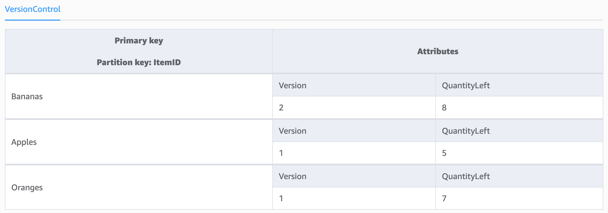

# Best practices for implementing version control in DynamoDB

In distributed systems like DynamoDB, item version control using optimistic locking
prevents conflicting updates. By tracking item versions and using conditional writes, applications
can manage concurrent modifications, ensuring data integrity across high-concurrency environments.

Optimistic locking is a strategy used to ensure that data modifications are applied correctly
without conflicts. Instead of locking data when it's read (as in pessimistic locking), optimistic
locking checks if data has changed before writing it back. In DynamoDB, this is achieved through
a form of version control, where each item includes an identifier that increments with every update.
When updating an item, the operation will only succeed if that identifier matches the one expected
by your application.

## When to use this pattern

###### This pattern is useful in the following scenarios:

- Multiple users or processes may attempt to update the same item concurrently.
- Ensuring data integrity and consistency is paramount.
- There is a need to avoid the overhead and complexity of managing distributed locks.

###### Examples include:

- E-commerce applications where inventory levels are frequently updated.
- Collaborative platforms where multiple users edit the same data.
- Financial systems where transaction records must remain consistent.

### Tradeoffs

While optimistic locking and conditional checks provide robust data integrity, they come
with the following tradeoffs:

**Concurrency conflicts**
In high-concurrency environments, the likelihood of conflicts increases,
potentially causing higher retries and write costs.

**Implementation complexity**

Adding version control to items and handling conditional checks can add complexity to
the application logic.

**Additional storage overhead**

Storing version numbers for each item slightly increases the storage
requirements.

## Pattern design

To implement this pattern, the DynamoDB schema should include a version attribute for
each item. Here is a simple schema design:

- Partition key – A unique identifier for each item (ex. `ItemId`).
- Attributes:
  - `ItemId` – The unique identifier for the item.
  - `Version` – An integer that represents the version number of the item.
  - `QuantityLeft` – The remaining inventory of the item.

When an item is first created, the `Version` attribute is set to 1. With each update, the
version number increments by 1.


## Using the pattern

To implement this pattern, follow these steps in your application flow:

1. Read the current version of the item.

Retrieve the current item from DynamoDB and read its version number.

```
def get_document(item_id):
    response = table.get_item(Key={'ItemID': item_id})
    return response['Item']

document = get_document('Bananas')
current_version = document['Version']
```

2. Increment the version number in your application logic.
   This will be the expected version for the update.

```
new_version = current_version + 1
```

3. Attempt to update the item using a conditional expression to ensure the
   version number matches.

```
def update_document(item_id, qty_bought, current_version):
    try:
        response = table.update_item(
            Key={'ItemID': item_id},
            UpdateExpression="set #qty = :qty, Version = :v",
            ConditionExpression="Version = :expected_v",
            ExpressionAttributeNames={
                '#qty': 'QuantityLeft'
            },
            ExpressionAttributeValues={
                ':qty': qty_bought,
                ':v': current_version + 1,
                ':expected_v': current_version
            },
            ReturnValues="UPDATED_NEW"
        )
        return response
    except ClientError as e:
        if e.response['Error']['Code'] == 'ConditionalCheckFailedException':
            print("Update failed due to version conflict.")
        else:
            print("Unexpected error: %s" % e)
        return None

update_document('Bananas', 2, new_version)
```

If the update is successful, the QuantityLeft for the item will be reduced by 2.

 4. Handle conflicts if they occur.

If a conflict occurs (e.g., another process has updated the item since you last read it),
handle the conflict appropriately, such as by retrying the operation or alerting the user.

This will require an additional read of the item for each retry, so limit the total number of
retries you allow before completely failing the request loop.

```
def update_document_with_retry(item_id, new_data, retries=3):
    for attempt in range(retries):
        document = get_document(item_id)
        current_version = document['Version']

        result = update_document(item_id, qty_bought, current_version)

        if result is not None:
            print("Update succeeded.")
            return result
        else:
            print(f"Retrying update... ({attempt + 1}/{retries})")

    print("Update failed after maximum retries.")
    return None

update_document_with_retry('Bananas', 2)
```

Implementing item version control using DynamoDB with optimistic locking and conditional
checks is a powerful pattern for ensuring data integrity in distributed applications. While it
introduces some complexity and potential performance tradeoffs, it is invaluable in scenarios
requiring robust concurrency control. By carefully designing the schema and implementing the
necessary checks in your application logic, you can effectively manage concurrent updates and
maintain data consistency.

Additional guidance and strategies for ways to implement version control of your DynamoDB
data can be found on the [AWS Database Blog](https://aws.amazon.com/blogs/database/implementing-version-control-using-amazon-dynamodb/ "https://aws.amazon.com/blogs/database/implementing-version-control-using-amazon-dynamodb/").
