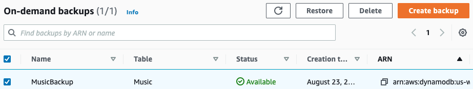

# Deleting a DynamoDB table backup

This section describes how to use the AWS Management Console or the AWS Command Line Interface (AWS CLI) to delete an
Amazon DynamoDB table backup.

###### Note

If you want to use the AWS CLI, you have to configure it first. For more information,
see [Using the AWS CLI](AccessingDynamoDB.md#Tools.CLI "AccessingDynamoDB.md#Tools.CLI").

###### Topics

The following procedure shows how to use the console to delete the
`MusicBackup` that is created in the [Backing up a DynamoDB table](Backup.md "Backup.md") tutorial.

###### To delete a backup

1. Sign in to the AWS Management Console and open the DynamoDB console at
   [https://console.aws.amazon.com/dynamodb/](https://console.aws.amazon.com/dynamodb/ "https://console.aws.amazon.com/dynamodb/").
2. In the navigation pane on the left side of the console, choose
   **Backups**.
3. In the list of backups, choose `MusicBackup`.

 4. Choose **Delete**. Confirm that you want to delete the backup
by typing `delete` and clicking
**Delete**.
The following example deletes a backup for an existing table
`Music` table using the AWS CLI.

```
aws dynamodb delete-backup \
--backup-arn arn:aws:dynamodb:us-east-1:123456789012:table/Music/backup/01489602797149-73d8d5bc
```
