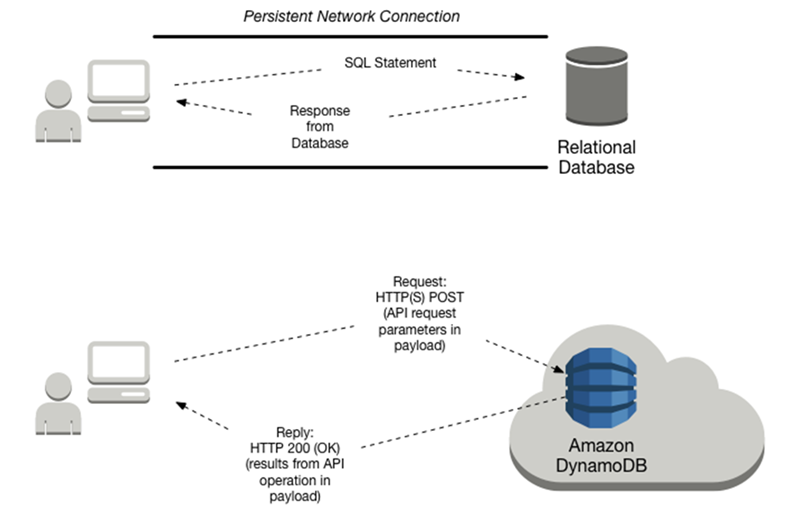

# Differences in accessing a relational (SQL)

database and DynamoDB

Before your application can access a database, it must be
_authenticated_ to ensure that the application is allowed to use
the database. It must be _authorized_ so that the application can
perform only the actions for which it has permissions.

The following diagram shows a client's interaction with a relational database and with
Amazon DynamoDB.

The following table has more details about client interaction tasks.

| Characteristic                          | Relational database management system (RDBMS)                                                                                                                                                                                                                                                                                        | Amazon DynamoDB                                                                                                                                                                                                                                                                                                                                                                                                                                             |
| --------------------------------------- | ------------------------------------------------------------------------------------------------------------------------------------------------------------------------------------------------------------------------------------------------------------------------------------------------------------------------------------ | ----------------------------------------------------------------------------------------------------------------------------------------------------------------------------------------------------------------------------------------------------------------------------------------------------------------------------------------------------------------------------------------------------------------------------------------------------------- |
| **Tools for Accessing the Database** | Most relational databases provide a command line interface (CLI) so that you can enter ad hoc SQL statements and see the results immediately.                                                                                                                                                                                  | In most cases, you write application code. You can also use the AWS Management Console, the AWS Command Line Interface (AWS CLI), or NoSQL Workbench to send ad hoc requests to DynamoDB and view the results. [PartiQL](ql-reference.md "ql-reference.md"), a SQL-compatible query language, lets you select, insert, update, and delete data in DynamoDB.                                                                                     |
| **Connecting to the Database**          | An application program establishes and maintains a network connection with the database. When the application is finished, it terminates the connection.                                                                                                                                                                       | DynamoDB is a web service, and interactions with it are stateless. Applications do not need to maintain persistent network connections. Instead, interaction with DynamoDB occurs using HTTP(S) requests and responses.                                                                                                                                                                                                                            |
| **Authentication**                      | An application cannot connect to the database until it is authenticated. The RDBMS can perform the authentication itself, or it can offload this task to the host operating system or a directory service.                                                                                                                  | Every request to DynamoDB must be accompanied by a cryptographic signature, which authenticates that particular request. The AWS SDKs provide all of the logic necessary for creating signatures and signing requests. For more information, see [Signing AWS API requests](../../../general/latest/gr/signing_aws_api_requests.md "../../../general/latest/gr/signing_aws_api_requests.md") in the _AWS General Reference_.                    |
| **Authorization**                       | Applications can perform only the actions for which they have been authorized. Database administrators or application owners can use the SQL `GRANT` and `REVOKE` statements to control access to database objects (such as tables), data (such as rows within a table), or the ability to issue certain SQL statements. | In DynamoDB, authorization is handled by AWS Identity and Access Management (IAM). You can write an IAM policy to grant permissions on a DynamoDB resource (such as a table), and then allow users and roles to use that policy. IAM also features fine-grained access control for individual data items in DynamoDB tables. For more information, see [Identity and Access Management for Amazon DynamoDB](security-iam.md "security-iam.md"). |
| **Sending a Request**                   | The application issues a SQL statement for every database operation that it wants to perform. Upon receipt of the SQL statement, the RDBMS checks its syntax, creates a plan for performing the operation, and then runs the plan.                                                                                          | The application sends HTTP(S) requests to DynamoDB. The requests contain the name of the DynamoDB operation to perform, along with parameters. DynamoDB runs the request immediately.                                                                                                                                                                                                                                                                 |
| **Receiving a Response**                | The RDBMS returns the results from the SQL statement. If there is an error, the RDBMS returns an error status and message.                                                                                                                                                                                                        | DynamoDB returns an HTTP(S) response containing the results of the operation. If there is an error, DynamoDB returns an HTTP error status and messages.                                                                                                                                                                                                                                                                                               |
