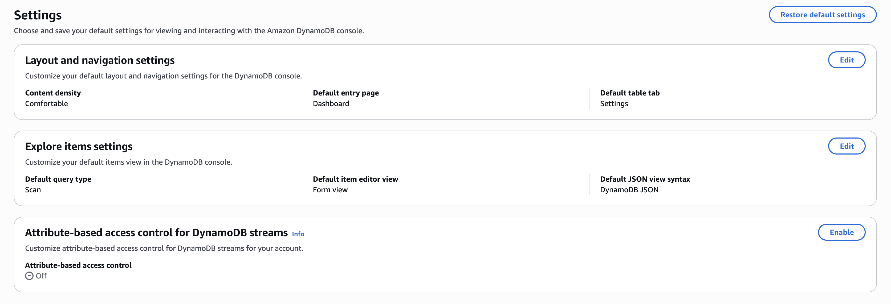

# Enabling ABAC for DynamoDB Streams

DynamoDB Streams ABAC is enabled by default for most AWS accounts. For existing customers, Streams ABAC is disabled by default, and you enable it after you audit your policies. Using the DynamoDB console, you can confirm whether Streams ABAC is enabled for your account. Open the DynamoDB console using a role that has the `dynamodb:GetAbacStatus` permission. Then, open the **Settings** page of the DynamoDB console.

The **Attribute-based access control for Streams** card appears on the **Settings** page only if you have a DynamoDB table in the current AWS Region. If you have a table, a status of **On** (or no card) means Streams ABAC is enabled, and **Off** (shown in the following image) means it isn't. Without a table in the Region, the card's absence doesn't indicate the status.


To enable Streams ABAC for your account, we recommend that you first audit your policies as described in the [Auditing your policies before enabling Streams ABAC](#policy-audit-for-stream-abac "#policy-audit-for-stream-abac") section. Then, include the [required permissions for Streams ABAC](#required-permissions-stream-abac "#required-permissions-stream-abac") in your IAM policy. Finally, perform the steps described in [Enabling Streams ABAC in console](#stream-abac-enable-console "#stream-abac-enable-console") to enable Streams ABAC for your account in the current AWS Region. After you enable Streams ABAC, you can opt out within the next seven calendar days of opting in.

###### Topics

- [Auditing your policies before enabling Streams ABAC](#policy-audit-for-stream-abac "#policy-audit-for-stream-abac")
- [IAM permissions required to enable Streams ABAC](#required-permissions-stream-abac "#required-permissions-stream-abac")
- [Enabling Streams ABAC in console](#stream-abac-enable-console "#stream-abac-enable-console")

## Auditing your policies before enabling Streams ABAC

Before you enable Streams ABAC, audit your policies. Confirm that any tag-based conditions in your account policies are set up as intended for stream resources. Auditing your policies helps you avoid unexpected authorization changes in your DynamoDB Streams workflows after you enable Streams ABAC.

When auditing, look for policies that:

- Use `aws:ResourceTag` conditions on stream ARNs (format: `arn:aws:dynamodb:*:*:table/*/stream/*`)
- Use `aws:RequestTag` or `aws:TagKeys` conditions with `dynamodb:TagResource` or `dynamodb:UntagResource` actions on stream resources
- Use wildcard resource ARNs (`arn:aws:dynamodb:*:*:*`) with tag-based conditions that might unintentionally apply to streams

To view examples of using attribute-based conditions with tags, and the before and after behavior of ABAC implementation, see [Examples for using ABAC with DynamoDB Streams](abac-examples-streams.md "abac-examples-streams.md").

## IAM permissions required to enable Streams ABAC

You need the `dynamodb:UpdateAbacStatus` permission to enable Streams ABAC for your account in the current Region. To confirm whether Streams ABAC is enabled for your account, you must also have the `dynamodb:GetAbacStatus` permission. With this permission, you can view the Streams ABAC status for an account in any Region. You need these permissions in addition to the permission needed for accessing the DynamoDB console.

The following IAM policy grants the permission to enable Streams ABAC and view its status for an account in the current Region.

```
{
  "Version": "2012-10-17",
  "Statement": [
    {
      "Effect": "Allow",
      "Action": [
        "dynamodb:UpdateAbacStatus",
        "dynamodb:GetAbacStatus"
      ],
      "Resource": "*"
    }
  ]
}
```

## Enabling Streams ABAC in console

1. Sign in to the AWS Management Console and open the DynamoDB console at [https://console.aws.amazon.com/dynamodb/](https://console.aws.amazon.com/dynamodb/ "https://console.aws.amazon.com/dynamodb/").
2. From the top navigation pane, choose the Region for which you want to enable Streams ABAC.
3. On the left navigation pane, choose **Settings**.
4. On the **Settings** page, do the following:

   1. In the **Attribute-based access control for Streams** card, choose **Enable**.
   2. In the **Confirm attribute-based access control for Streams setting** box, choose **Enable** to confirm your choice.

   This enables Streams ABAC for the current Region and the **Attribute-based access control for Streams** card shows the status of **On**.

   If you want to opt out after enabling Streams ABAC on the console, you can do so within the next seven calendar days of opting in. To opt out, choose **Disable** in the **Attribute-based access control for Streams** card on the **Settings** page.

   ###### Note

   Updating the status of Streams ABAC is an asynchronous operation. If DynamoDB doesn't evaluate the tags in your policies right away, wait a few minutes and try again. Tag evaluation changes are eventually consistent.
