# Complaint management system schema

design in DynamoDB

## Complaint management system

business use case

DynamoDB is a database well-suited for a complaint management system (or contact center)
use case as most access patterns associated with them would be key-value based
transactional lookups. The typical access patterns in this scenario would be to:

- Create and update complaints
- Escalate a complaint
- Create and read comments on a complaint
- Get all complaints by a customer
- Get all comments by an agent and get all escalations

Some comments may have attachments describing the complaint or solution. While these
are all key-value access patterns, there can be additional requirements such as sending
out notifications when a new comment is added to a complaint or running analytical
queries to find complaint distribution by severity (or agent performance) per week. An
additional requirement related to lifecycle management or compliance would be to archive
complaint data after three years of logging the complaint.

## Complaint management system

architecture diagram

The following diagram shows the architecture diagram of the complaint management system. This diagram shows the different AWS service integrations that the complaint management system uses.

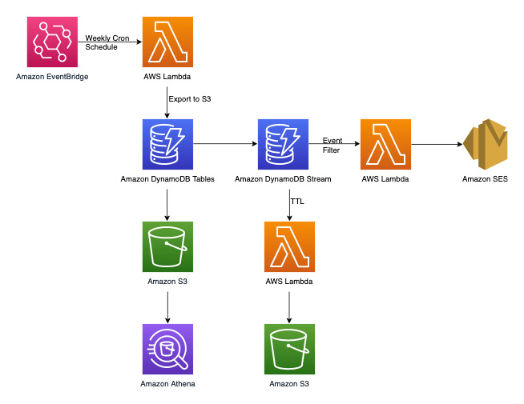

Apart from the key-value transactional access patterns that we will be handling in the
DynamoDB data modeling section later, we have three non-transactional requirements. The
architecture diagram above can be broken down into the following three workflows:

1. Send a notification when a new comment is added to a complaint
2. Run analytical queries on weekly data
3. Archive data older than three years

Let's take a more in-depth look at each one.

**Send a notification when a new comment is added to a
complaint**

We can use the below workflow to achieve this requirement:

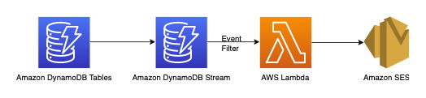

[DynamoDB Streams](Streams.md "Streams.md") is a change data capture mechanism to
record all write activity on your DynamoDB tables. You can configure Lambda functions to
trigger on some or all of these changes. An [event filter](../../../lambda/latest/dg/invocation-eventfiltering.md "../../../lambda/latest/dg/invocation-eventfiltering.md") can be
configured on Lambda triggers to filter out events that are not relevant to the
use-case. In this instance, we can use a filter to trigger Lambda only when a new
comment is added and send out notification to relevant email ID(s) which can be fetched
from [AWS
Secrets Manager](../../../secretsmanager/latest/userguide/intro.md "../../../secretsmanager/latest/userguide/intro.md") or any other credential store.

**Run analytical queries on weekly data**

DynamoDB is suitable for workloads that are primarily focused on online transactional
processing (OLTP). For the other 10-20% access patterns with analytical requirements,
data can be exported to S3 with the managed [Export to Amazon S3](S3DataExport.md "S3DataExport.md") feature with no impact to the live traffic on DynamoDB table.
Take a look at this workflow below:

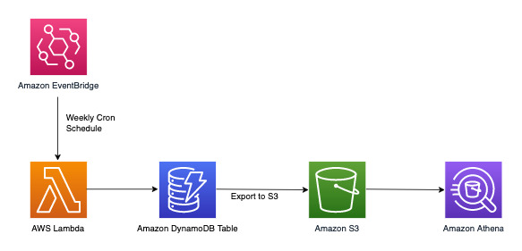

[Amazon EventBridge](../../../eventbridge/latest/userguide/eb-what-is.md "../../../eventbridge/latest/userguide/eb-what-is.md") can be used to trigger AWS Lambda on schedule - it allows you to
configure a cron expression for Lambda invocation to take place periodically. Lambda can
invoke the `ExportToS3` API call and store DynamoDB data in S3. This S3 data
can then be accessed by a SQL engine such as [Amazon Athena](../../../athena/latest/ug/what-is.md "../../../athena/latest/ug/what-is.md") to run analytical queries on DynamoDB
data without affecting the live transactional workload on the table. A sample Athena
query to find number of complaints per severity level would look like this:

```
SELECT Item.severity.S as "Severity", COUNT(Item) as "Count"
FROM "complaint_management"."data"
WHERE NOT Item.severity.S = ''
GROUP BY Item.severity.S ;
```

This results in the following Athena query result:

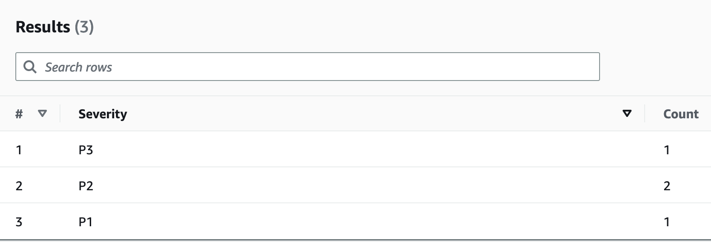

**Archive data older than three years**

You can leverage the DynamoDB [Time to Live (TTL)](TTL.md "TTL.md") feature to
delete obsolete data from your DynamoDB table at no additional cost (except in the case of
global tables replicas for the 2019.11.21 (Current) version, where TTL deletes
replicated to other Regions consume write capacity). This data appears and can be
consumed from DynamoDB Streams to be archived off into Amazon S3. The workflow for this
requirement is as follows:

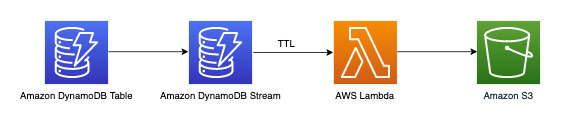

## Complaint management system

entity relationship diagram

This is the entity relationship diagram (ERD) we'll be using for the complaint
management system schema design.

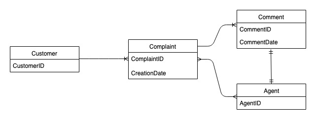

## Complaint

management system access patterns

These are the access patterns we'll be considering for the complaint management schema
design.

1. createComplaint
2. updateComplaint
3. updateSeveritybyComplaintID
4. getComplaintByComplaintID
5. addCommentByComplaintID
6. getAllCommentsByComplaintID
7. getLatestCommentByComplaintID
8. getAComplaintbyCustomerIDAndComplaintID
9. getAllComplaintsByCustomerID
10. escalateComplaintByComplaintID
11. getAllEscalatedComplaints
12. getEscalatedComplaintsByAgentID (order from newest to oldest)
13. getCommentsByAgentID (between two dates)

## Complaint

management system schema design evolution

Since this is a complaint management system, most access patterns revolve around a
complaint as the primary entity. The `ComplaintID` being highly cardinal will
ensure even distribution of data in the underlying partitions and is also the most
common search criteria for our identified access patterns. Therefore,
`ComplaintID` is a good partition key candidate in this data set.

**Step 1: Address access patterns 1
(`createComplaint`), 2 (`updateComplaint`), 3
(`updateSeveritybyComplaintID`), and 4
(`getComplaintByComplaintID`)**

We can use a generic sort key valued called "metadata" (or "AA") to store
complaint-specific information such as `CustomerID`, `State`,
`Severity`, and `CreationDate`. We use singleton operations
with `PK=ComplaintID` and `SK=“metadata”` to do the
following:

1. [`PutItem`](../APIReference/API_PutItem.md "../APIReference/API_PutItem.md") to create a new complaint
2. [`UpdateItem`](../APIReference/API_UpdateItem.md "../APIReference/API_UpdateItem.md") to update the severity or other fields
   in the complaint metadata
3. [`GetItem`](../APIReference/API_GetItem.md "../APIReference/API_GetItem.md") to fetch metadata for the complaint

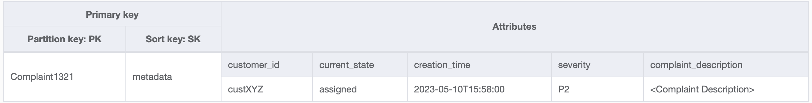

**Step 2: Address access pattern 5
(`addCommentByComplaintID`)**

This access pattern requires a one-to-many relationship model between a complaint and
comments on the complaint. We will use the [vertical partitioning](data-modeling-blocks.md#data-modeling-blocks-vertical-partitioning "data-modeling-blocks.md#data-modeling-blocks-vertical-partitioning")
technique here to use a sort key and create an item collection with different types of
data. If we look at access patterns 6 (`getAllCommentsByComplaintID`) and 7
(`getLatestCommentByComplaintID`), we know that comments will need to be
sorted by time. We can also have multiple comments coming in at the same time so we can
use the [composite sort key](data-modeling-blocks.md#data-modeling-blocks-composite "data-modeling-blocks.md#data-modeling-blocks-composite")
technique to append time and `CommentID` in the sort key attribute.

Other options to deal with such possible comment collisions would be to increase the
granularity for the timestamp or add an incremental number as a suffix instead of using
`Comment_ID`. In this case, we’ll prefix the sort key value for items
corresponding to comments with “comm#” to enable range-based operations.

We also need to ensure that the `currentState` in the complaint metadata
reflects the state when a new comment is added. Adding a comment might indicate that the
complaint has been assigned to an agent or it has been resolved and so on. In order to
bundle the addition of comment and update of current state in the complaint metadata, in
an all-or-nothing manner, we will use the [TransactWriteItems](../APIReference/API_TransactWriteItems.md "../APIReference/API_TransactWriteItems.md") API. The resulting table
state now looks like this:

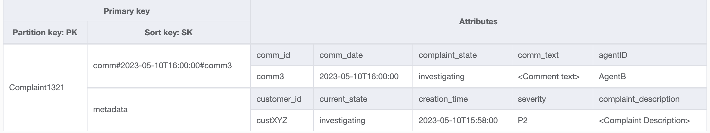

Let’s add some more data in the table and also add `ComplaintID` as a
separate field from our `PK` for future-proofing the model in case we need
additional indexes on `ComplaintID`. Also note that some comments may have
attachments which we will store in Amazon Simple Storage Service and only maintain their references or URLs
in DynamoDB. It’s a best practice to keep the transactional database as lean as possible to
optimize cost and performance. The data now looks like this:

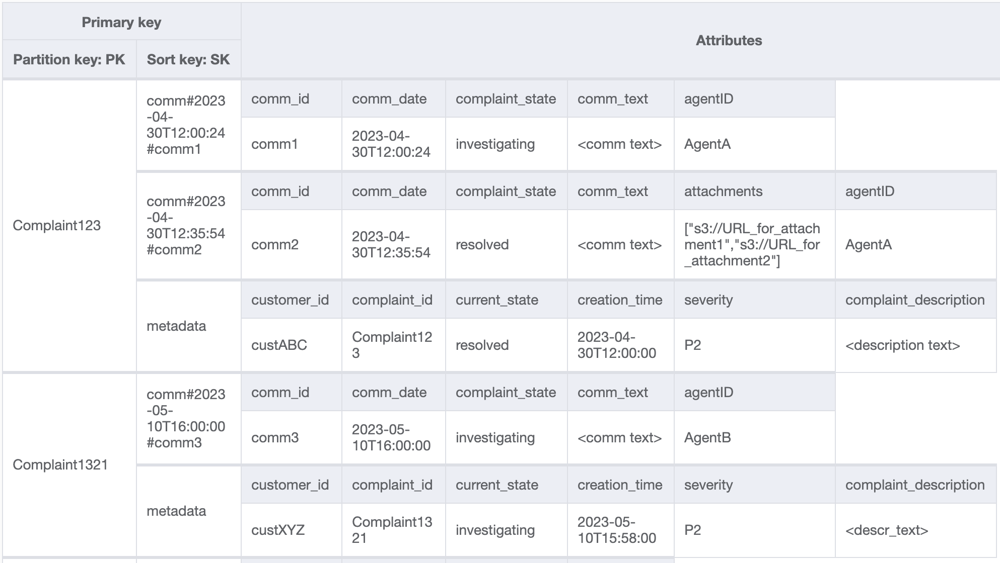

**Step 3: Address access patterns 6
(`getAllCommentsByComplaintID`) and 7
(`getLatestCommentByComplaintID`)**

In order to get all comments for a complaint, we can use the [query](Query.md "Query.md") operation with the `begins_with` condition on the sort key. Instead of
consuming additional read capacity to read the metadata entry and then having the
overhead of filtering the relevant results, having a sort key condition like this help
us only read what we need. For example, a query operation with `PK=Complaint123` and
`SK` begins_with `comm#` would return the following while
skipping the metadata entry:

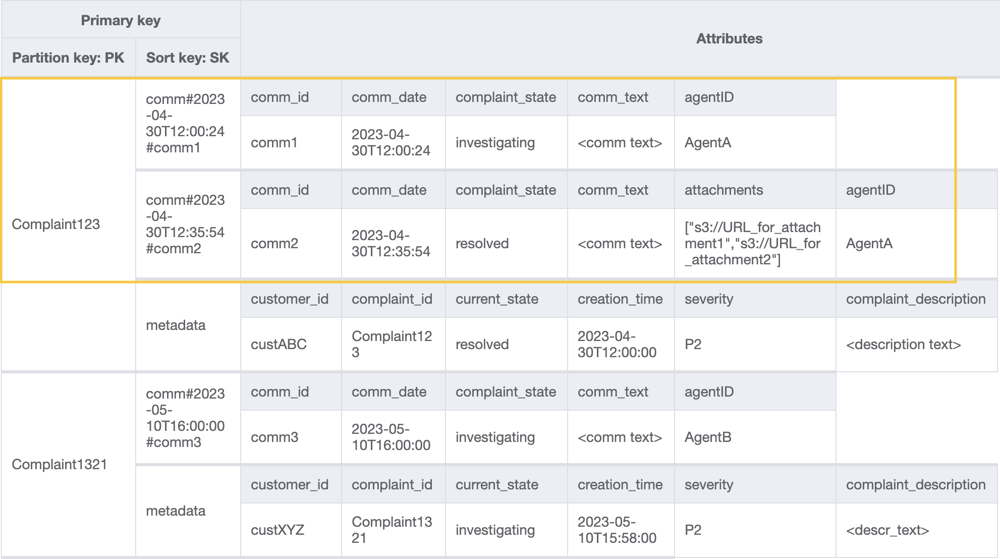

Since we need the latest comment for a complaint in pattern 7
(`getLatestCommentByComplaintID`), let's use two additional query
parameters:

1. `ScanIndexForward` should be set to False to get results sorted in
   a descending order
2. `Limit` should be set to 1 to get the latest (only one)
   comment

Similar to access pattern 6 (`getAllCommentsByComplaintID`), we skip the
metadata entry using `begins_with`
`comm#` as the sort key condition. Now, you can perform access pattern 7 on
this design using the query operation with `PK=Complaint123` and
`SK=begins_with comm#`, `ScanIndexForward=False`, and
`Limit` 1. The following targeted item will be returned as a
result:

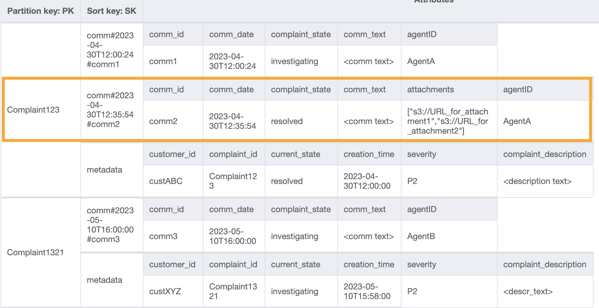

Let's add more dummy data to the table.

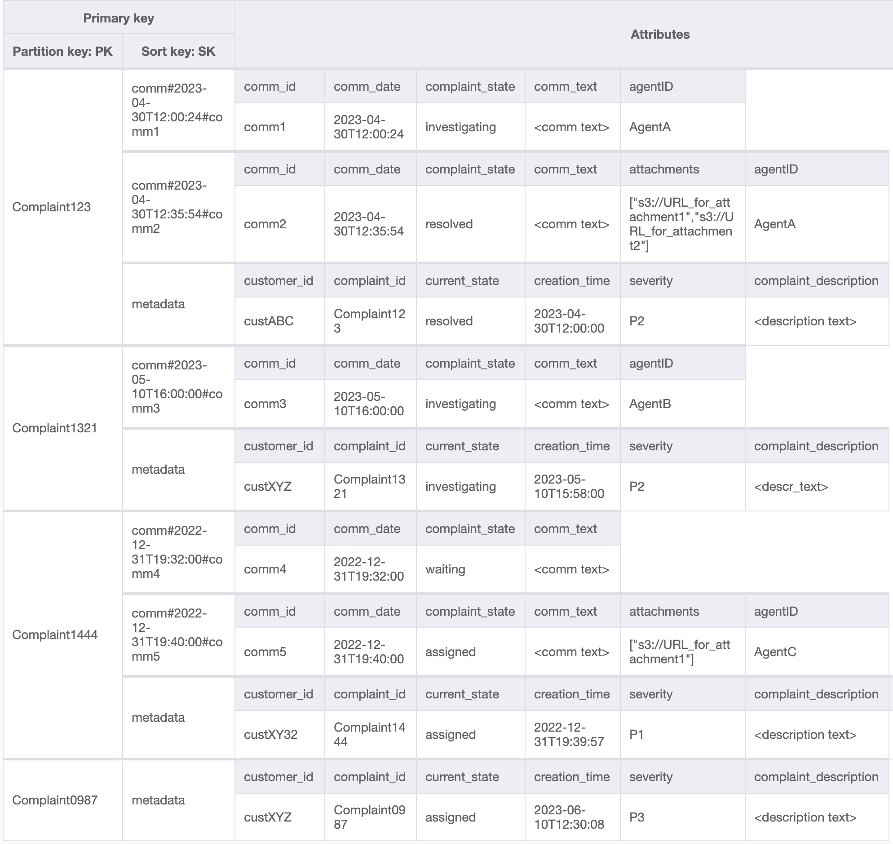

**Step 4: Address access patterns 8
(`getAComplaintbyCustomerIDAndComplaintID`) and 9
(`getAllComplaintsByCustomerID`)**

Access patterns 8 (`getAComplaintbyCustomerIDAndComplaintID`) and 9
(`getAllComplaintsByCustomerID`) introduces a new search criteria:
`CustomerID`. Fetching it from the existing table requires an expensive
[`Scan`](../APIReference/API_Scan.md "../APIReference/API_Scan.md") to read all data and then filter relevant items for
the `CustomerID` in question. We can make this search more efficient by
creating a [global secondary index (GSI)](GSI.md "GSI.md") with
`CustomerID` as the partition key. Keeping in mind the one-to-many
relationship between customer and complaints as well as access pattern 9
(`getAllComplaintsByCustomerID`), `ComplaintID` would be the
right candidate for the sort key.

The data in the GSI would look like this:

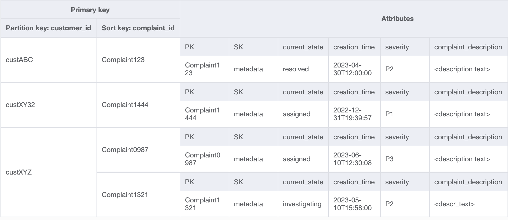

An example query on this GSI for access pattern 8
(`getAComplaintbyCustomerIDAndComplaintID`) would be:
`customer_id=custXYZ`, `sort key=Complaint1321`. The result
would be:

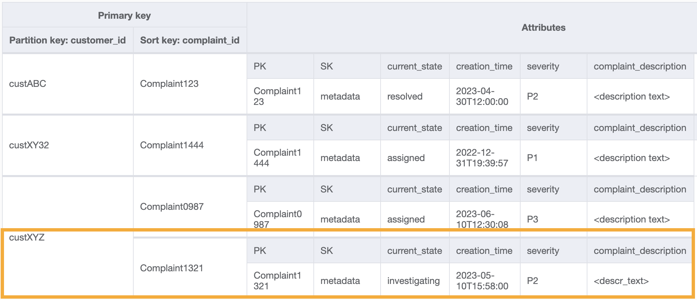

To get all complaints for a customer for access pattern 9
(`getAllComplaintsByCustomerID`), the query on the GSI would be:
`customer_id=custXYZ` as the partition key condition. The result would
be:

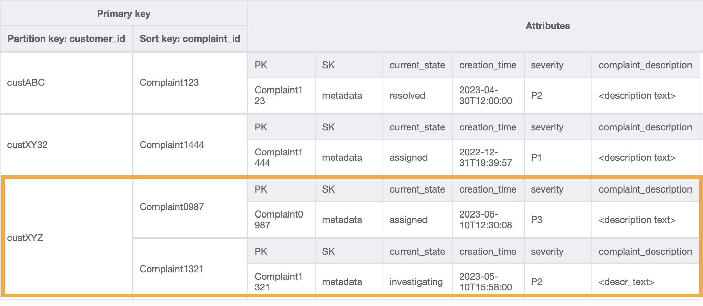

**Step 5: Address access pattern 10
(`escalateComplaintByComplaintID`)**

This access introduces the escalation aspect. To escalate a complaint, we can use
`UpdateItem` to add attributes such as `escalated_to` and
`escalation_time` to the existing complaint metadata item. DynamoDB provides
flexible schema design which means a set of non-key attributes can be uniform or
discrete across different items. See below for an example:

`UpdateItem with PK=Complaint1444, SK=metadata`

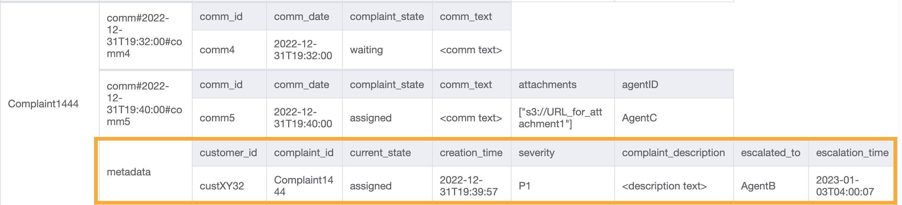

**Step 6: Address access patterns 11
(`getAllEscalatedComplaints`) and 12
(`getEscalatedComplaintsByAgentID`)**

Only a handful of complaints are expected to be escalated out of the whole data set.
Therefore, creating an index on the escalation-related attributes would lead to
efficient lookups as well as cost-effective GSI storage. We can do this by leveraging
the [sparse index](data-modeling-blocks.md#data-modeling-blocks-sparse-index "data-modeling-blocks.md#data-modeling-blocks-sparse-index") technique. The
GSI with partition key as `escalated_to` and sort key as
`escalation_time` would look like this:

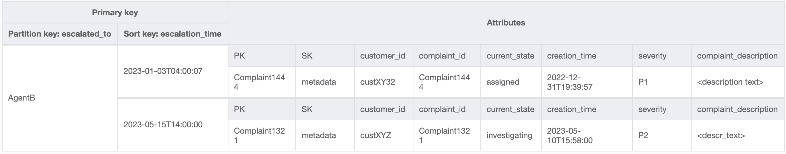

To get all escalated complaints for access pattern 11
(`getAllEscalatedComplaints`), we simply scan this GSI. Note that this
scan will be performant and cost-efficient due to the size of the GSI. To get escalated
complaints for a specific agent (access pattern 12
(`getEscalatedComplaintsByAgentID`)), the partition key would be
`escalated_to=agentID` and we set `ScanIndexForward` to
`False` for ordering from newest to oldest.

**Step 7: Address access pattern 13
(`getCommentsByAgentID`)**

For the last access pattern, we need to perform a lookup by a new dimension:
`AgentID`. We also need time-based ordering to read comments between two
dates so we create a GSI with `agent_id` as the partition key and
`comm_date` as the sort key. The data in this GSI will look like the
following:

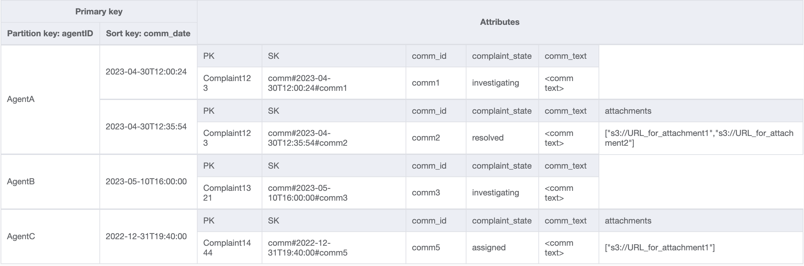

An example query on this GSI would be `partition key agentID=AgentA` and
`sort key=comm_date between (2023-04-30T12:30:00, 2023-05-01T09:00:00)`,
the result of which is:

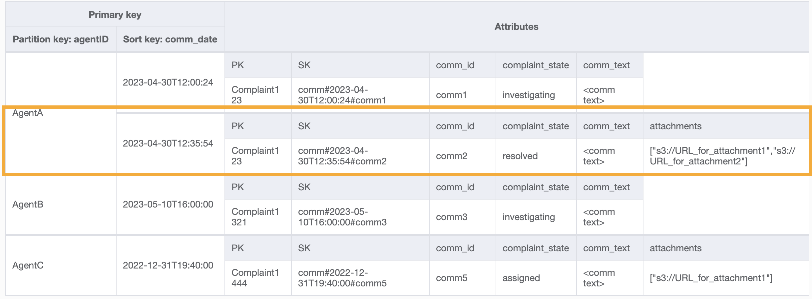

All access patterns and how the schema design addresses them are summarized in the
table below:

| Access pattern                                                | Base table/GSI/LSI     | Operation          | Partition key value     | Sort key value                         | Other conditions/filters          |
| ------------------------------------------------------------- | ---------------------- | ------------------ | ----------------------- | -------------------------------------- | --------------------------------- |
| createComplaint                                               | Base table             | PutItem            | PK=complaint_id         | SK=metadata                            |                                   |
| updateComplaint                                               | Base table             | UpdateItem         | PK=complaint_id         | SK=metadata                            |                                   |
| updateSeveritybyComplaintID                                   | Base table             | UpdateItem         | PK=complaint_id         | SK=metadata                            |                                   |
| getComplaintByComplaintID                                     | Base table             | GetItem            | PK=complaint_id         | SK=metadata                            |                                   |
| addCommentByComplaintID                                       | Base table             | TransactWriteItems | PK=complaint_id         | SK=metadata, SK=comm#comm_date#comm_id |                                   |
| getAllCommentsByComplaintID                                   | Base table             | Query              | PK=complaint_id         | SK begins_with "comm#"                 |                                   |
| getLatestCommentByComplaintID                                 | Base table             | Query              | PK=complaint_id         | SK begins_with "comm#"                 | scan_index_forward=False, Limit 1 |
| getAComplaintbyCustomerIDAndComplaintID                       | Customer_complaint_GSI | Query              | customer_id=customer_id | complaint_id = complaint_id            |                                   |
| getAllComplaintsByCustomerID                                  | Customer_complaint_GSI | Query              | customer_id=customer_id | N/A                                    |                                   |
| escalateComplaintByComplaintID                                | Base table             | UpdateItem         | PK=complaint_id         | SK=metadata                            |                                   |
| getAllEscalatedComplaints                                     | Escalations_GSI        | Scan               | N/A                     | N/A                                    |                                   |
| getEscalatedComplaintsByAgentID (order from newest to oldest) | Escalations_GSI        | Query              | escalated_to=agent_id   | N/A                                    | scan_index_forward=False          |
| getCommentsByAgentID (between two dates)                      | Agents_Comments_GSI    | Query              | agent_id=agent_id       | SK between (date1, date2)              |                                   |

## Complaint management

system final schema

Here are the final schema designs. To download this schema design as a JSON file, see
[DynamoDB Examples](https://github.com/aws-samples/aws-dynamodb-examples/blob/master/schema_design/SchemaExamples/ComplainManagement/ComplaintManagementSchema.json "https://github.com/aws-samples/aws-dynamodb-examples/blob/master/schema_design/SchemaExamples/ComplainManagement/ComplaintManagementSchema.json") on GitHub.

**Base table**

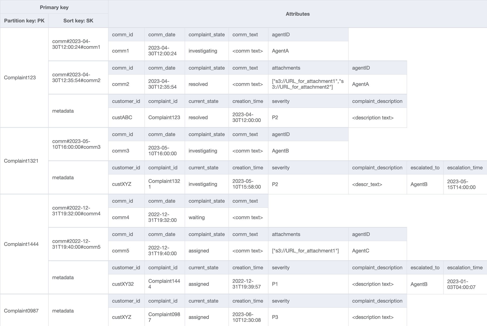

**Customer_Complaint_GSI**

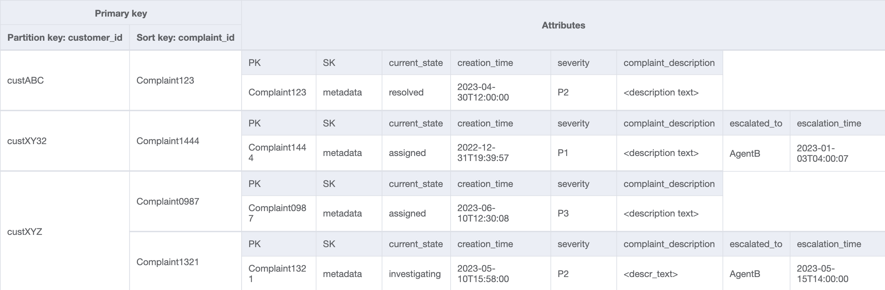

**Escalations_GSI**

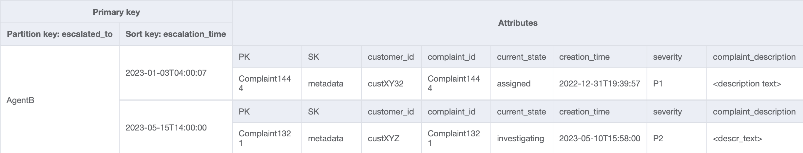

**Agents_Comments_GSI**

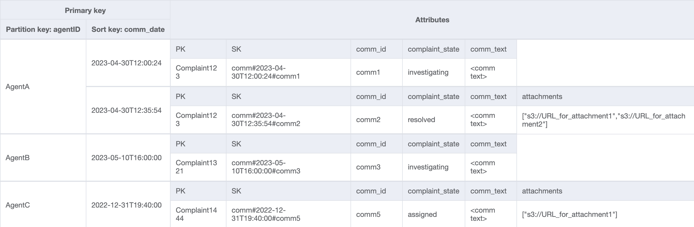

## Using NoSQL Workbench

with this schema design

You can import this final schema into [NoSQL
Workbench](workbench.md "workbench.md"), a visual tool that provides data modeling, data visualization, and
query development features for DynamoDB, to further explore and edit your new project.
Follow these steps to get started:

1. Download NoSQL Workbench. For more information, see [Download NoSQL Workbench for DynamoDB](workbench.md "workbench.md").
2. Download the JSON schema file listed above, which is already in the NoSQL
   Workbench model format.
3. Import the JSON schema file into NoSQL Workbench. For more information, see
   [Importing an existing data model](workbench.Modeler.md "workbench.Modeler.md").
4. Once you've imported into NOSQL Workbench, you can edit the data model. For
   more information, see [Editing an existing data model](workbench.Modeler.md "workbench.Modeler.md").
