# Using DynamoDB as a data store for an online

shop

This use case talks about using DynamoDB as a data store for an online shop (or
e-store).

## Use case

An online store lets users browse through different products and eventually purchase
them. Based on the generated invoice, a customer can pay using a discount code or gift
card and then pay the remaining amount with a credit card. Purchased products will be
picked from one of several warehouses and will be shipped to the provided address.
Typical access patterns for an online store include:

- Get customer for a given customerId
- Get product for a given productId
- Get warehouse for a given warehouseId
- Get a product inventory for all warehouses by a productId
- Get order for a given orderId
- Get all products for a given orderId
- Get invoice for a given orderId
- Get all shipments for a given orderId
- Get all orders for a given productId for a given date range
- Get invoice for a given invoiceId
- Get all payments for a given invoiceId
- Get shipment details for a given shipmentId
- Get all shipments for a given warehouseId
- Get inventory of all products for a given warehouseId
- Get all invoices for a given customerId for a given date range
- Get all products ordered by a given customerId for a given date range

## Entity relationship

diagram

This is the entity relationship diagram (ERD) we'll be using to model DynamoDB as a data
store for an online shop.

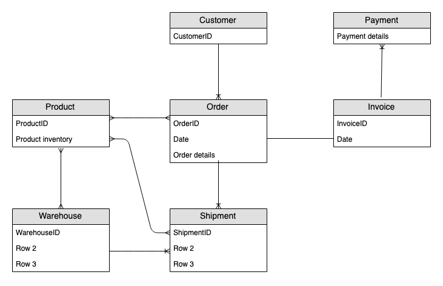

## Access

patterns

These are the access patterns we'll be considering when using DynamoDB as a data store
for an online shop.

1. `getCustomerByCustomerId`
2. `getProductByProductId`
3. `getWarehouseByWarehouseId`
4. `getProductInventoryByProductId`
5. `getOrderDetailsByOrderId`
6. `getProductByOrderId`
7. `getInvoiceByOrderId`
8. `getShipmentByOrderId`
9. `getOrderByProductIdForDateRange`
10. `getInvoiceByInvoiceId`
11. `getPaymentByInvoiceId`
12. `getShipmentDetailsByShipmentId`
13. `getShipmentByWarehouseId`
14. `getProductInventoryByWarehouseId`
15. `getInvoiceByCustomerIdForDateRange`
16. `getProductsByCustomerIdForDateRange`

## Schema design

evolution

Using [NoSQL Workbench for DynamoDB](workbench.md "workbench.md") , import [AnOnlineShop_1.json](https://github.com/aws-samples/amazon-dynamodb-design-patterns/blob/master/examples/an-online-shop/json/AnOnlineShop_1.json "https://github.com/aws-samples/amazon-dynamodb-design-patterns/blob/master/examples/an-online-shop/json/AnOnlineShop_1.json") to create a new data model called
`AnOnlineShop` and a new table called `OnlineShop`. Note that
we use the generic names `PK` and `SK` for the partition key and
sort key. This is a practice used in order to store different types of entities in the
same table.

**Step 1: Address access pattern 1
(`getCustomerByCustomerId`)**

Import [AnOnlineShop_2.json](https://github.com/aws-samples/amazon-dynamodb-design-patterns/blob/master/examples/an-online-shop/json/AnOnlineShop_2.json "https://github.com/aws-samples/amazon-dynamodb-design-patterns/blob/master/examples/an-online-shop/json/AnOnlineShop_2.json") to handle access pattern 1
(`getCustomerByCustomerId`). Some entities do not have relationships to
other entities, so we will use the same value of `PK` and `SK` for
them. In the example data, note that the keys use a prefix `c#` in order to
distinguish the `customerId` from other entities that will be added later.
This practice is repeated for other entities as well.

To address this access pattern, a [`GetItem`](../APIReference/API_GetItem.md "../APIReference/API_GetItem.md") operation can be used with `PK=customerId`
and `SK=customerId`.

**Step 2: Address access pattern 2
(`getProductByProductId`)**

Import [AnOnlineShop_3.json](https://github.com/aws-samples/amazon-dynamodb-design-patterns/blob/master/examples/an-online-shop/json/AnOnlineShop_3.json "https://github.com/aws-samples/amazon-dynamodb-design-patterns/blob/master/examples/an-online-shop/json/AnOnlineShop_3.json") to address access pattern 2
(`getProductByProductId`) for the `product` entity. The
product entities are prefixed by `p#` and the same sort key attribute has
been used to store `customerID` as well as `productID`. Generic
naming and [vertical
partitioning](data-modeling-blocks.md#data-modeling-blocks-vertical-partitioning "data-modeling-blocks.md#data-modeling-blocks-vertical-partitioning") allows us to create such item collections for an effective
single table design.

To address this access pattern, a `GetItem` operation can be used with
`PK=productId` and `SK=productId`.

**Step 3: Address access pattern 3
(`getWarehouseByWarehouseId`)**

Import [AnOnlineShop_4.json](https://github.com/aws-samples/amazon-dynamodb-design-patterns/blob/master/examples/an-online-shop/json/AnOnlineShop_4.json "https://github.com/aws-samples/amazon-dynamodb-design-patterns/blob/master/examples/an-online-shop/json/AnOnlineShop_4.json") to address access pattern 3
(`getWarehouseByWarehouseId`) for the `warehouse` entity. We
currently have the `customer`, `product`, and
`warehouse` entities added to the same table. They are distinguished
using prefixes and the `EntityType` attribute. A type attribute (or prefix
naming) improves the model’s readability. The readability would be affected if we simply
stored alphanumeric IDs for different entities in the same attribute. It would be
difficult to tell one entity from the other in the absence of these identifiers.

To address this access pattern, a `GetItem` operation can be used with
`PK=warehouseId` and `SK=warehouseId`.

**Base table:**

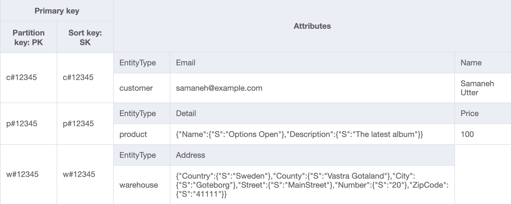

**Step 4: Address access pattern 4
(`getProductInventoryByProductId`)**

Import [AnOnlineShop_5.json](https://github.com/aws-samples/amazon-dynamodb-design-patterns/blob/master/examples/an-online-shop/json/AnOnlineShop_5.json "https://github.com/aws-samples/amazon-dynamodb-design-patterns/blob/master/examples/an-online-shop/json/AnOnlineShop_5.json") to address access pattern 4
(`getProductInventoryByProductId`). `warehouseItem` entity is
used to keep track of the number of products in each warehouse. This item would normally
be updated when a product is added or removed from a warehouse. As seen in the ERD,
there is a many-to-many relationship between `product` and
`warehouse`. Here, the one-to-many relationship from `product`
to `warehouse` is modeled as `warehouseItem`. Later on, the
one-to-many relationship from `warehouse` to `product` will be
modeled as well.

Access pattern 4 can be addressed with a query on `PK=ProductId` and
`SK begins_with “w#“`.

For more information about `begins_with()` and other expressions that can
be applied to sort keys, see [Key Condition
Expressions](Query.md "Query.md").

**Base table:**

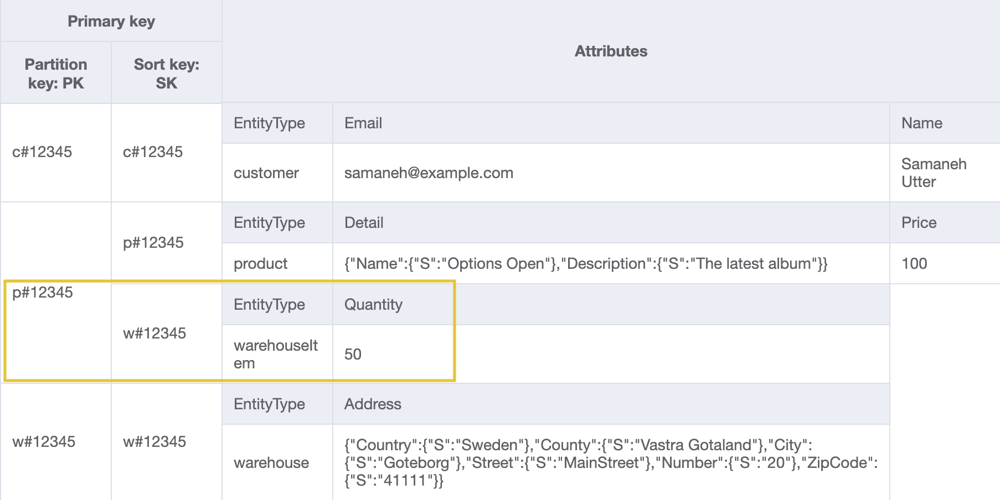

**Step 5: Address access patterns 5
(`getOrderDetailsByOrderId`) and 6
(`getProductByOrderId`)**

Add some more `customer`, `product`, and `warehouse`
items to the table by importing [AnOnlineShop_6.json](https://github.com/aws-samples/amazon-dynamodb-design-patterns/blob/master/examples/an-online-shop/json/AnOnlineShop_6.json "https://github.com/aws-samples/amazon-dynamodb-design-patterns/blob/master/examples/an-online-shop/json/AnOnlineShop_6.json"). Then, import [AnOnlineShop_7.json](https://github.com/aws-samples/amazon-dynamodb-design-patterns/blob/master/examples/an-online-shop/json/AnOnlineShop_7.json "https://github.com/aws-samples/amazon-dynamodb-design-patterns/blob/master/examples/an-online-shop/json/AnOnlineShop_7.json") to build an item collection for `order` that
can address access patterns 5 (`getOrderDetailsByOrderId`) and 6
(`getProductByOrderId`). You can see the one-to-many relationship between
`order` and `product` modeled as orderItem entities.

To address access pattern 5 (`getOrderDetailsByOrderId`), query the table
with `PK=orderId`. This will provide all information about the order
including `customerId` and ordered products.

**Base table:**

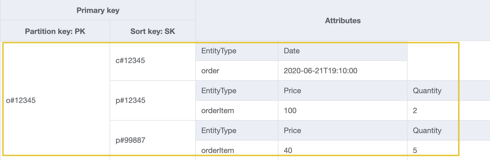

To address access pattern 6 (`getProductByOrderId`), we need to read
products in an `order` only. Query the table with `PK=orderId` and
`SK begins_with “p#”` to accomplish this.

**Base table:**

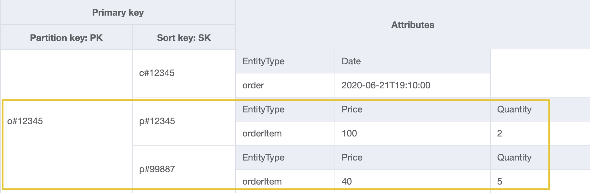

**Step 6: Address access pattern 7
(`getInvoiceByOrderId`)**

Import [AnOnlineShop_8.json](https://github.com/aws-samples/amazon-dynamodb-design-patterns/blob/master/examples/an-online-shop/json/AnOnlineShop_8.json "https://github.com/aws-samples/amazon-dynamodb-design-patterns/blob/master/examples/an-online-shop/json/AnOnlineShop_8.json") to add an `invoice` entity to the _order_ item collection to handle access pattern 7
(`getInvoiceByOrderId`). To address this access pattern, you can use a
query operation with `PK=orderId` and `SK begins_with
 “i#”`.

**Base table:**

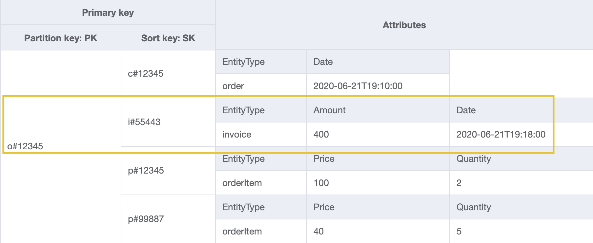

**Step 7: Address access pattern 8
(`getShipmentByOrderId`)**

Import [AnOnlineShop_9.json](https://github.com/aws-samples/amazon-dynamodb-design-patterns/blob/master/examples/an-online-shop/json/AnOnlineShop_9.json "https://github.com/aws-samples/amazon-dynamodb-design-patterns/blob/master/examples/an-online-shop/json/AnOnlineShop_9.json") to add `shipment` entities to the _order_ item collection to address access pattern 8
(`getShipmentByOrderId`). We are extending the same vertically
partitioned model by adding more types of entities in the single table design. Notice
how the _order_ item collection contains the different
relationships that an `order` entity has with the `shipment`,
`orderItem`, and `invoice` entities.

To get shipments by `orderId`, you can perform a query operation with
`PK=orderId` and `SK begins_with “sh#”`.

**Base table:**

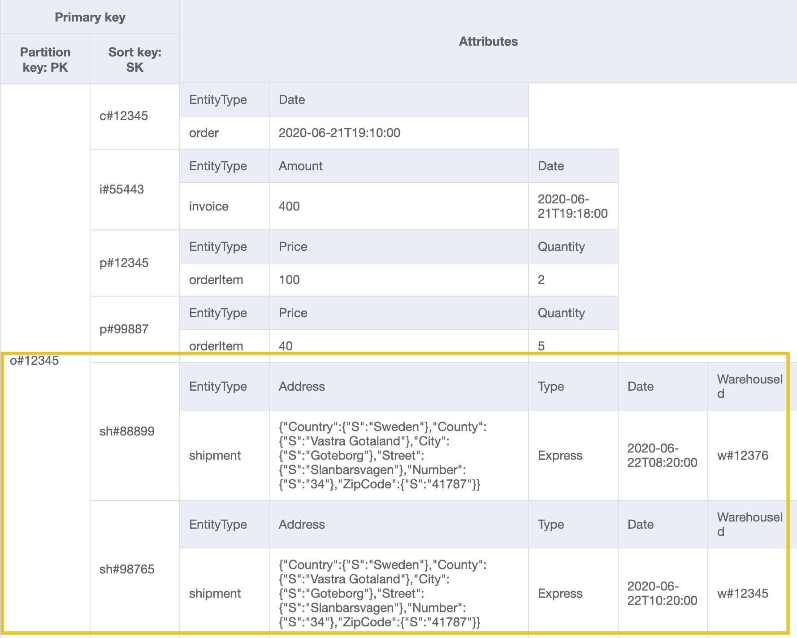

**Step 8: Address access pattern 9
(`getOrderByProductIdForDateRange`)**

We created an _order_ item collection in the previous
step. This access pattern has new lookup dimensions (`ProductID` and
`Date`) which requires you to scan the whole table and filter out
relevant records to fetch targeted items. In order to address this access pattern, we'll
need to create a [global secondary index (GSI)](GSI.md "GSI.md"). Import [AnOnlineShop_10.json](https://github.com/aws-samples/amazon-dynamodb-design-patterns/blob/master/examples/an-online-shop/json/AnOnlineShop_10.json "https://github.com/aws-samples/amazon-dynamodb-design-patterns/blob/master/examples/an-online-shop/json/AnOnlineShop_10.json") to create a new item collection using the GSI that
makes it possible to retrieve `orderItem` data from several _order_ item collections. The data now has
`GSI1-PK` and `GSI1-SK` which will be `GSI1`’s
partition key and sort key, respectively.

DynamoDB automatically populates items which contain a GSI’s key attributes from the
table to the GSI. There is no need to manually do any additional inserts into the GSI.

To address access pattern 9, perform a query on `GSI1` with
`GSI1-PK=productId` and `GSI1SK between (date1,
 date2)`.

**Base table:**

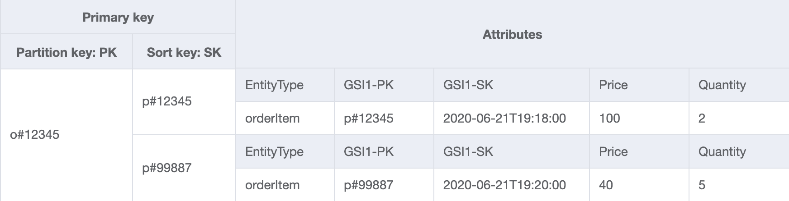

**GSI1:**

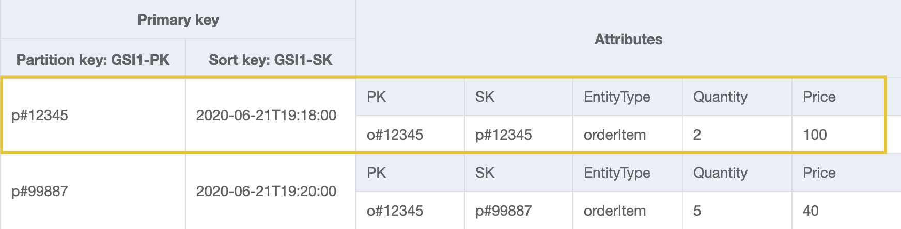

**Step 9: Address access patterns 10
(`getInvoiceByInvoiceId`) and 11
(`getPaymentByInvoiceId`)**

Import [AnOnlineShop_11.json](https://github.com/aws-samples/amazon-dynamodb-design-patterns/blob/master/examples/an-online-shop/json/AnOnlineShop_11.json "https://github.com/aws-samples/amazon-dynamodb-design-patterns/blob/master/examples/an-online-shop/json/AnOnlineShop_11.json") to address access patterns 10
(`getInvoiceByInvoiceId`) and 11 (`getPaymentByInvoiceId`),
both of which are related to `invoice`. Even though these are two different
access patterns, they are realized using the same key condition. `Payments`
are defined as an attribute with the map data type on the `invoice`
entity.

###### Note

`GSI1-PK` and `GSI1-SK` is overloaded to store information
about different entities so that multiple access patterns can be served from the
same GSI. For more information about GSI overloading, see [Overloading Global Secondary Indexes in DynamoDB](bp-gsi-overloading.md "bp-gsi-overloading.md").

To address access pattern 10 and 11, query `GSI1` with
`GSI1-PK=invoiceId` and `GSI1-SK=invoiceId`.

**GSI1:**

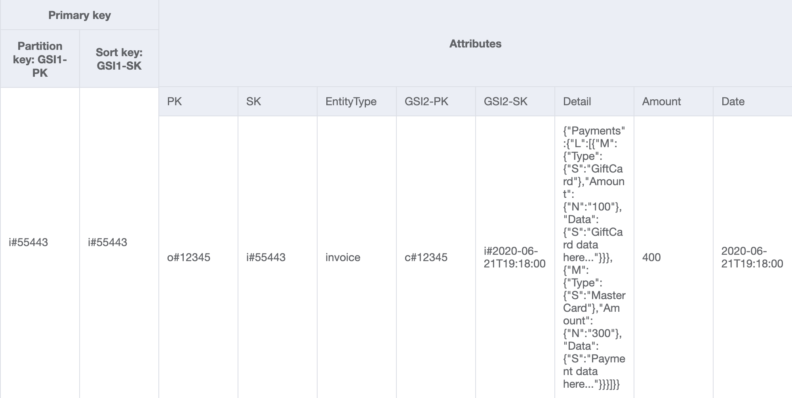

**Step 10: Address access patterns 12
(`getShipmentDetailsByShipmentId`) and 13
(`getShipmentByWarehouseId`)**

Import [AnOnlineShop_12.json](https://github.com/aws-samples/amazon-dynamodb-design-patterns/blob/master/examples/an-online-shop/json/AnOnlineShop_12.json "https://github.com/aws-samples/amazon-dynamodb-design-patterns/blob/master/examples/an-online-shop/json/AnOnlineShop_12.json") to address access patterns 12
(`getShipmentDetailsByShipmentId`) and 13
(`getShipmentByWarehouseId`).

Notice that `shipmentItem` entities are added to the _order_ item collection on the base table in order to be able
to retrieve all details about an order in a single query operation.

**Base table:**

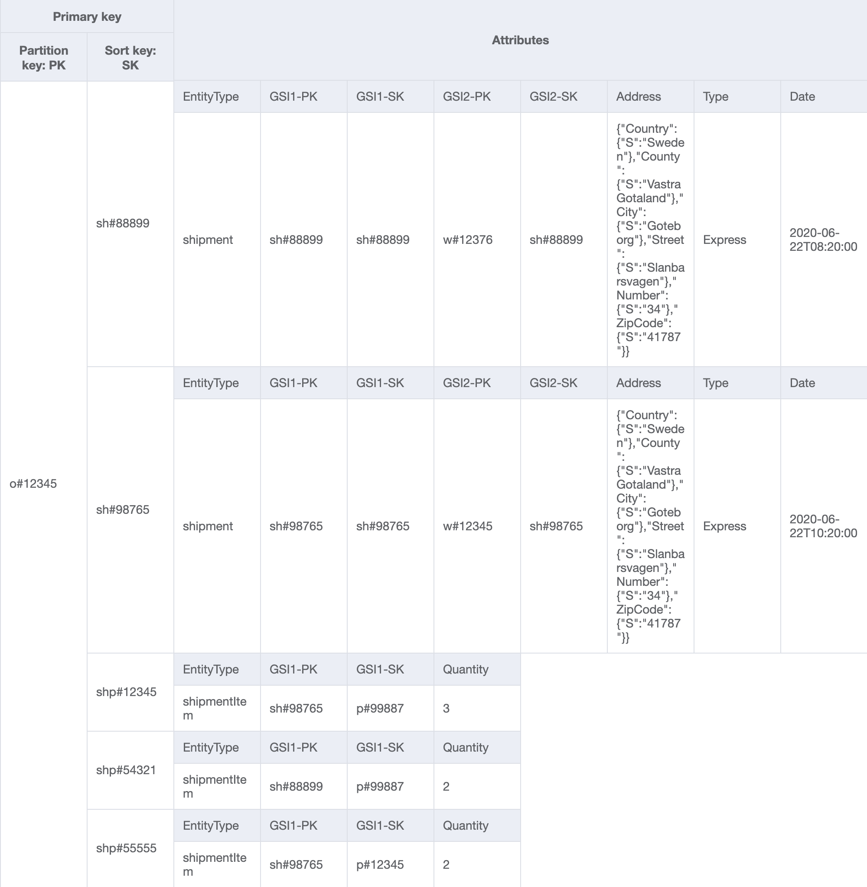

The `GSI1` partition and sort keys have already been used to model a
one-to-many relationship between `shipment` and `shipmentItem`. To
address access pattern 12 (`getShipmentDetailsByShipmentId`), query
`GSI1` with `GSI1-PK=shipmentId` and
`GSI1-SK=shipmentId`.

**GSI1:**

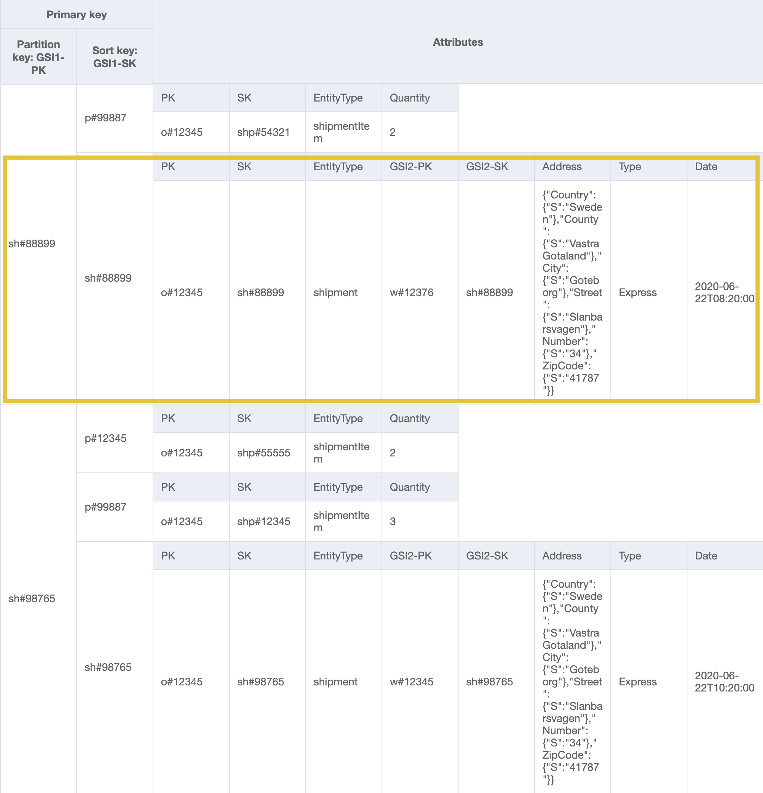

We’ll need to create another GSI (`GSI2`) to model the new one-to-many
relationship between `warehouse` and `shipment` for access pattern
13 (`getShipmentByWarehouseId`). To address this access pattern, query
`GSI2` with `GSI2-PK=warehouseId` and `GSI2-SK
 begins_with “sh#”`.

**GSI2:**

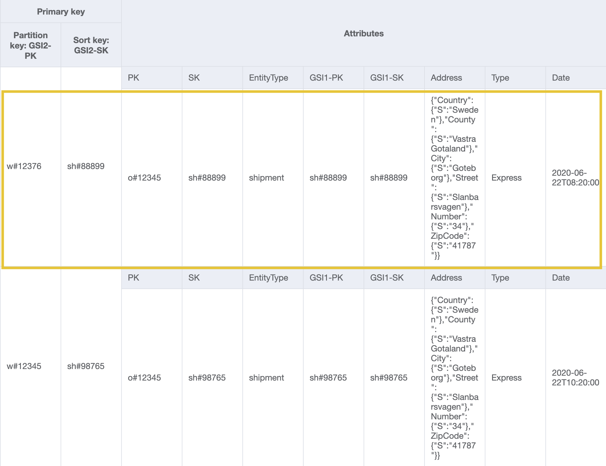

**Step 11: Address access patterns 14
(`getProductInventoryByWarehouseId`) 15
(`getInvoiceByCustomerIdForDateRange`), and 16
(`getProductsByCustomerIdForDateRange`)**

Import [AnOnlineShop_13.json](https://github.com/aws-samples/amazon-dynamodb-design-patterns/blob/master/examples/an-online-shop/json/AnOnlineShop_13.json "https://github.com/aws-samples/amazon-dynamodb-design-patterns/blob/master/examples/an-online-shop/json/AnOnlineShop_13.json") to add data related to the next set of access
patterns. To address access pattern 14 (`getProductInventoryByWarehouseId`),
query `GSI2` with `GSI2-PK=warehouseId` and `GSI2-SK
 begins_with “p#”`.

**GSI2:**

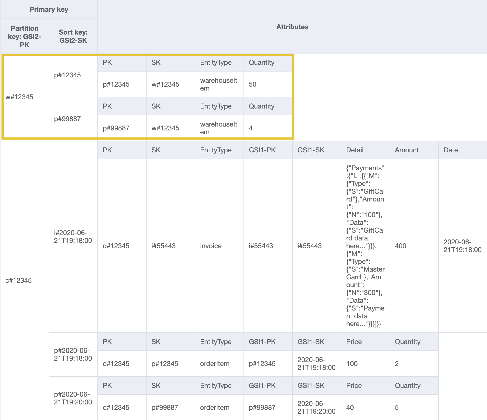

To address access pattern 15 (`getInvoiceByCustomerIdForDateRange`), query
`GSI2` with `GSI2-PK=customerId` and `GSI2-SK between
 (i#date1, i#date2)`.

**GSI2:**

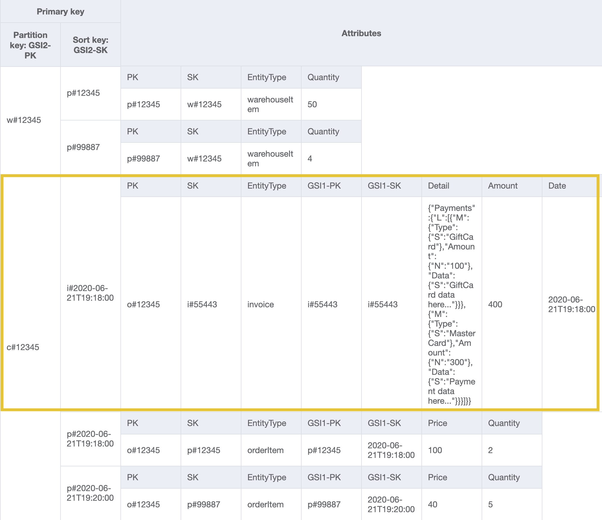

To address access pattern 16 (`getProductsByCustomerIdForDateRange`), query
`GSI2` with `GSI2-PK=customerId` and `GSI2-SK between
 (p#date1, p#date2)`.

**GSI2:**

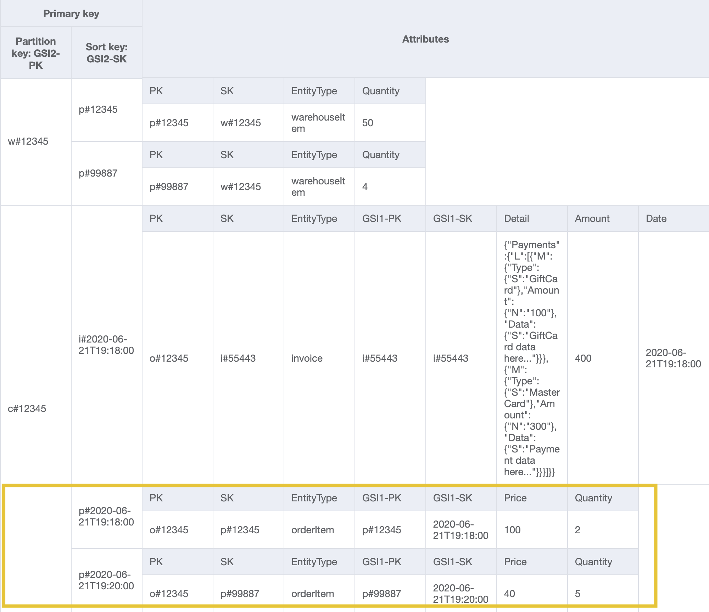

###### Note

In [NoSQL Workbench](workbench.md "workbench.md"), _facets_ represent an application's different data access patterns for
DynamoDB. Facets give you a way to view a subset of the data in a table, without having
to see records that don't meet the constraints of the facet. Facets are considered a
visual data modeling tool, and don't exist as a usable construct in DynamoDB as they
are purely an aid for modeling access patterns.

Import [AnOnlineShop_facets.json](https://github.com/aws-samples/amazon-dynamodb-design-patterns/blob/master/examples/an-online-shop/json/AnOnlineShop_facets.json "https://github.com/aws-samples/amazon-dynamodb-design-patterns/blob/master/examples/an-online-shop/json/AnOnlineShop_facets.json") to see the facets for this use case.

All access patterns and how the schema design addresses them are summarized in the
table below:

| Access pattern                      | Base table/GSI/LSI | Operation | Partition key value | Sort key value                 |
| ----------------------------------- | ------------------ | --------- | ------------------- | ------------------------------ | -------------------------------------------------------------------------------------------------------------------------------------------------------------------------------------------------------------------------------------------------------------------------------------------------------------------------------------------------------------------------------------------------------------------------------------------------------------------------------------------------------------------------------------------------------------------------------------------------------------------------------------------------------------------------------------------------------------------------------------------------------------------------------------------------------------------------------------------------------------------------------------------------------------------------------------------------------------------------------------------------------------------------------------------------------------------------------------------------------------------------------------------------------------------------------------------------------------------------------------------------------------------------------------------------------------------------------------------------------------------------------------------------------------------------------------------------------------------------------------------------------------------------------------------------------------------------------------------------------------------------------------------------------------------------------------------------------------------------------------------------------------------------------------------------------------------------------------------------------------------------------------------------------------------------------------------- |
| getCustomerByCustomerId             | Base table         | GetItem   | PK=customerId       | SK=customerId                  |
| getProductByProductId               | Base table         | GetItem   | PK=productId        | SK=productId                   |
| getWarehouseByWarehouseId           | Base table         | GetItem   | PK=warehouseId      | SK=warehouseId                 |
| getProductInventoryByProductId      | Base table         | Query     | PK=productId        | SK begins_with "w#"            |
| getOrderDetailsByOrderId            | Base table         | Query     | PK=orderId          |                                |
| getProductByOrderId                 | Base table         | Query     | PK=orderId          | SK begins_with "p#"            |
| getInvoiceByOrderId                 | Base table         | Query     | PK=orderId          | SK begins_with "i#"            |
| getShipmentByOrderId                | Base table         | Query     | PK=orderId          | SK begins_with "sh#"           |
| getOrderByProductIdForDateRange     | GSI1               | Query     | PK=productId        | SK between date1 and date2     |
| getInvoiceByInvoiceId               | GSI1               | Query     | PK=invoiceId        | SK=invoiceId                   |
| getPaymentByInvoiceId               | GSI1               | Query     | PK=invoiceId        | SK=invoiceId                   |
| getShipmentDetailsByShipmentId      | GSI1               | Query     | PK=shipmentId       | SK=shipmentId                  |
| getShipmentByWarehouseId            | GSI2               | Query     | PK=warehouseId      | SK begins_with "sh#"           |
| getProductInventoryByWarehouseId    | GSI2               | Query     | PK=warehouseId      | SK begins_with "p#"            |
| getInvoiceByCustomerIdForDateRange  | GSI2               | Query     | PK=customerId       | SK between i#date1 and i#date2 |
| getProductsByCustomerIdForDateRange | GSI2               | Query     | PK=customerId       | SK between p#date1 and p#date2 | ### Online shop final schema Here are the final schema designs. To download this schema design as a JSON file, see [DynamoDB Design Patterns](https://github.com/aws-samples/aws-dynamodb-examples/tree/master/schema_design/SchemaExamples "https://github.com/aws-samples/aws-dynamodb-examples/tree/master/schema_design/SchemaExamples") on GitHub. **Base table** 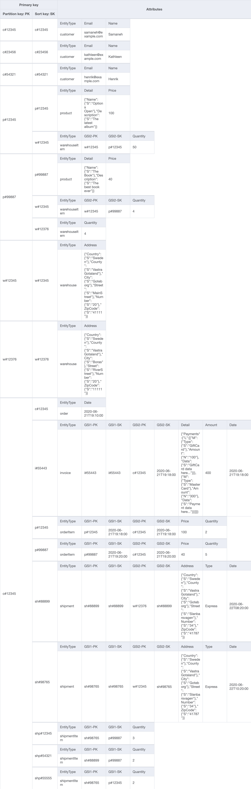 **GSI1** 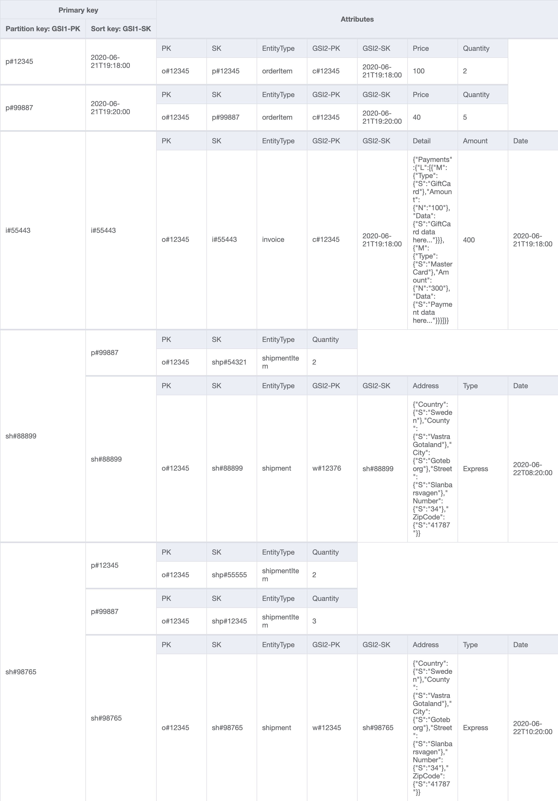 **GSI2** 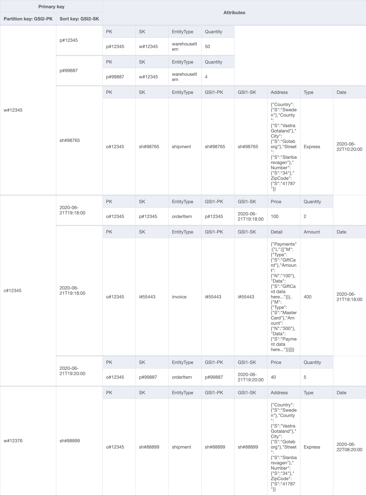 ## Using NoSQL Workbench with this schema design You can import this final schema into [NoSQL Workbench](workbench.md "workbench.md"), a visual tool that provides data modeling, data visualization, and query development features for DynamoDB, to further explore and edit your new project. Follow these steps to get started: 1. Download NoSQL Workbench. For more information, see [Download NoSQL Workbench for DynamoDB](workbench.md "workbench.md"). 2. Download the JSON schema file listed above, which is already in the NoSQL Workbench model format. 3. Import the JSON schema file into NoSQL Workbench. For more information, see [Importing an existing data model](workbench.Modeler.md "workbench.Modeler.md"). 4. Once you've imported into NOSQL Workbench, you can edit the data model. For more information, see [Editing an existing data model](workbench.Modeler.md "workbench.Modeler.md"). 5. To visualize your data model, add sample data, or import sample data from a CSV file, use the [Data Visualizer](workbench.md "workbench.md") feature of NoSQL Workbench. |
