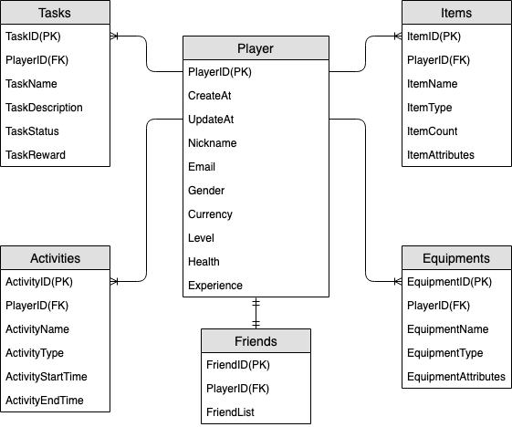
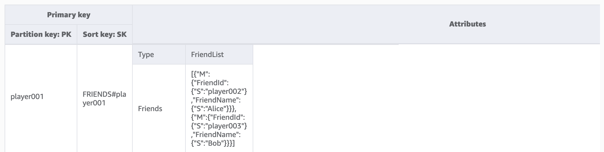
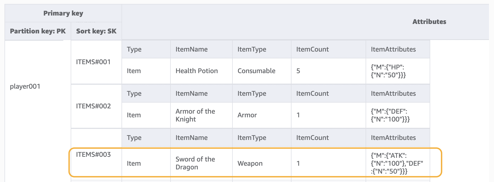
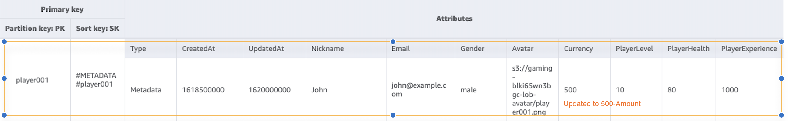
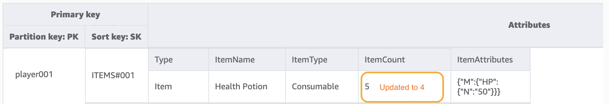
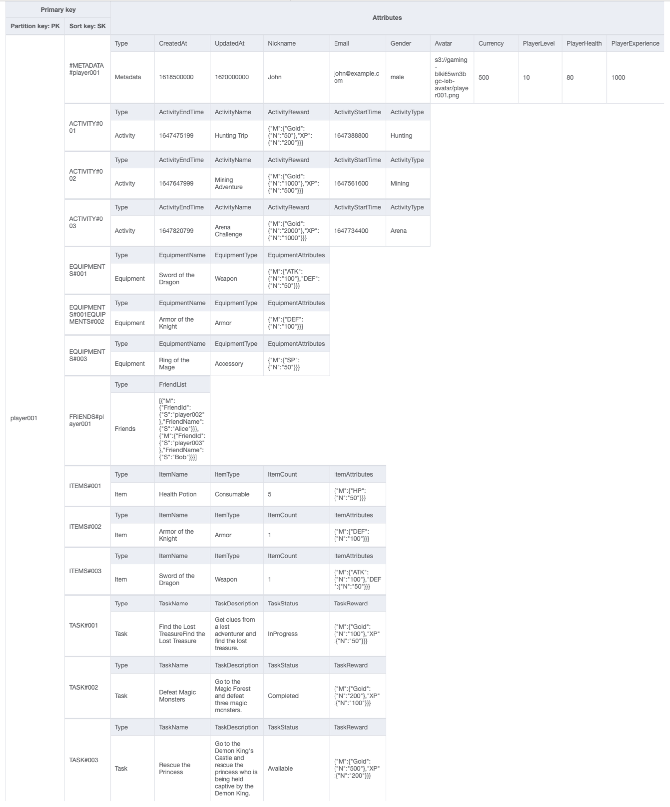

# Gaming profile schema design in DynamoDB

## Gaming profile business use case

This use case talks about using DynamoDB to store player profiles for a gaming system.
Users (in this case, players) need to create profiles before they can interact with many
modern games, especially online ones. Gaming profiles typically include the
following:

- Basic information such as their user name
- Game data such as items and equipment
- Game records such as tasks and activities
- Social information such as friend lists

To meet the fine-grained data query access requirements for this application, the
primary keys (partition key and sort key) will use generic names (PK and SK) so they can
be overloaded with various types of values as we will see below.

The access patterns for this schema design are:

- Get a user's friend list
- Get all of a player's information
- Get a user's item list
- Get a specific item from the user's item list
- Update a user's character
- Update the item count for a user

The size of the gaming profile will vary in different games. [Compressing large attribute values](bp-use-s3-too.md "bp-use-s3-too.md") can let them fit
within item limits in DynamoDB and reduce costs. The throughput management strategy would
depend various on factors such as: number of players, number of games played per second,
and seasonality of the workload. Typically for a newly launched game, the number of
players and the level of popularity are unknown so we will start with the [on-demand throughput mode](capacity-mode.md#capacity-mode-on-demand "capacity-mode.md#capacity-mode-on-demand").

## Gaming profile entity relationship diagram

This is the entity relationship diagram (ERD) we'll be using for the gaming profile
schema design.



## Gaming profile access patterns

These are the access patterns we'll be considering for the social network schema
design.

- `getPlayerFriends`
- `getPlayerAllProfile`
- `getPlayerAllItems`
- `getPlayerSpecificItem`
- `updateCharacterAttributes`
- `updateItemCount`

## Gaming profile schema design evolution

From the above ERD, we can see that this is a one-to-many relationship type of data
modeling. In DynamoDB, one-to-many data models can be organized into item collections,
which is different from traditional relational databases where multiple tables are
created and linked through foreign keys. An [item collections](WorkingWithItemCollections.md "WorkingWithItemCollections.md") is a group of items that share the same partition key value
but have different sort key values. Within an item collection, each item has a unique
sort key value that distinguishes it from other items. With this in mind, let’s use the
following pattern for `HASH` and `RANGE` values for each entity
type.

To begin, we use generic names like `PK` and `SK` to store
different types of entities in the same table to make the model future-proof. For better
readability, we can include prefixes to denote the type of data or include an arbitrary
attribute called `Entity_type` or `Type`. In the current example,
we use a string starting with `player` to store `player_ID` as the
`PK`; use `entity name#` as the prefix of `SK`, and
add a `Type` attribute to indicate which entity type this piece of data is.
This allows us to support storing more entity types in the future, and use advanced
technologies such as GSI Overloading and Sparse GSI to meet more access patterns.

Let’s start implementing the access patterns. Access patterns such as adding players
and adding equipment can be realized through the [`PutItem`](../APIReference/API_PutItem.md "../APIReference/API_PutItem.md") operation, so we can ignore them. In this document,
we’ll focus on the typical access patterns listed above.

**Step 1: Address access pattern 1
(`getPlayerFriends`)**

We address access pattern 1 (`getPlayerFriends`) with this step. In our
current design, friendship is simple and the number of friends in the game is small. For
simplicity's sake, we use a list data type to store friend lists (1:1 modeling). In this
design, we use [`GetItem`](../APIReference/API_GetItem.md "../APIReference/API_GetItem.md") to satisfy this access pattern. In the
`GetItem` operation, we explicitly provide the partition key and sort key
value to get a specific item.

However, if a game has a large number of friends, and the relationships between them
are complex (such as friendships being bi-directional with both an invite and accept
component) it would be necessary to use a many-to-many relationship to store each friend
individually, in order to scale to an unlimited friend list size. And if the friendship
change involves operating on multiple items at the same time, DynamoDB transactions can be
used to group multiple actions together and submit them as a single all-or-nothing
[`TransactWriteItems`](../APIReference/API_TransactWriteItems.md "../APIReference/API_TransactWriteItems.md") or [`TransactGetItems`](../APIReference/API_TransactGetItems.md "../APIReference/API_TransactGetItems.md") operation.



**Step 2: Address access patterns 2
(`getPlayerAllProfile`), 3 (`getPlayerAllItems`), and 4
(`getPlayerSpecificItem`)**

We address access patterns 2 (`getPlayerAllProfile`), 3
(`getPlayerAllItems`), and 4 (`getPlayerSpecificItem`) using
this step. What these three access patterns have in common is a range query, which uses
the [Query](Query.md "Query.md") operation. Depending on the scope of
the query, [Key Condition](Query.md "Query.md") and [Filter Expressions](Query.md "Query.md") are used, which are
commonly used in practical development.

In the Query operation, we provide a single value for Partition Key and get all items
with that Partition Key value. Access pattern 2 (`getPlayerAllProfile`) is
implemented in this way. Optionally, we can add a sort key condition expression — a
string that determines the items to be read from the table. Access pattern 3
(`getPlayerAllItems`) is implemented by adding the key condition of sort
key begins_with `ITEMS#`. Further, in order to simplify the development of
the application side, we can use filter expressions to implement access pattern 4
(`getPlayerSpecificItem`).

Here's a pseudocode example using filter expression that filters items of the
`Weapon` category:

```
filterExpression: "ItemType = :itemType"
expressionAttributeValues: {":itemType": "Weapon"}
```



###### Note

A filter expression is applied after a Query finishes, but before the results are
returned to the client. Therefore, a Query consumes the same amount of read capacity
regardless of whether a filter expression is present.

If the access pattern is to query a large dataset and filter out a large amount of
data to keep only a small subset of data, the appropriate approach is to design DynamoDB
Partition Key and Sort Key more effectively. For example, in the above example for
obtaining a certain `ItemType`, if there are many items for each player and
querying for a certain `ItemType` is a typical access pattern, it would be
more efficient to bring `ItemType` into the `SK` as a composite
key. The data model would look like this: `ITEMS#ItemType#ItemId`.

**Step 3: Address access patterns 5
(`updateCharacterAttributes`) and 6 (`updateItemCount`)**

We address access patterns 5 (`updateCharacterAttributes`) and 6
(`updateItemCount`) using this step. When the player needs to modify the
character, such as reducing the currency, or modifying the quantity of a certain weapon
in their items, use [`UpdateItem`](../APIReference/API_UpdateItem.md "../APIReference/API_UpdateItem.md") to implement these access patterns. To update a
player's currency but ensure it never goes below a minimum amount, we can add a [DynamoDB condition expression CLI example](Expressions.md "Expressions.md") to reduce the balance only if it's
greater than or equal to the minimum amount. Here is a pseudocode example:

```
UpdateExpression: "SET currency = currency - :amount"
ConditionExpression: "currency >= :minAmount"
```



When developing with DynamoDB and using [Atomic Counters](WorkingWithItems.md#WorkingWithItems.AtomicCounters "WorkingWithItems.md#WorkingWithItems.AtomicCounters") to decrement inventory, we can ensure idempotency by using
optimistic locking. Here is a pseudocode example for Atomic Counters:

```
UpdateExpression: "SET ItemCount = ItemCount - :incr"
expression-attribute-values: '{":incr":{"N":"1"}}'
```



In addition, in a scenario where the player purchases an item with currency, the
entire process needs to deduct currency and add an item at the same time. We can use
DynamoDB Transactions to group multiple actions together and submit them as a single
all-or-nothing `TransactWriteItems` or `TransactGetItems`
operation. `TransactWriteItems` is a synchronous and idempotent write
operation that groups up to 100 write actions in a single all-or-nothing operation. The
actions are completed atomically so that either all of them succeed or none of them
succeeds. Transactions help eliminate the risk of duplication or vanishing currency. For
more information on transactions, see [DynamoDB transactions example](transaction-example.md "transaction-example.md") .

All access patterns and how the schema design addresses them are summarized in the
table below:

| Access pattern            | Base table/GSI/LSI | Operation  | Partition key value | Sort key value          | Other conditions/filters                                                                                        |
| ------------------------- | ------------------ | ---------- | ------------------- | ----------------------- | --------------------------------------------------------------------------------------------------------------- |
| getPlayerFriends          | Base table         | GetItem    | PK=PlayerID         | SK=“FRIENDS#playerID”   |                                                                                                                 |
| getPlayerAllProfile       | Base table         | Query      | PK=PlayerID         |                         |                                                                                                                 |
| getPlayerAllItems         | Base table         | Query      | PK=PlayerID         | SK begins_with “ITEMS#” |                                                                                                                 |
| getPlayerSpecificItem     | Base table         | Query      | PK=PlayerID         | SK begins_with “ITEMS#” | filterExpression: "ItemType = :itemType" expressionAttributeValues: {<br>":itemType": "Weapon" }                |
| updateCharacterAttributes | Base table         | UpdateItem | PK=PlayerID         | SK=“#METADATA#playerID” | UpdateExpression: "SET currency = currency<br>• :amount"<br>ConditionExpression: "currency >= :minAmount"       |
| updateItemCount           | Base table         | UpdateItem | PK=PlayerID         | SK =“ITEMS#ItemID”      | update-expression: "SET ItemCount = ItemCount<br>• :incr"<br>expression-attribute-values: '{":incr":{"N":"1"}}' |

## Gaming profile final schema

Here is the final schema design. To download this schema design as a JSON file, see
[DynamoDB Examples](https://github.com/aws-samples/aws-dynamodb-examples/blob/master/schema_design/SchemaExamples/GamingPlayerProfiles/GamePlayerProfilesSchema.json "https://github.com/aws-samples/aws-dynamodb-examples/blob/master/schema_design/SchemaExamples/GamingPlayerProfiles/GamePlayerProfilesSchema.json") on GitHub.

**Base table:**



## Using NoSQL Workbench with this schema design

You can import this final schema into [NoSQL
Workbench](workbench.md "workbench.md"), a visual tool that provides data modeling, data visualization, and
query development features for DynamoDB, to further explore and edit your new project.
Follow these steps to get started:

1. Download NoSQL Workbench. For more information, see [Download NoSQL Workbench for DynamoDB](workbench.md "workbench.md").
2. Download the JSON schema file listed above, which is already in the NoSQL
   Workbench model format.
3. Import the JSON schema file into NoSQL Workbench. For more information, see
   [Importing an existing data model](workbench.Modeler.md "workbench.Modeler.md").
4. Once you've imported into NOSQL Workbench, you can edit the data model. For
   more information, see [Editing an existing data model](workbench.Modeler.md "workbench.Modeler.md").
