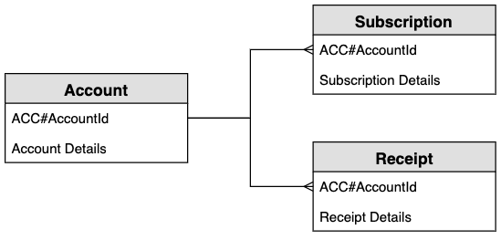
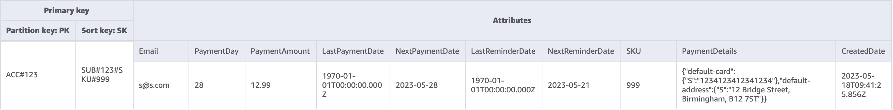
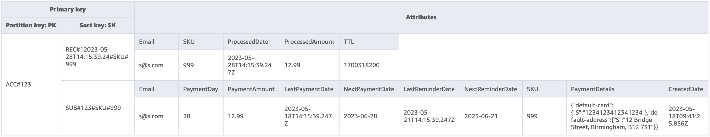
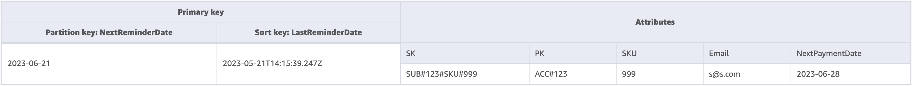
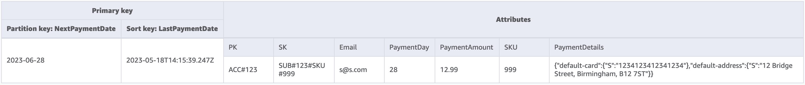
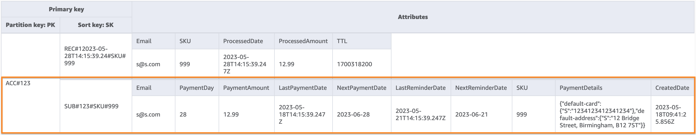

# Recurring payments schema design in

DynamoDB

## Recurring payments

business use case

This use case talks about using DynamoDB to implement a recurring payments system. The
data model has the following entities: _accounts_,
_subscriptions_, and _receipts_. The specifics for our use case include the following:

- Each _account_ can have multiple _subscriptions_
- The _subscription_ has a
  `NextPaymentDate` when the next payment needs to be processed and
  a `NextReminderDate` when an email reminder is sent to the
  customer
- There is an item for the _subscription_ that
  is stored and updated when the payment been processed (the average item size is
  around 1KB and the throughput depends on the number of
  _accounts_ and _subscriptions_)
- The _payment_ processor will also create a
  _receipt_ as part of the process which is
  stored in the table and are set to expire after a period of time by using a
  [TTL](TTL.md "TTL.md") attribute

## Recurring payments entity

relationship diagram

This is the entity relationship diagram (ERD) we'll be using for the recurring
payments system schema design.

## Recurring

payments system access patterns

These are the access patterns we'll be considering for the recurring payments system
schema design.

1. `createSubscription`
2. `createReceipt`
3. `updateSubscription`
4. `getDueRemindersByDate`
5. `getDuePaymentsByDate`
6. `getSubscriptionsByAccount`
7. `getReceiptsByAccount`

## Recurring

payments schema design

The generic names `PK` and `SK` are used for key attributes to
allow storing different types of entities in the same table such as the account,
subscription, and receipt entities. The user first creates a subscription, which is
where the user agrees to pay an amount on the same day each month in return for a
product. They get the choice on which day of the month to process the payment. There is
also a reminder that will be sent prior to the payment being processed. The application
works by having two batch jobs that run each day: one batch job sends reminders due that
day and the other batch job processes any payments due that day.

**Step 1: Address access pattern 1
(`createSubscription`)**

Access pattern 1 (`createSubscription`) is used to initially create the
subscription, and the details including `SKU`, `NextPaymentDate`,
`NextReminderDate` and `PaymentDetails` are set. This step
shows the state of the table for just one account with one subscription. There can be
multiple subscriptions in the item collection so this is a one-to-many
relationship.

**Step 2: Address access patterns 2 (`createReceipt`)
and 3 (`updateSubscription`)**

Access pattern 2 (`createReceipt`) is used to create the receipt item.
After the payment is processed each month, the payment processor will write a receipt
back to the base table. There, could be multiple receipts in the item collection so this
is a one-to-many relationship. The payment processor will also update the subscription
item (access Pattern 3 (`updateSubscription`)) to update for the
`NextReminderDate` or the `NextPaymentDate` for the next
month.

**Step 3: Address access pattern 4
(`getDueRemindersByDate`)**

The application processes reminders for the payment in batches for the current day.
Therefore the application needs to access the subscriptions on a different dimension:
date rather than account. This is a good use case for a [global
secondary index (GSI)](GSI.md "GSI.md"). In this step we add the index `GSI-1`,
which uses the `NextReminderDate` as the GSI partition key. We do not need to
replicate all the items. This GSI is a [sparse index](data-modeling-blocks.md#data-modeling-blocks-sparse-index "data-modeling-blocks.md#data-modeling-blocks-sparse-index") and the receipts items are not replicated. We also do not need
to project all the attributes—we only need to include a subset of the attributes.
The image below shows the schema of `GSI-1` and it gives the information
needed for the application to send the reminder email.

**Step 4: Address access pattern 5
(`getDuePaymentsByDate`)**

The application processes the payments in batches for the current day in the same way
it does with reminders. We add `GSI-2` in this step, and it uses the
`NextPaymentDate` as the GSI partition key. We do not need to replicate
all the items. This GSI is a sparse index as the receipts items are not replicated. The
image below shows the schema of `GSI-2`.

**Step 5: Address access patterns 6
(`getSubscriptionsByAccount`) and 7
(`getReceiptsByAccount`)**

The application can retrieve all the subscriptions for an account by using a [query](Query.md "Query.md") on the base table that targets the account identifier
(the `PK`) and uses the range operator to get all the items where the
`SK` begins with “SUB#”. The application can also use the same query
structure to retrieve all the receipts by using a range operator to get all the items
where the `SK` begins with “REC#”. This allows us to satisfy access patterns
6 (`getSubscriptionsByAccount`) and 7 (`getReceiptsByAccount`).
The application uses these access patterns so the user can see their current
subscriptions and their past receipts for the last six months. There is no change to the
table schema in this step and we can see below how we target just the subscription
item(s) in access pattern 6 (`getSubscriptionsByAccount`).

All access patterns and how the schema design addresses them are summarized in the
table below:

| Access pattern            | Base table/GSI/LSI | Operation  | Partition key value | Sort key value               |
| ------------------------- | ------------------ | ---------- | ------------------- | ---------------------------- |
| createSubscription        | Base table         | PutItem    | ACC#account_id      | SUB#<SUBID>#SKU<SKUID>       |
| createReceipt             | Base table         | PutItem    | ACC#account_id      | REC#<RecieptDate>#SKU<SKUID> |
| updateSubscription        | Base table         | UpdateItem | ACC#account_id      | SUB#<SUBID>#SKU<SKUID>       |
| getDueRemindersByDate     | GSI-1              | Query      | <NextReminderDate>  |                              |
| getDuePaymentsByDate      | GSI-2              | Query      | <NextPaymentDate>   |                              |
| getSubscriptionsByAccount | Base table         | Query      | ACC#account_id      | SK begins_with “SUB#”        |
| getReceiptsByAccount      | Base table         | Query      | ACC#account_id      | SK begins_with “REC#”        |

## Recurring

payments final schema

Here are the final schema designs. To download this schema design as a JSON file, see
[DynamoDB Examples](https://github.com/aws-samples/aws-dynamodb-examples/blob/master/schema_design/SchemaExamples/ReocurringPayments/ReocurringPaymentsSchema.json "https://github.com/aws-samples/aws-dynamodb-examples/blob/master/schema_design/SchemaExamples/ReocurringPayments/ReocurringPaymentsSchema.json") on GitHub.

**Base table**

**GSI-1**

**GSI-2**

## Using NoSQL Workbench

with this schema design

You can import this final schema into [NoSQL
Workbench](workbench.md "workbench.md"), a visual tool that provides data modeling, data visualization, and
query development features for DynamoDB, to further explore and edit your new project.
Follow these steps to get started:

1. Download NoSQL Workbench. For more information, see [Download NoSQL Workbench for DynamoDB](workbench.md "workbench.md").
2. Download the JSON schema file listed above, which is already in the NoSQL
   Workbench model format.
3. Import the JSON schema file into NoSQL Workbench. For more information, see
   [Importing an existing data model](workbench.Modeler.md "workbench.Modeler.md").
4. Once you've imported into NOSQL Workbench, you can edit the data model. For
   more information, see [Editing an existing data model](workbench.Modeler.md "workbench.Modeler.md").
