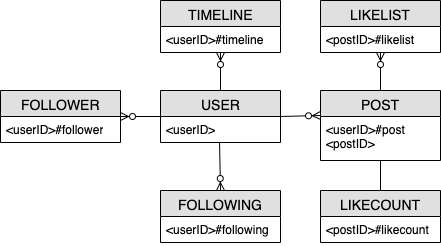
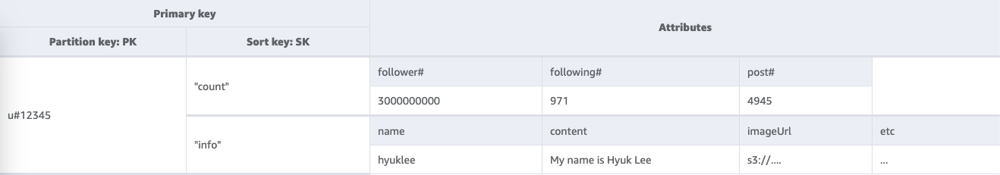
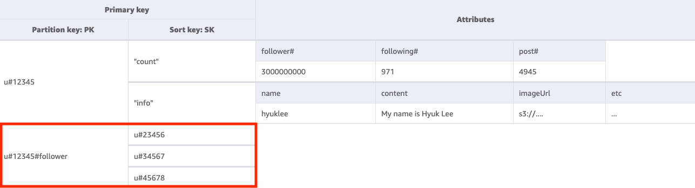
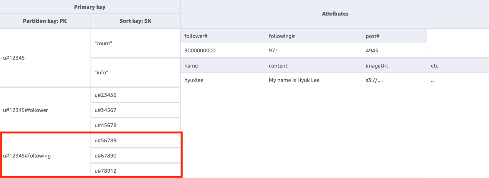
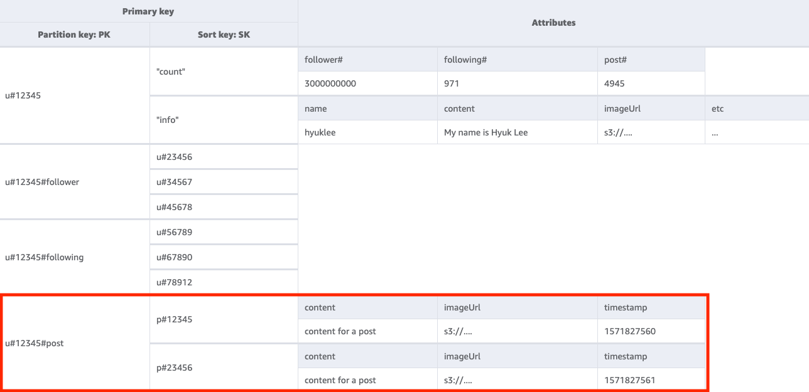
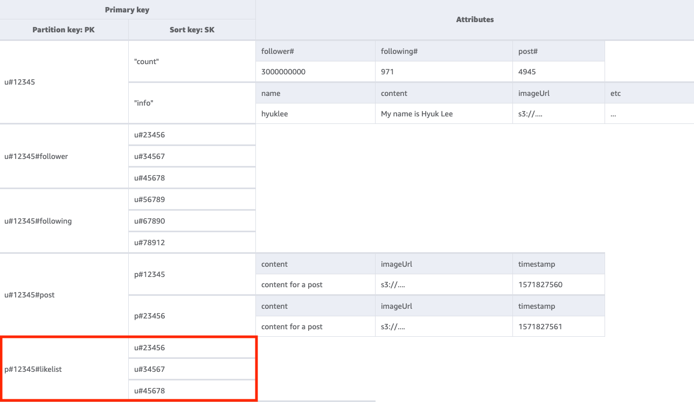
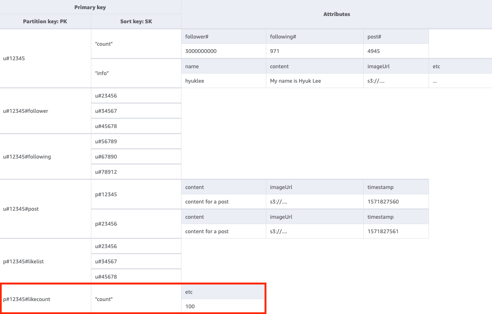
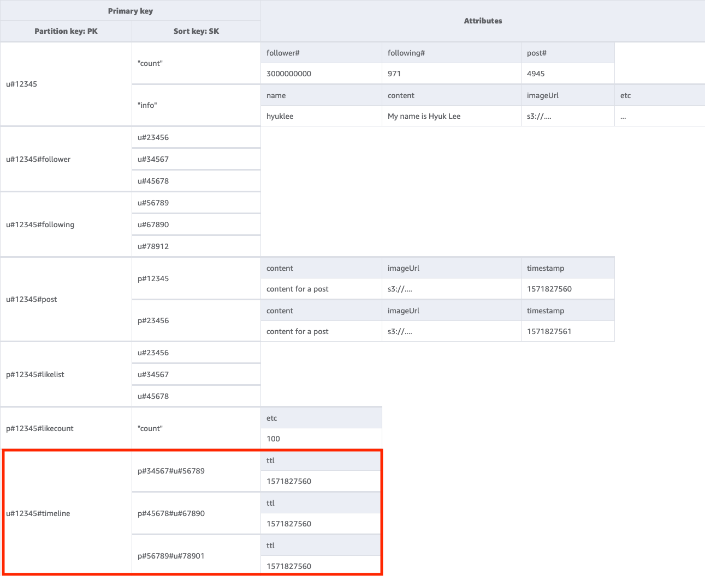
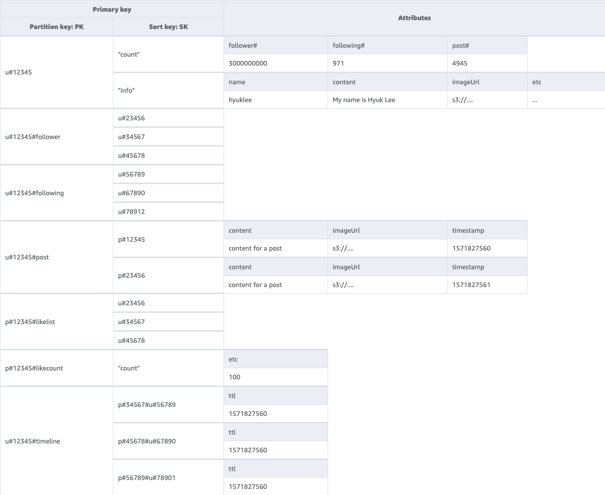

# Social network schema design in

DynamoDB

## Social network business

use case

This use case talks about using DynamoDB as a social network. A social network is an
online service that lets different users interact with each other. The social network
we'll design will let the user see a timeline consisting of their posts, their
followers, who they are following, and the posts written by who they are following. The
access patterns for this schema design are:

- Get user information for a given userID
- Get follower list for a given userID
- Get following list for a given userID
- Get post list for a given userID
- Get user list who likes the post for a given postID
- Get the like count for a given postID
- Get the timeline for a given userID

## Social network entity

relationship diagram

This is the entity relationship diagram (ERD) we'll be using for the social network
schema design.

## Social network

access patterns

These are the access patterns we'll be considering for the social network schema
design.

- `getUserInfoByUserID`
- `getFollowerListByUserID`
- `getFollowingListByUserID`
- `getPostListByUserID`
- `getUserLikesByPostID`
- `getLikeCountByPostID`
- `getTimelineByUserID`

## Social network

schema design evolution

DynamoDB is a NoSQL database, so it does not allow you to perform a join - an operation
that combines data from multiple databases. Customers unfamiliar with DynamoDB might apply
relational database management system (RDBMS) design philosophies (such as creating a
table for each entity) to DynamoDB when they do not need to. The purpose of DynamoDB's
single-table design is to write data in a pre-joined form according to the application's
access pattern, and then immediately use the data without additional computation. For
more information, see [Single-table
vs. multi-table design in DynamoDB](https://aws.amazon.com/blogs/database/single-table-vs-multi-table-design-in-amazon-dynamodb/ "https://aws.amazon.com/blogs/database/single-table-vs-multi-table-design-in-amazon-dynamodb/").

Now, let's step through how we'll evolve our schema design to address all the access
patterns.

**Step 1: Address access pattern 1
(`getUserInfoByUserID`)**

To get a given user's information, we'll need to [`Query`](../APIReference/API_Query.md "../APIReference/API_Query.md")
the base table with a key condition of `PK=<userID>`. The query
operation lets you paginate the results, which can be useful when a user has many
followers. For more information on Query, see [Querying tables in DynamoDB](Query.md "Query.md").

In our example, we track two types of data for our user: their "count" and their
"info." A user's "count" reflects how many followers they have, how many users they are
following, and how many posts they've created. A user's "info" reflects their personal
information such as their name.

We see these two kinds of data represented by the two items below. The item that has
"count" in its sort key (SK) is more likely to change than the item with "info." DynamoDB
considers the size of the item as it appears before and after the update and the
provisioned throughput consumed will reflect the larger of these item sizes. So even if
you update just a subset of the item's attributes, [`UpdateItem`](../APIReference/API_UpdateItem.md "../APIReference/API_UpdateItem.md") will still consume the full amount of provisioned
throughput (the larger of the before and after item sizes). You can get the items via a
single `Query` operation and use `UpdateItem` to add or subtract
from existing numeric attributes.

**Step 2: Address access pattern 2
(`getFollowerListByUserID`)**

To get a list of users who are following a given user, we'll need to
`Query` the base table with a key condition of
`PK=<userID>#follower`.

**Step 3: Address access pattern 3
(`getFollowingListByUserID`)**

To get a list of users a given user is following, we'll need to `Query` the
base table with a key condition of `PK=<userID>#following`. You can
then use a [`TransactWriteItems`](../APIReference/API_TransactWriteItems.md "../APIReference/API_TransactWriteItems.md") operation to group up several requests together
and do the following:

- Add User A to User B's follower list, and then increment User B's follower
  count by one.
- Add User B to User A's follower list, and then increment User A's follower
  count by one.

**Step 4: Address access pattern 4
(`getPostListByUserID`)**

To get a list of posts created by a given user, we'll need to `Query` the
base table with a key condition of `PK=<userID>#post`. One important
thing to note here is that a user's postIDs must be incremental: the second postID value
must be greater than the first postID value (since users want to see their posts in a
sorted manner). You can do this by generating postIDs based on a time value like a
Universally Unique Lexicographically Sortable Identifier (ULID).

**Step 5: Address access pattern 5
(`getUserLikesByPostID`)**

To get a list of users who liked a given user's post, we'll need to `Query`
the base table with a key condition of `PK=<postID>#likelist`. This
approach is the same pattern that we used for retrieving the follower and following
lists in access pattern 2 (`getFollowerListByUserID`) and access pattern 3
(`getFollowingListByUserID`).

**Step 6: Address access pattern 6
(`getLikeCountByPostID`)**

To get a count of likes for a given post, we'll need to perform a [`GetItem`](../APIReference/API_GetItem.md "../APIReference/API_GetItem.md") operation on the base table with a key condition
of `PK=<postID>#likecount`. This access pattern can cause throttling
issues whenever a user with many followers (such as a celebrity) creates a post since
throttling occurs when a partition's throughput exceeds 1000 WCU per second. This
problem is not a result of DynamoDB, it just appears in DynamoDB since it's at the end of the
software stack.

You should evaluate whether it's really essential for all users to view the like count
simultaneously or if it can happen gradually over time. In general, a post's like count
doesn't need to be immediately 100% accurate. You can implement this strategy by putting
a queue between your application and DynamoDB to have the updates happen
periodically.

**Step 7: Address access pattern 7
(`getTimelineByUserID`)**

To get the timeline for a given user, we'll need to perform a `Query`
operation on the base table with a key condition of
`PK=<userID>#timeline`. Let's consider a scenario where a user's
followers need to view their post synchronously. Every time a user writes a post, their
follower list is read and their userID and postID are slowly entered into the timeline
key of all its followers. Then, when your application starts, you can read the timeline
key with the `Query` operation and fill the timeline screen with a
combination of userID and postID using the [`BatchGetItem`](../APIReference/API_BatchGetItem.md "../APIReference/API_BatchGetItem.md") operation for any new items. You cannot read
the timeline with an API call, but this is a more cost effective solution if the posts
could be edited frequently.

The timeline is a place that shows recent posts, so we'll need a way to clean up the
old ones. Instead of using WCU to delete them, you can use DynamoDB's [TTL](TTL.md "TTL.md") feature to do it for free.

All access patterns and how the schema design addresses them are summarized in the
table below:

| Access pattern           | Base table/GSI/LSI | Operation | Partition key value   | Sort key value | Other conditions/filters |
| ------------------------ | ------------------ | --------- | --------------------- | -------------- | ------------------------ |
| getUserInfoByUserID      | Base table         | Query     | PK=<userID>           |                |                          |
| getFollowerListByUserID  | Base table         | Query     | PK=<userID>#follower  |                |                          |
| getFollowingListByUserID | Base table         | Query     | PK=<userID>#following |                |                          |
| getPostListByUserID      | Base table         | Query     | PK=<userID>#post      |                |                          |
| getUserLikesByPostID     | Base table         | Query     | PK=<postID>#likelist  |                |                          |
| getLikeCountByPostID     | Base table         | GetItem   | PK=<postID>#likecount |                |                          |
| getTimelineByUserID      | Base table         | Query     | PK=<userID>#timeline  |                |                          |

## Social network final

schema

Here is the final schema design. To download this schema design as a JSON file, see
[DynamoDB Examples](https://github.com/aws-samples/aws-dynamodb-examples/blob/master/schema_design/SchemaExamples/SocialNetwork/SocialNetworkSchema.json "https://github.com/aws-samples/aws-dynamodb-examples/blob/master/schema_design/SchemaExamples/SocialNetwork/SocialNetworkSchema.json") on GitHub.

**Base table:**

## Using NoSQL Workbench with

this schema design

You can import this final schema into [NoSQL
Workbench](workbench.md "workbench.md"), a visual tool that provides data modeling, data visualization, and
query development features for DynamoDB, to further explore and edit your new project.
Follow these steps to get started:

1. Download NoSQL Workbench. For more information, see [Download NoSQL Workbench for DynamoDB](workbench.md "workbench.md").
2. Download the JSON schema file listed above, which is already in the NoSQL
   Workbench model format.
3. Import the JSON schema file into NoSQL Workbench. For more information, see
   [Importing an existing data model](workbench.Modeler.md "workbench.Modeler.md").
4. Once you've imported into NOSQL Workbench, you can edit the data model. For
   more information, see [Editing an existing data model](workbench.Modeler.md "workbench.Modeler.md").
