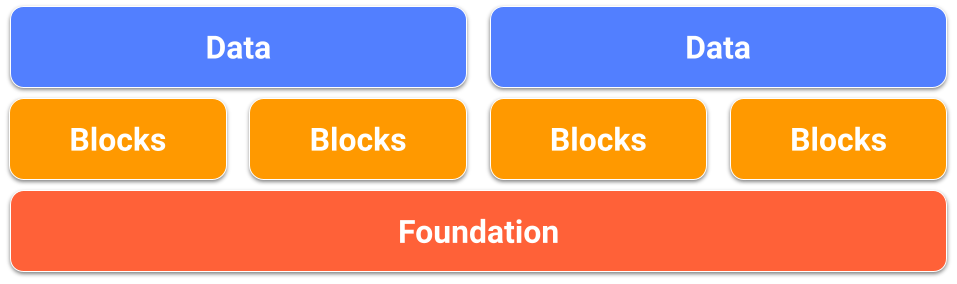

# Data modeling for DynamoDB tables

Before we dive into data modeling, it's important to understand some DynamoDB fundamentals.
DynamoDB is a key-value NoSQL database which allows flexible schema. The set of data attributes
apart from the key attributes for each item can be either uniform or discrete. The DynamoDB key
schema is in the form of either a simple primary key where a partition key uniquely identifies
an item, or in the form of a composite primary key where a combination of a partition key and
sort key uniquely defines an item. The partition key is hashed to determine the physical
location of data and retrieve it. Therefore, it is important to choose a high cardinality and
horizontally scalable attribute as a partition key to ensure even distribution of data. The sort
key attribute is optional in the key schema and having a sort key enables modelling one-to-many
relationships and creating item collections in DynamoDB. Sort keys are also referred to as range
keys—they are used to sort items in an item collection and also allow flexible
range-based operations.

For more details and best practices on DynamoDB key schema, you can refer to the
following:

- [Partitions and data distribution in DynamoDB](HowItWorks.md "HowItWorks.md")
- [Best practices for designing and using partition keys effectively in DynamoDB](bp-partition-key-design.md "bp-partition-key-design.md")
- [Best practices for using sort keys to organize data in DynamoDB](bp-sort-keys.md "bp-sort-keys.md")
- [Choosing the right DynamoDB partition key](https://aws.amazon.com/blogs/database/choosing-the-right-dynamodb-partition-key/ "https://aws.amazon.com/blogs/database/choosing-the-right-dynamodb-partition-key/")
  Secondary indexes are often needed to support additional query patterns in DynamoDB. Secondary
  indexes are shadow tables where the same data is organised via a different key schema compared
  to the base table. A local secondary index (LSI) shares the same partition key as the base table
  and allows having an alternate sort key allowing it to share the base table’s capacity. A global
  secondary index (GSI) can have a different partition key as well as a different sort key
  attribute than the base table which means throughput management for a GSI is independent of the
  base table.

For more details on secondary indexes and best practices, you can refer to the
following:

- [Improving data access with secondary indexes in DynamoDB](SecondaryIndexes.md "SecondaryIndexes.md")
- [Best practices for using secondary indexes in DynamoDB](bp-indexes.md "bp-indexes.md")
  Let's now look at data modeling a little closer. The process of designing a flexible and
  highly-optimized schema on DynamoDB, or any NoSQL database for that matter, can be a challenging
  skill to learn. The goal of this module is to help you develop a mental flowchart for designing
  a schema that will take you from use case into production. We will start with an introduction to
  the foundational choice of any design, single table versus multiple table design. Then we will
  review the multitude of design patterns (building blocks) that can be used to achieve various
  organizational or performance results for your application. Finally, we are including a variety
  of complete schema design packages for different use cases and industries.

###### Topics

- [Item collections - how to model one-to-many relationships in DynamoDB](WorkingWithItemCollections.md "WorkingWithItemCollections.md")
- [Data Modeling foundations in DynamoDB](data-modeling-foundations.md "data-modeling-foundations.md")
- [Data modeling building blocks in DynamoDB](data-modeling-blocks.md "data-modeling-blocks.md")
- [Data modeling schema design packages in DynamoDB](data-modeling-schemas.md "data-modeling-schemas.md")
- [Best practices for modeling relational data in DynamoDB](bp-relational-modeling.md "bp-relational-modeling.md")
