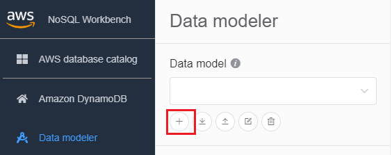
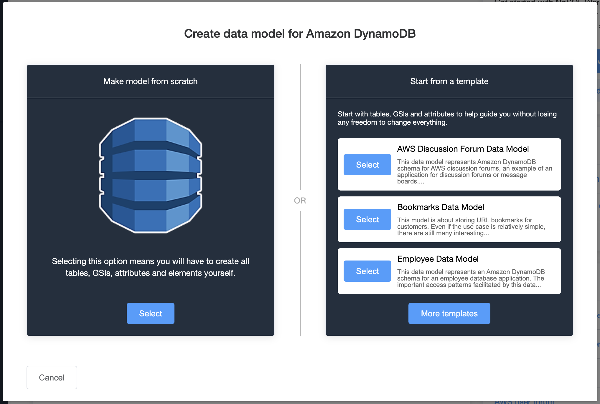
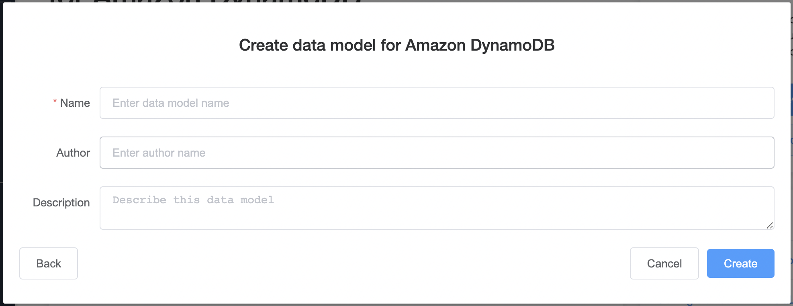
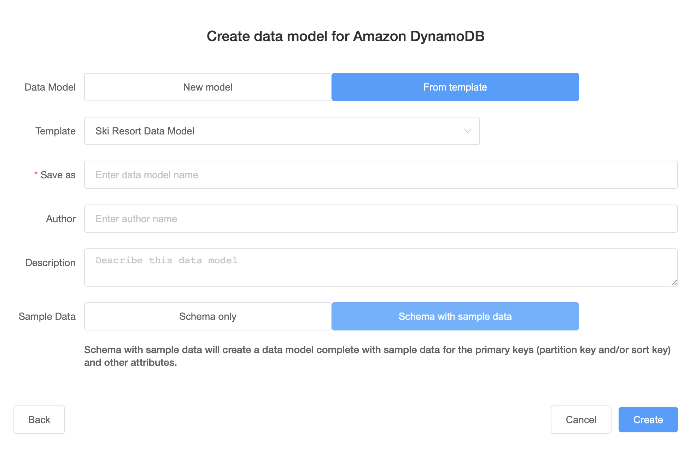
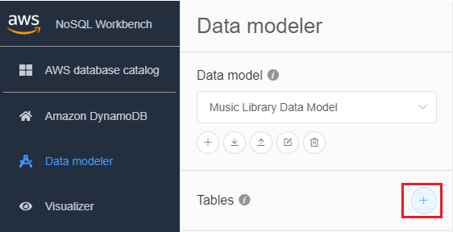
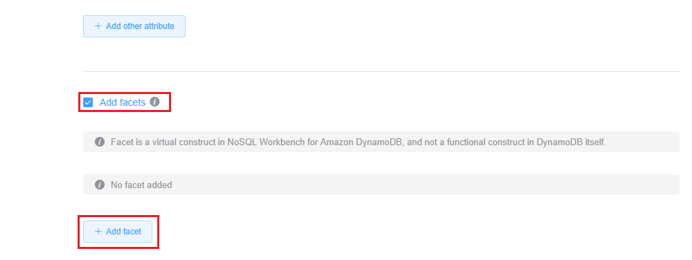
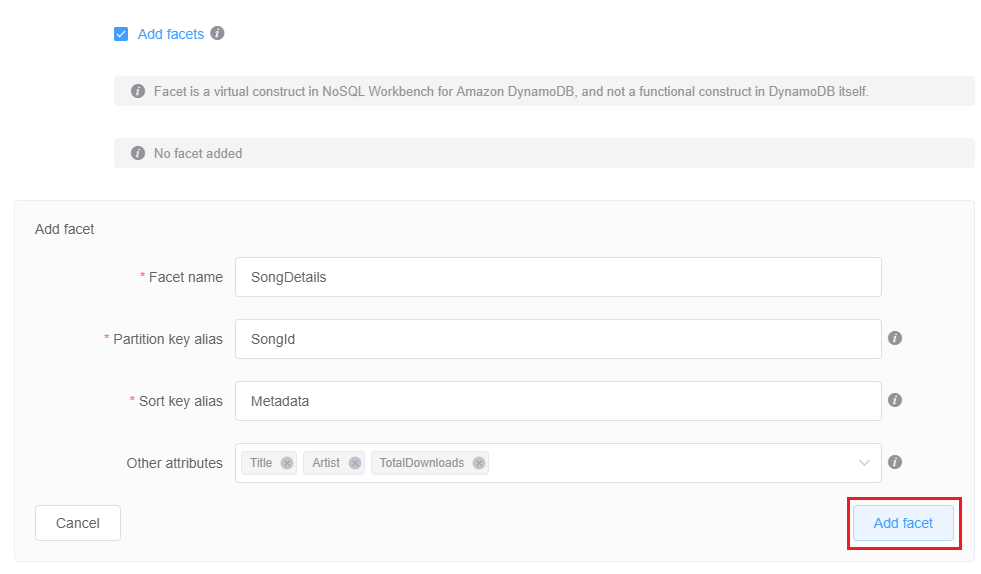
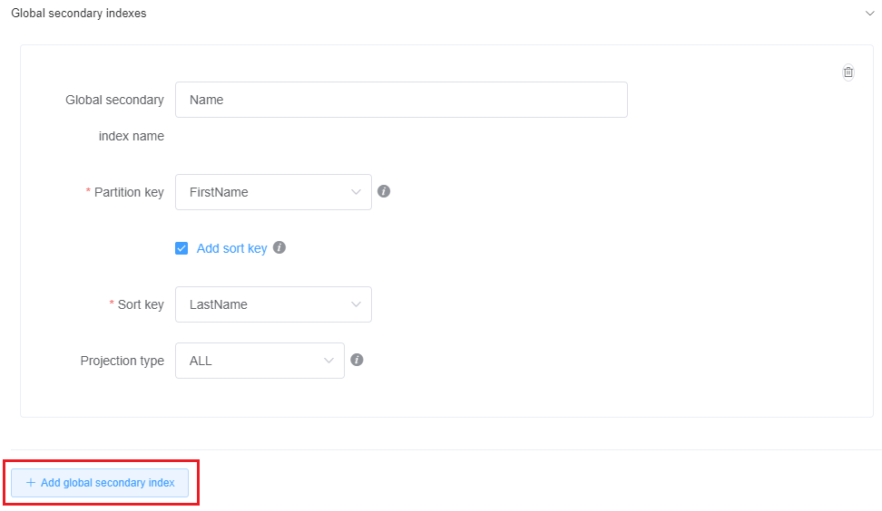
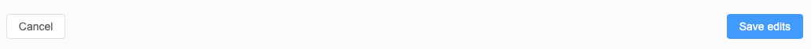

# Creating a new data model

Follow these steps to create a new data model in Amazon DynamoDB using NoSQL Workbench.

###### To create a new data model

1. Open NoSQL Workbench, and in the navigation pane on the left side, choose the
   **Data modeler** icon.

 2. Choose **Create data model**.

**Create data model** has two choices: Make model from scratch and Start from a template.

Make model from scratch
To make a model from scratch, enter a name, author, and description
for the data model. Choose **Create** when
finished.

Start from a template
Starting from a template lets you choose a sample model to start
from. Choose **More templates** to see more
template options. Choose **Select** for the
template that you want to use.

Enter a data model name, author, and description for the template you selected. You can choose
between **Schema only** and **Schema with sample data**.

    * **Schema only** creates an empty data model with the primary key (partition and
     sort key) and other attributes.
    * **Schema with sample data** will create a data model complete with sample
     data for the primary key (partition and sort key) and other attributes.

When this information is complete, choose **Create** to create the model.

 3. With the model created, choose **Add table**.

For more information about tables, see [Working
with tables in DynamoDB](WorkingWithTables.md "WorkingWithTables.md"). 4. Specify the following:

    * **Table name** – Enter a unique name for the
     table.
    * **Partition key** – Enter a partition key name,
     and specify its type. Optionally, you can also select a more granular data type
     format for sample data generation.
    * If you want to add a sort key:

    	1. Select **Add sort key**.
    	2. Specify the sort key name and its type. Optionally, you can select a more granular data type format
    	 for sample data generation.

###### Note

To learn more about primary key design, designing and using partition
keys effectively, and using sort keys, see the following:

    * [Primary key](HowItWorks.md#HowItWorks.CoreComponents.PrimaryKey "HowItWorks.md#HowItWorks.CoreComponents.PrimaryKey")
    * [Best practices for designing and using partition keys
     effectively in DynamoDB](bp-partition-key-design.md "bp-partition-key-design.md")
    * [Best practices for using sort keys to organize data in DynamoDB](bp-sort-keys.md "bp-sort-keys.md")

5. To add other attributes, do the following for each attribute:
   1. Choose **Add an attribute**.
   2. Specify the attribute name and its type. Optionally, you can select a more granular data type format
      for sample data generation.

6. Add a facet:

You can optionally add a facet. A facet is a virtual construct in NoSQL Workbench.
It is not a functional construct in DynamoDB itself.

###### Note

_Facets_ in NoSQL Workbench help you visualize an application's different data access patterns
for Amazon DynamoDB with only a subset of the data in a table. To learn more about facets, see [Viewing data access patterns](workbench.Visualizer.md "workbench.Visualizer.md").

To add a facet,

    * Select **Add facets**.
    * Choose **Add facet**.

    
    * Specify the following:

    	+ The **Facet name**.
    	+ A **Partition key alias** to help distinguish this facet view.
    	+ A **Sort key alias**.
    	+ Choose the **Other attributes** that are part
    	 of this facet.

Choose **Add facet**.

Repeat this step if you want to add more facets. 7. If you want to add a global secondary index, choose **Add
global secondary index**.

Specify the **Global secondary index name**,
**Partition key** attribute, and **Projection
type**.

For more information about working with global secondary indexes in DynamoDB, see
[Global secondary
indexes](GSI.md "GSI.md"). 8. Save the edits to your table settings..

For more information about the `CreateTable` API operation, see [CreateTable](../APIReference/API_CreateTable.md "../APIReference/API_CreateTable.md") in the _Amazon DynamoDB API Reference_.
