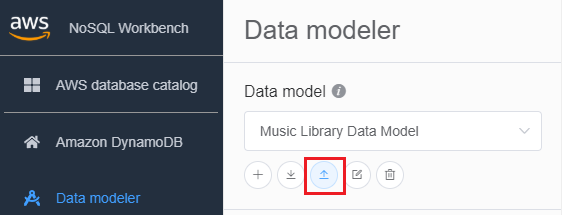
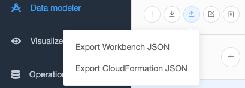
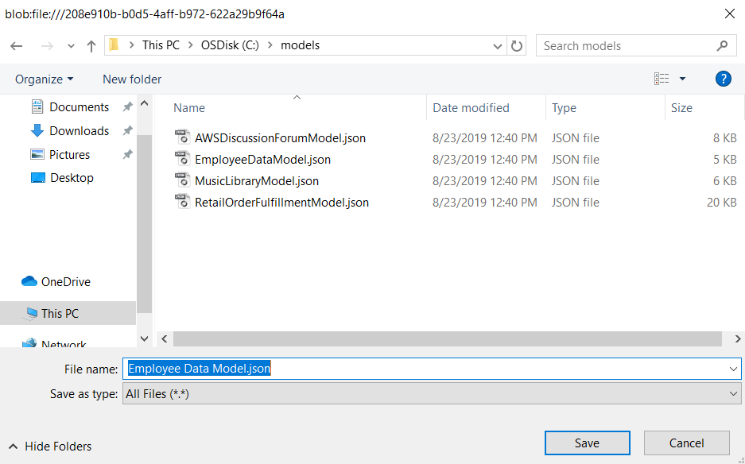

# Exporting a data model

After you create a data model using NoSQL Workbench for Amazon DynamoDB, you can save and
export the model in either NoSQL Workbench model format or [AWS CloudFormation
JSON template format](../../../AWSCloudFormation/latest/UserGuide/aws-resource-dynamodb-table.md "../../../AWSCloudFormation/latest/UserGuide/aws-resource-dynamodb-table.md").

###### To export a data model

1. In NoSQL Workbench, in the navigation pane on the left side, choose the
   **Data modeler** icon.

 2. Hover your pointer over **Export data model**.

In the dropdown list, choose whether to export your data model in NoSQL
Workbench model format or CloudFormation JSON template format.

 3. Choose a location to save your model.

