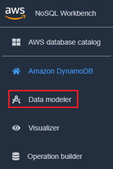
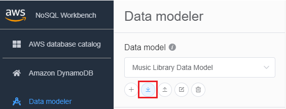
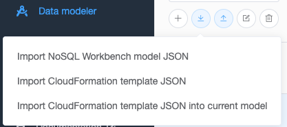
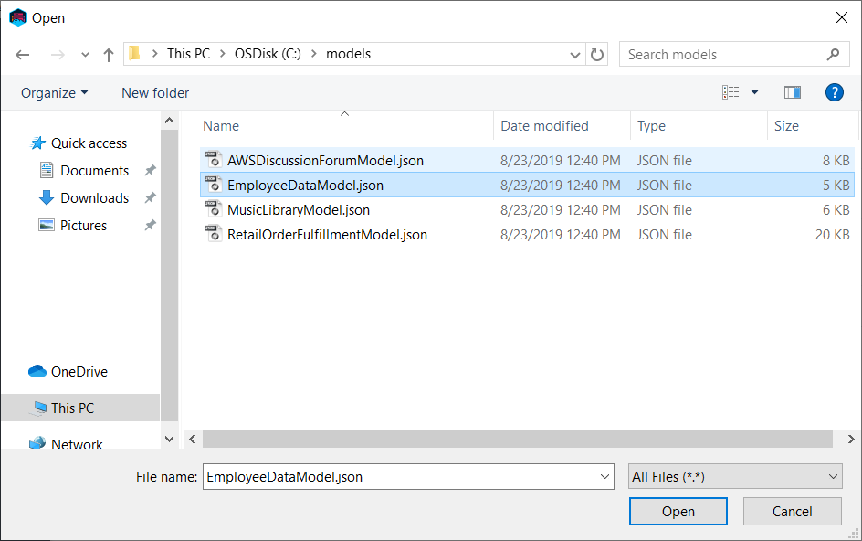
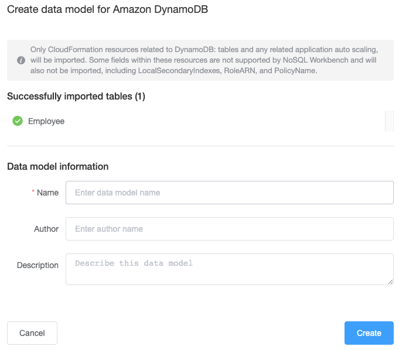

# Importing an existing data

model

You can use NoSQL Workbench for Amazon DynamoDB to build a data model by importing and
modifying an existing model. You can import data models in either NoSQL Workbench model
format or in [AWS CloudFormation
JSON template format](../../../AWSCloudFormation/latest/UserGuide/aws-resource-dynamodb-table.md "../../../AWSCloudFormation/latest/UserGuide/aws-resource-dynamodb-table.md").

###### To import a data model

1. In NoSQL Workbench, in the navigation pane on the left side, choose the
   **Data modeler** icon.

 2. Hover your pointer over **Import data model**.

In the dropdown list, choose whether the model you want to import is in NoSQL
Workbench model format or CloudFormation JSON template format. If you have an
existing data model open in NoSQL Workbench, you'll have the option to import a
CloudFormation template into the current model.

 3. Choose a model to import.

 4. If the model you're importing is in CloudFormation template format, you'll see a list
of tables to be imported and have an opportunity to specify a data model name,
author, and description.

