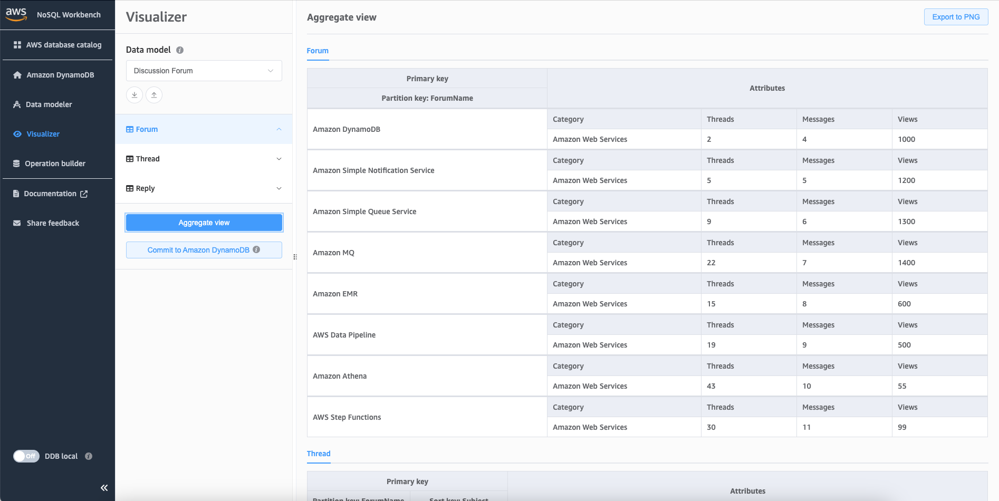

# Viewing all tables in a data model

using aggregate view

The aggregate view in NoSQL Workbench for Amazon DynamoDB represents all the tables in a
data model. For each table, the following information appears:

- Table column names
- Sample data
- All global secondary indexes that are associated with the table. The following
  information is displayed for each index:
  - Index column names
  - Sample data

###### To view all table information

1. In the navigation pane on the left side, choose the
   **visualizer** icon.

 2. In the visualizer, choose **Aggregate view**.

