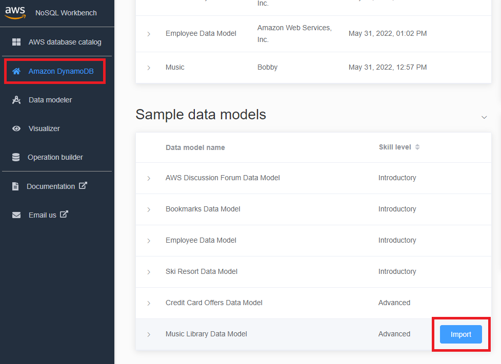
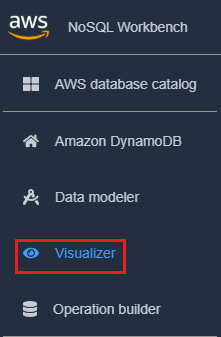
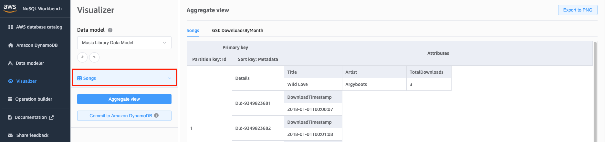
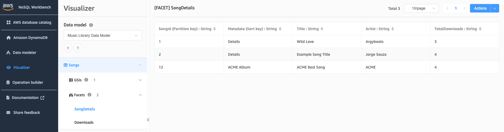

# Viewing data access patterns

In NoSQL Workbench, _facets_ represent an application's different
data access patterns for Amazon DynamoDB. Facets can help you visualize your data model when multiple data types
are represented by a sort key.
Facets give you a way to view a subset of the data in a table,
without having to see records that don't meet the constraints of the facet. Facets are considered a visual
data modeling tool, and don't exist as a usable construct in DynamoDB, as they are purely an aid to modeling of access patterns.

To see an example of facets, you can import one of our sample data models with facets as part of the data model template.

###### Import sample data model

1. On the left, choose **Amazon DynamoDB**.
2. In the Sample data models section, hover your pointer over Music Library Data
   Model and choose **Import**.

 3. In the navigation pane on the left side, choose the
**visualizer** icon.

 4. Choose the Songs table to expand it. You'll be shown an aggregate view of your data.

 5. Choose **Facets** drop-down arrow to expand the available facets. 6. Choose the SongDetails facet to visualize the data with the SongDetails facet applied.

You can also edit the facet definitions using the Data Modeler. For more information,
see [Editing an existing data model](workbench.Modeler.md "workbench.Modeler.md").
