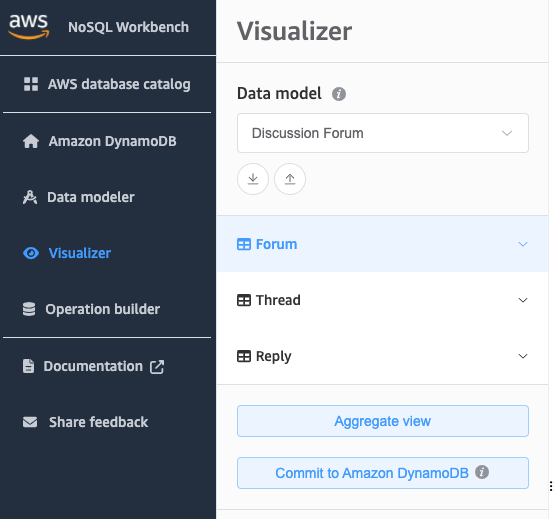

# Committing a data model to DynamoDB

When you are satisfied with your data model, you can commit the model to
Amazon DynamoDB.

###### Note

- This action results in the creation of server-side resources in AWS for
  the tables and global secondary indexes represented in the data
  model.
- Tables are created with the following characteristics:
  - Auto scaling is set to 70 percent target utilization.
  - Provisioned capacity is set to 5 read capacity units and 5 write
    capacity units.

- Global secondary indexes are created with provisioned capacity of 10 read
  capacity units and 5 write capacity units.

###### To commit the data model to DynamoDB

1. In the navigation pane on the left side, choose the
   **visualizer** icon.

 2. Choose **Commit to DynamoDB**.

 3. Choose an already existing connection, or create a new connection by choosing
the **Add new remote connection** tab.

    * To add a new connection, specify the following information:

    	+ **Account Alias**
    	+ **AWS Region**
    	+ **Access key ID**
    	+ **Secret access key**
    For more information about how to obtain the access keys, see [Getting an AWS access key](SettingUp.md#SettingUp.DynamoWebService.GetCredentials "SettingUp.md#SettingUp.DynamoWebService.GetCredentials").
    * You can optionally specify the following:

    	+ [**Session token**](../../../IAM/latest/UserGuide/id_credentials_temp_use-resources.md "../../../IAM/latest/UserGuide/id_credentials_temp_use-resources.md")
    	+ [**IAM role ARN**](../../../IAM/latest/UserGuide/reference_identifiers.md#identifiers-arns "../../../IAM/latest/UserGuide/reference_identifiers.md#identifiers-arns")
    * If you don't want to sign up for a free tier account, and prefer to
     use [DynamoDB
     local (downloadable version)](DynamoDBLocal.md "DynamoDBLocal.md"):

    	1. Choose the **Add a new DynamoDB local
    	 connection** tab.
    	2. Specify the **Connection name** and
    	 **Port**.

4. Choose **Commit**.

###### Note

If you installed DynamoDB local as part of the NoSQL Workbench setup, you'll need to turn DynamoDB local on by using the
**DynamoDB local Server** toggle at the bottom left of the NoSQL Workbench screen. See
[Install NoSQL Workbench for DynamoDB](workbench.settingup.md "workbench.settingup.md") for more information on
this toggle.
