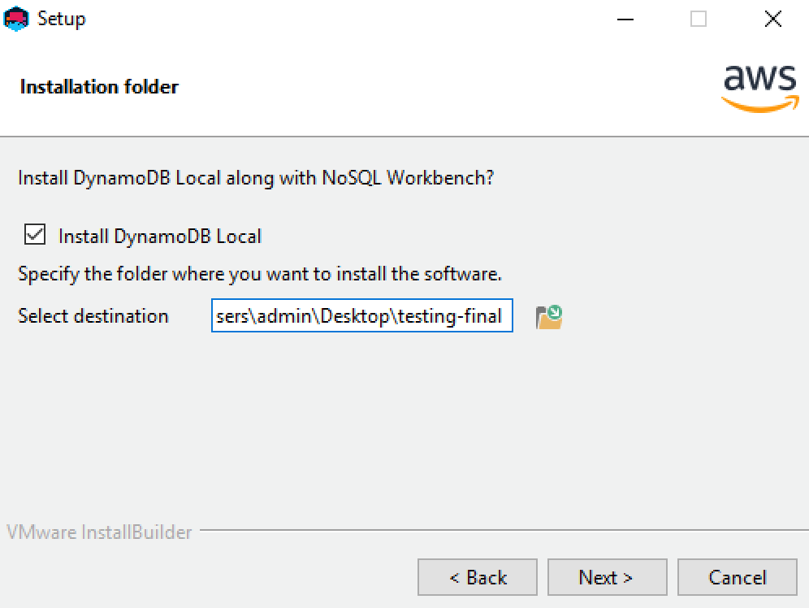
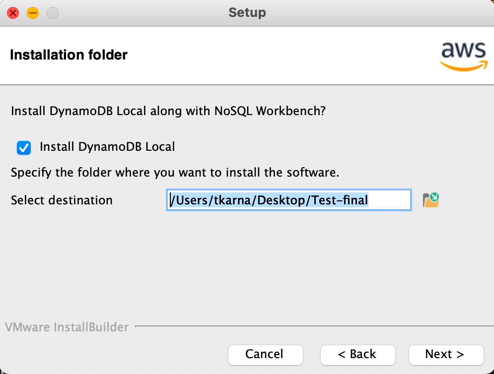
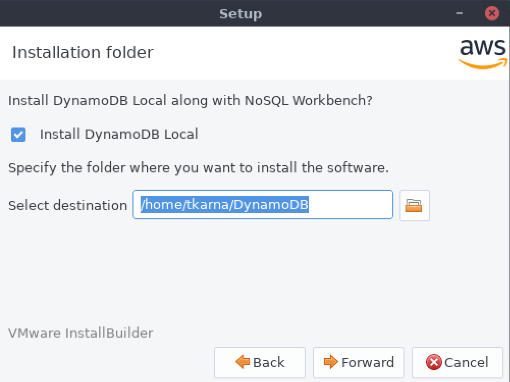
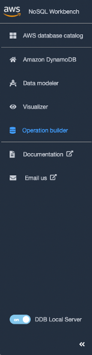

# Install NoSQL Workbench for DynamoDB

Follow these steps to install NoSQL Workbench and DynamoDB local on a supported platform.

Windows

###### To install NoSQL Workbench on Windows

1. Run the NoSQL Workbench installer application and choose the
   setup language. Then choose **OK** to begin the
   setup. For more information about downloading NoSQL Workbench, see
   [Download NoSQL Workbench for DynamoDB](workbench.md "workbench.md").
2. Choose **Next** to continue the setup, and then
   choose **Next** on the following screen.
3. By default, the **Install DynamoDB Local** check
   box is selected to include DynamoDB local as part of the installation.
   Keeping this option selected ensures that DynamoDB local will be
   installed, and the destination path will be the same as the
   installation path of NoSQL Workbench. Clearing the check box for
   this option will skip the installation of DynamoDB local, and the
   installation path will be for NoSQL Workbench only.

Choose the destination where you want the software installed, and
choose **Next**.

###### Note

If you opted to not include DynamoDB local as part of the setup,
clear the **Install DynamoDB Local** check box,
choose **Next**, and skip to step 6. You can
download DynamoDB local separately as a standalone installation at a
later time. For more information, see [Setting up DynamoDB local (downloadable version)](DynamoDBLocal.md "DynamoDBLocal.md") .

 4. Choose the port number for DynamoDB local to use. The default port is 8000. After you enter the port number, choose
**Next**. 5. Choose **Next** to begin setup. 6. When the setup has completed, choose **Finish**
to close the setup screen. 7. Open the application in your installation path, such as
_/programs/DynamoDBWorkbench/_.

macOS

###### To install NoSQL Workbench on macOS

1. Run the NoSQL Workbench installer application and choose the
   setup language. Then choose **OK** to begin the
   setup. For more information about downloading NoSQL Workbench, see
   [Download NoSQL Workbench for DynamoDB](workbench.md "workbench.md").
2. Choose **Next** to continue the setup, and then
   choose **Next** on the following screen.
3. By default, the **Install DynamoDB local** check box
   is selected to include DynamoDB local as part of the installation.
   Keeping this option selected ensures that DynamoDB local will be
   installed, and the destination path will be the same as the
   installation path of NoSQL Workbench. Clearing this option will skip
   the installation of DynamoDB local, and the installation path will be
   for NoSQL Workbench only.

Choose the destination where you want the software installed, and
choose **Next**.

###### Note

If you opted to not include DynamoDB local as part of the setup,
clear the **Install DynamoDB local** check box,
choose **Next**, and skip to step 6. You can
download DynamoDB local separately as a standalone installation at a
later time. For more information, see [Setting up DynamoDB local (downloadable version)](DynamoDBLocal.md "DynamoDBLocal.md") .

 4. Choose the port number for DynamoDB local to use. The default port is 8000. After you enter the port number, choose
**Next**. 5. Choose **Next** to begin setup. 6. When the setup has completed, choose **Finish**
to close the setup screen. 7. Open the application in your installation path, such as
_/Applications/DynamoDBWorkbench/_.

###### Note

NoSQL Workbench for macOS performs auto-updates. To get notification
about updates, enable notification access to NoSQL Workbench in System
Preferences > Notifications.

Linux

###### To install NoSQL Workbench on Linux

1. Run the NoSQL Workbench installer application and choose the
   setup language. Then choose **OK** to begin the
   setup. For more information about downloading NoSQL Workbench, see
   [Download NoSQL Workbench for DynamoDB](workbench.md "workbench.md").
2. Choose **Forward** to continue the setup, and
   choose **Forward** on the following screen.
3. By default, the **Install DynamoDB local** check box
   is selected to include DynamoDB local as part of the installation.
   Keeping this option selected ensures that DynamoDB local will be
   installed, and the destination path will be the same as the
   installation path of NoSQL Workbench. Clearing this option will skip
   the installation of DynamoDB local, and the installation path will be
   for NoSQL Workbench only.

Choose the destination where you want the software installed, and
choose **Forward**.

###### Note

If you opted to not include DynamoDB local as part of the setup,
clear the **Install DynamoDB local** check box,
choose **Forward**, and skip to step 6. You can
download DynamoDB local separately as a standalone installation at a
later time. For more information, see [Setting up DynamoDB local (downloadable version)](DynamoDBLocal.md "DynamoDBLocal.md") .

 4. Choose the port number for DynamoDB local to use. The default port is 8000. After you enter the port number entered, choose
**Forward**. 5. Choose **Forward** to begin setup. 6. When the setup has completed, choose **Finish**
to close the setup screen. 7. Open the application in your installation path, such as
_/usr/local/programs/DynamoDBWorkbench/_.

###### To start an AppImage on Linux

1. Make the AppImage file executable:

chmod +x noSQL-workbench-linux.AppImage

Replace noSQL-workbench-linux.AppImage with the actual
file name of the AppImage you downloaded. 2. Run the AppImage:

./noSQL-workbench-linux.AppImage

This will launch the NoSQL Workbench application.

###### Note

Depending on your Linux distribution, you may need to install additional
dependencies for the AppImage to run properly. If you encounter any issues, refer
to the documentation provided by the AppImage developers or seek support from
the community.

###### Note

If you opted to install DynamoDB local as part of the installation of NoSQL
Workbench, DynamoDB local will be preconfigured with default options. To edit the
default options, modify the _DDBLocalStart_ script located in the
_/resources/DDBLocal_Scripts/_ directory. You can find this
in the path that you provided during installation. To learn more about DynamoDB local
options, see [DynamoDB local usage notes](DynamoDBLocal.md "DynamoDBLocal.md") .

If you opted to install DynamoDB local as part of the NoSQL Workbench installation, you
will have access to a toggle to enable and disable DynamoDB local as shown in the following
image.

