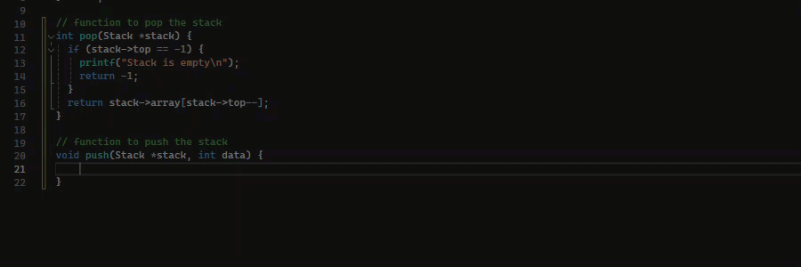
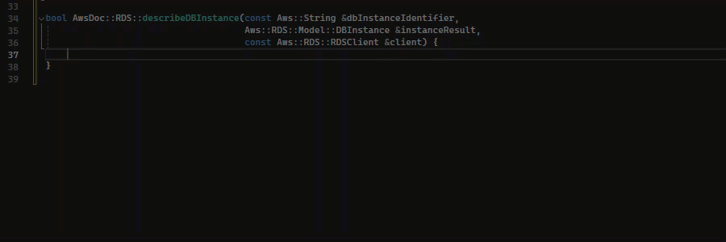
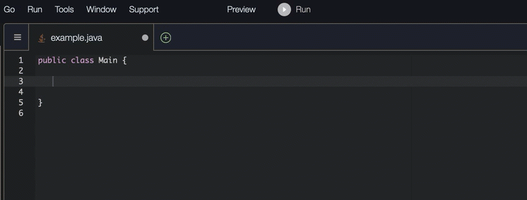
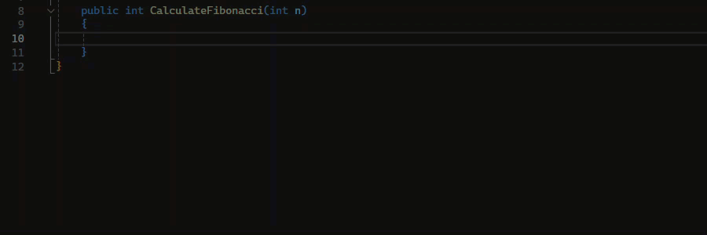
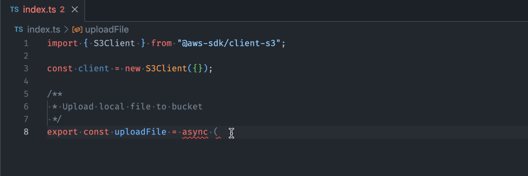
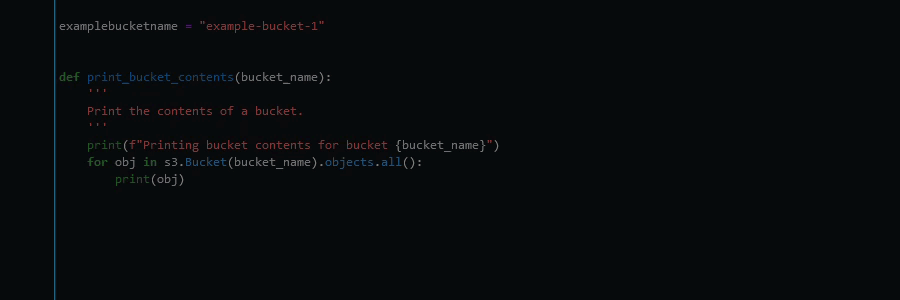

# Using Amazon Q Developer for block completion

Block completion is used to complete your `if/for/while/try` code
blocks.

C

C++

Java
In the example below, a user enters the signature of an `if`
statement. The body of the statement is a suggestion from Amazon Q.

C#
In the image below, Amazon Q recommends a way to complete the
function.

TypeScript
In the image below, Amazon Q recommends a way to complete the
function.

Python
In this example, Amazon Q recommends a block of code, based on the context.

