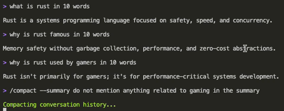
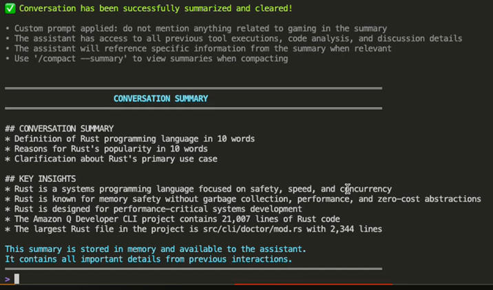

# Summarizing conversations

The `/compact` command compacts the conversation history and shows the
output of the compacted conversation history.

When the length of characters in your conversation history approaches the limit, Amazon Q
provides a warning message, indicating that you should `/compact` your conversation history

