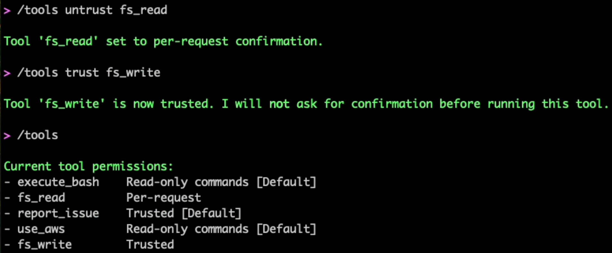
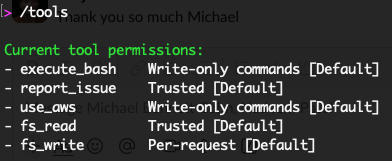
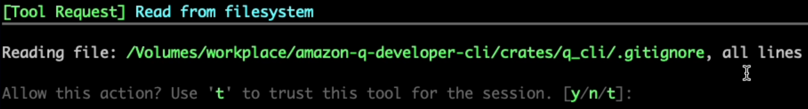
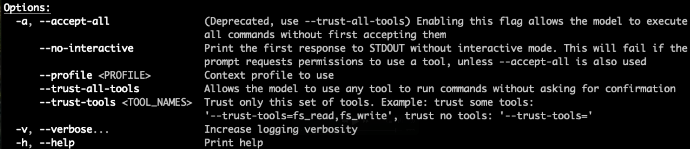

# Managing tool permissions

You can use the `/tools` command to manage permissions for tools that
Amazon Q uses to perform actions on your system. This provides granular control over what
actions Amazon Q can perform.

| Tools commands | Command                                                  | Description                                                                                                                                                                                                                                                                                                                                                                                                                                                                                                                                                                                                                                                                                                                                                                                                                                                                                                                                                                                                                                                                                                                                                                                                                                                                                                                                                                                                                                  |
| -------------- | -------------------------------------------------------- | -------------------------------------------------------------------------------------------------------------------------------------------------------------------------------------------------------------------------------------------------------------------------------------------------------------------------------------------------------------------------------------------------------------------------------------------------------------------------------------------------------------------------------------------------------------------------------------------------------------------------------------------------------------------------------------------------------------------------------------------------------------------------------------------------------------------------------------------------------------------------------------------------------------------------------------------------------------------------------------------------------------------------------------------------------------------------------------------------------------------------------------------------------------------------------------------------------------------------------------------------------------------------------------------------------------------------------------------------------------------------------------------------------------------------------------------- | ---- | ----------- |
| `help`         | Shows help related to tools.                             |
| `trust`        | Trusts a specific tool for the session.                  |
| `untrust`      | Reverts a tool to per-request confirmation.              |
| `trust-all`    | Trusts all tools (equivalent to deprecated /acceptall).  |
| `reset`        | Resets all tools to default permission levels.           | To view the current permission settings for all tools: `$ q chat Amazon Q> /tools` This displays a list of all available tools and their current permission status (trusted or per-request). Tool permissions have two possible states:  • _Trusted_: Amazon Q can use the tool without asking for confirmation each time.  • _Per-request_: Amazon Q must ask for your confirmation each time before using the tool. To trust or untrust a specific tool for the current session: `Amazon Q> /tools trust fs_read Amazon Q> /tools untrust execute_bash`  You can also trust all tools at once with `/tools trust-all`(equivalent to the deprecated `/acceptall` command): `Amazon Q> /tools trust-all` ###### Warning Using `/tools trust-all` carries risks. For more information, see [Understanding security risks](command-line-chat-security.md#command-line-chat-security-risks "command-line-chat-security.md#command-line-chat-security-risks") . The following image shows the status of the CLI tools when they are all in their default trust status.  The following tools are natively available for Amazon Q to use: Available tools | Tool | Description |
| ---            | ---                                                      |
| `fs_read`      | Reads files and directories on your system.              |
| `fs_write`     | Creates and modifies files on your system.               |
| `execute_bash` | Executes bash commands on your system.                   |
| `use_aws`      | Makes AWS CLI calls to interact with AWS services.       |
| `report_issue` | Opens a browser to report an issue with the chat to AWS. | When Amazon Q attempts to use a tool that doesn't have explicit permission, it will ask for your approval before proceeding. You can choose to allow or deny the action, or trust the tool for the remainder of your session. Each tool has a default trust behavior. `fs_read` is the only tool that is trusted by default. Here are some examples of when to use different permission levels:  • _Trust fs_read_: When you want Amazon Q to read files without confirmation, such as when exploring a codebase.  • _Trust fs_write_: When you're actively working on a project and want Amazon Q to help you create or modify files.  • _Untrust execute_bash_: When working in sensitive environments where you want to review all commands before execution.  • _Untrust use_aws_: When working with production AWS resources to prevent unintended changes. When Amazon Q uses a tool, it shows you the trust permission being used.  You can also specify trust permissions as part of starting a `q chat` session.                                                                                                                                        |
