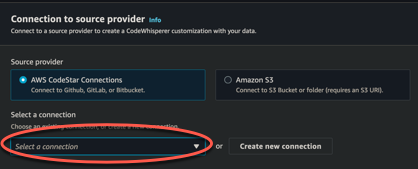
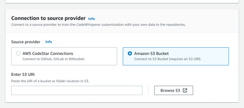

# Creating your customization

This section explains how to create a customization with Amazon Q.

To create your customization, follow this procedure:

1. Subscribe users to Amazon Q Developer Pro following the instructions in [Getting started with IAM Identity Center](getting-started-idc.md "getting-started-idc.md"). As part of the
   subscription process, you will install the Amazon Q Developer profile, which is necessary to create
   customizations.
2. Sign in to the AWS Management Console.
3. Switch to the Amazon Q Developer console.
4. From the navigation pane on the left, choose **Customizations**.
5. The customizations page will appear.
6. Choose **Create customization**.
7. Enter a customization name and (optional) description.

###### Note

Use both names and descriptions that will be informative to your developers. Developers
from your organization who are authorized to use Amazon Q Developer Pro will be able to see them in
their IDE through the AWS plugin.

## Connecting to your data source

Before you create a customization, you must connect to the data source that contains your
codebase. How you do this depends on where your data source is.

If your data source is in Github, GitLab, or Bitbucket, then you can connect to it with
AWS CodeConnections. Otherwise, place your data in a folder within an Amazon S3 bucket.

To learn more about CodeConnections, see [What are connections?](../../../dtconsole/latest/userguide/welcome-connections.md "../../../dtconsole/latest/userguide/welcome-connections.md") in the
_Developer Tools console User Guide_.

###### To connect to your data source through CodeConnections

1. Under **Connection to source provider**, select **AWS CodeStar
   CodeConnections**.
2. If you want to use an existing connection, choose **Select a
   connection**.

Then, under **Choose repository selection**, do one of the
following:

    * To use all the repositories in the connection to generate the customization,
     choose **Use all repositories in this connection**.
    * To select specific repositories to generate the customization, choose
     **Select specific repositories** and then choose
     **Choose repositories**. In the the pop-up window, find the
     repositories you want to use, and then choose **Add**.

    ###### Note

    Although there is no limit to the number of repositories you can include in
     a customization, you are restricted to 100 when you individually select them.
     If you want to use more than 100 repositories, choose the **Use all
     repositories** option, or place the repositories in Amazon S3 and
     follow the instructions for connecting your data source through Amazon S3.

3. If you want to create a new connection, choose **Create a new
   connection** and follow the remaining steps of this procedure.
4. In the pop-up window that opens, navigate to your data source and follow the
   instructions in the console.
5. After you create your data source, return to the **Create
   customization** page.
6. Under **Select a connection**, select your connection from the
   dropdown.

###### To connect to your data source through Amazon S3

1. Under **Connection to source provider**, select Amazon S3.

 2. Choose **Browse Amazon S3**. 3. Navigate to your codebase and make a note of the URI. The codebase must be in a folder
within the Amazon S3 bucket, not the bucket's root.

For more information, see [Creating, configuring, and
working with Amazon S3 buckets](../../../AmazonS3/latest/userguide/creating-buckets-s3.md "../../../AmazonS3/latest/userguide/creating-buckets-s3.md") and [Access control
best practices](../../../AmazonS3/latest/userguide/access-control-best-practices.md "../../../AmazonS3/latest/userguide/access-control-best-practices.md") in the _Amazon S3 User Guide_. 4. Paste the URL into the field labeled **Enter Amazon S3 URI**.

Before you create your customization, you have the option of adding tags to it.

To learn more about tags, see [the Tagging your AWS
resources User Guide](../../../tag-editor/latest/userguide/tagging.md "../../../tag-editor/latest/userguide/tagging.md").

After following the procedures above, choose **Create customization**.

## Customizations and your data

Amazon Q customizations use your content to present suggestions to you in the style of your
organization's developers.

However, AWS will not store or use your content in any context that does not directly serve
your enterprise.

AWS will not use your content to provide code suggestions to other customers.

Amazon Q will not reference [code reviews](code-reviews.md "code-reviews.md") for other
customers (or for you).

For more information, see [Amazon Q Developer service improvement](service-improvement.md "service-improvement.md").

## Troubleshooting the creation of your

customization

- You may receive the error: `Total size of the provided repositories exceeds the
maximum allowed size of `number` for a
customization.`

In that case, remove a repository from your data source and try again.

- You may receive the error: `Insufficient data to create a customization. Add more
files from supported languages and retry.`

In order for code written in a particular language to be used to create a

customization, there must be at least 10 files containing code in that
 language in your
data source. Your data source must contain at least 2 MB, while it is recommended to have
close to 20MB, and at most 20 GB, of source code files from supported languages.

Some files, even if they are in the relevant language, will not count
 toward the 2 MB.
For example, duplicate files and files in an unsupported
 format will not be
counted.

If you receive this error, add more files containing the programming language that is
the focus of your customization, and try again.

- You may receive the error: `Encountered an issue when retrieving some of the
selected repositories from CodeConnections. Check the customization's log deliveries for
details.`

If you receive this error, try creating or updating the customization again with valid
repositories that your connection has access to.
