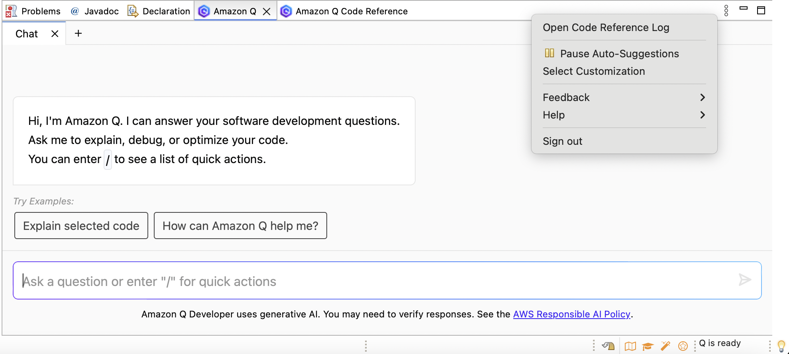

# Using Amazon Q customizations

This section contains information about how to use customizations as a developer.

###### Note

Customizations are supported for the following features of Amazon Q Developer:

- inline suggestions – see [Generating inline suggestions](inline-suggestions.md "inline-suggestions.md")
- chat in the IDE – see [Chatting about code](q-in-IDE-chat.md "q-in-IDE-chat.md")

Visual Studio Code
To use customizations with Visual Studio Code:

1. Authenticate to Amazon Q Developer Pro with IAM Identity Center using the steps in [Installing the Amazon Q Developer extension or plugin in your IDE](q-in-IDE-setup.md "q-in-IDE-setup.md").
2. In the **Developer Tools** pane, under Amazon Q, choose
   **Select Customization**.
3. At the top of the window, from the dropdown menu, select the appropriate
   customization.

JetBrains
To use customizations in JetBrains IDEs:

1. Authenticate to Amazon Q Developer Pro with IAM Identity Center using the steps in [Installing the Amazon Q Developer extension or plugin in your IDE](q-in-IDE-setup.md "q-in-IDE-setup.md").
2. In the **Developer Tools** pane, under Amazon Q, choose
   **Select Customization**.
3. In the pop-up window, select the appropriate customization.
4. Choose **Connect**.

Eclipse
To use customizations in Eclipse IDEs:

1. Authenticate to Amazon Q Developer Pro with IAM Identity Center using the steps in [Installing the Amazon Q Developer extension or plugin in your IDE](q-in-IDE-setup.md "q-in-IDE-setup.md").
2. In your Eclipse IDE, choose the **Amazon Q** icon in the top
   right corner of the IDE.
3. With the Amazon Q chat tab open, choose the ellipsis icon in the top right
   corner of the tab. The Amazon Q task bar opens.

The following image shows the Amazon Q task bar in an Eclipse IDE.

 4. Choose **Select Customization**. 5. In the pop-up window, select the appropriate customization. 6. Choose **Select**.
