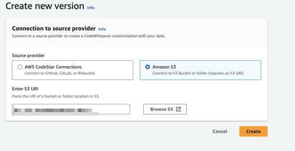

# Updating your Amazon Q customizations

A customization is created based on a snapshot of your data source at the time of creation. You
might want to update your Amazon Q customization if:

- You updated the files in your data source, and you want to re-create your customization
  with the new files.
- You want to switch the data source from AWS CodeConnections to Amazon S3, or the reverse.
- You want to change the repositories referenced in a CodeConnections data source.
  A customization can have multiple versions.

Amazon Q administrators have access to a maximum of three versions for each
customization:

- the latest version
- the currently active version
- the most recently active version that is not currently active

## Creating a new version

To create a new version of your customization, follow this procedure:

1. Sign in to the AWS Management Console.
2. Switch to the Amazon Q Developer console.
3. From the navigation pane on the left, choose
   **Customizations**.

The customizations page will appear. 4. Choose the customization for which you want to create a new version.

The customization details page will appear. 5. Do one of the following:

    * Select **Create new version** from the
     **Actions** dropdown.
    * Choose the **Sources** tab, and then choose
     **Update**.

The **Update customization** page appears. 6. Select **Create new version** from the **Actions**
dropdown. 7. (Optional) Change the data source.

 8. (Optional) If you selected the CodeConnections data source, change the repositories associated
with the connection. 9. Choose **Create**.

If you receive error messages, see [Troubleshooting the creation of your
customization](customizations-admin-customize.md#customizations-creating-troubleshooting "customizations-admin-customize.md#customizations-creating-troubleshooting").
