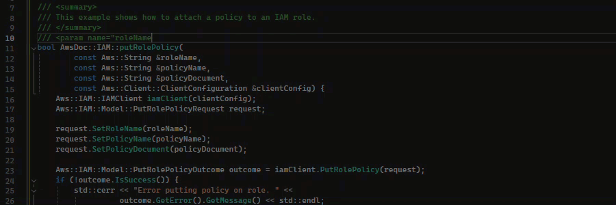
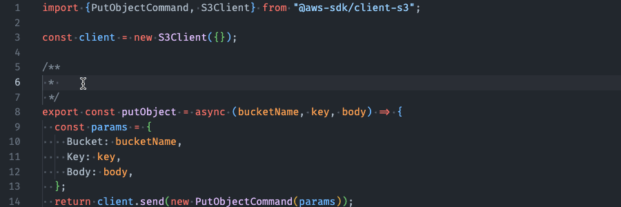
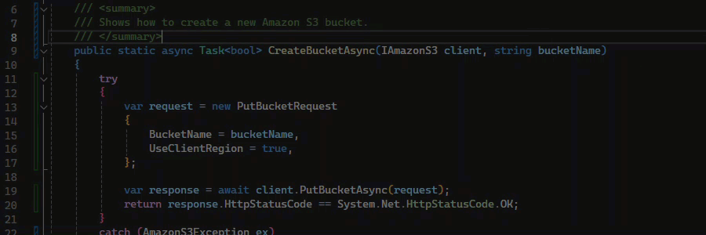
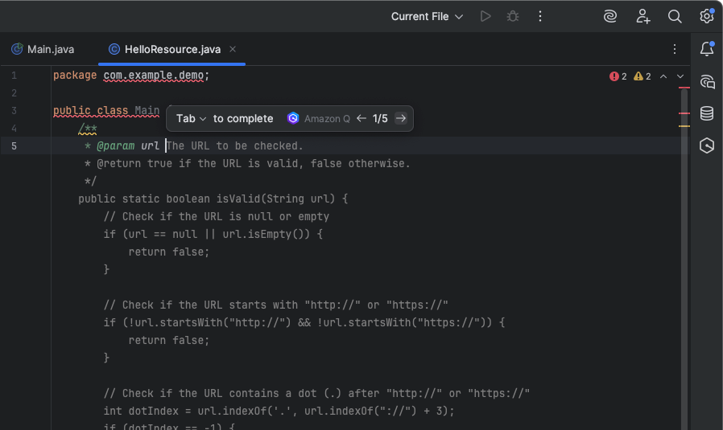
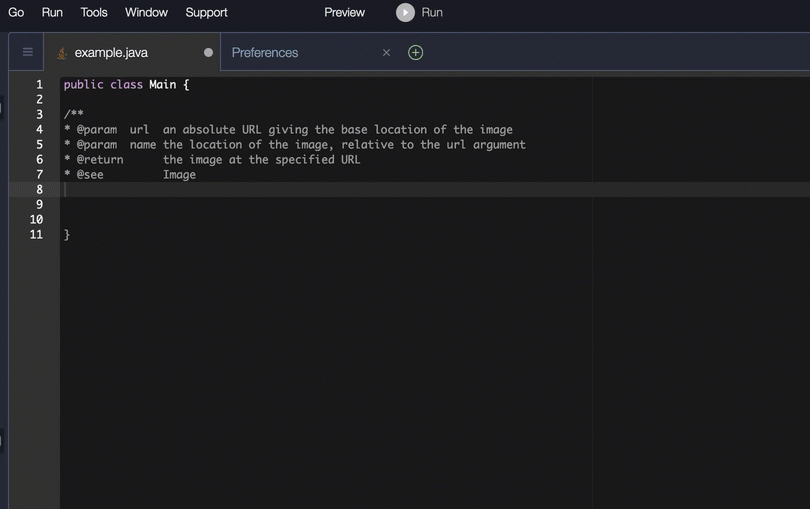
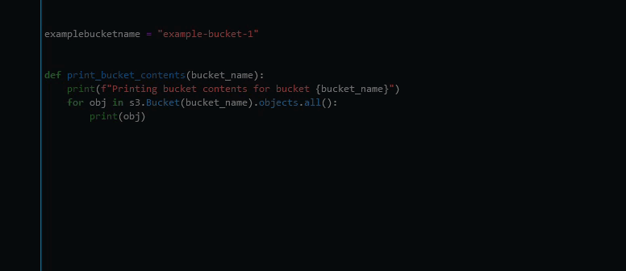

# Using Amazon Q Developer for Docstring, JSDoc, and Javadoc completion

Amazon Q can help you generate or complete documentation inside your code.

C++

Javascript
In this example, Amazon Q fills in JSDoc parameters based on
existing constants.

C#
In this example, Amazon Q fills in JSDoc parameters based on
existing constants.

Java
The following example is adapted from [an example
on the Oracle website](https://www.oracle.com/technical-resources/articles/java/javadoc-tool.html "https://www.oracle.com/technical-resources/articles/java/javadoc-tool.html").

In the image below, the user has started entering a docstring. Amazon Q has suggested words to add to the docstring.

The following example is adapted from [an example
on the Oracle website](https://www.oracle.com/technical-resources/articles/java/javadoc-tool.html "https://www.oracle.com/technical-resources/articles/java/javadoc-tool.html").

In the example below, in Java, the user enters a docstring. Amazon Q suggests a function
to process the docstring.

Python
In this example, Amazon Q recommends a Docstring, based on the surrounding context.

