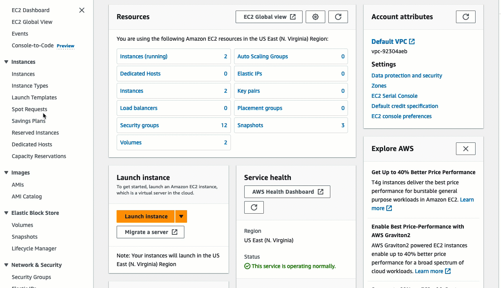
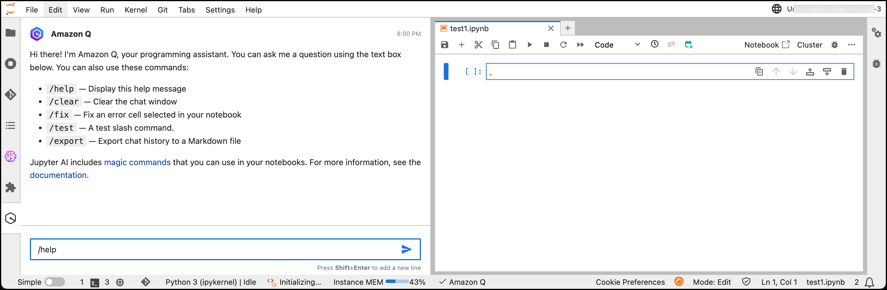

# Amazon Q Developer features

Amazon Q Developer is available across AWS environments and services, and also as a coding
assistant in third party IDEs.

Many of Amazon Q Developer’s capabilities exist in a chat interface, where you can use natural
language to ask questions about AWS, get help with code, explore resources, or troubleshoot.
When you chat with Amazon Q, Amazon Q uses the context of your current conversation to inform its
responses. You can ask follow-up questions or refer to its response when you ask a new
question.

Other Amazon Q Developer features are available as a part of your workflows in AWS service
consoles and supported IDEs. The following sections explain the different features of Amazon Q
Developer that you might encounter across your AWS experience.

## Analytics

### Summarizing your data

With Amazon Q Quick Suite, you can utilize the Generative BI authoring experience, create executive
summaries of your data, ask and answer questions of data, and generate data
stories.

For more information, see [Using Generative BI with
Amazon Q Quick Suite](../../../quicksight/latest/user/quicksight-gen-bi.md "../../../quicksight/latest/user/quicksight-gen-bi.md") in the _Quick Suite User Guide_.

## Management and governance

### Exploring nodes using text

prompts

Using AWS Systems Manager and Amazon Q, you can ask natural language questions about your managed
nodes or instances. Amazon Q then uses the Systems Manager `ListNodes` action and creates
filters based on your textual input to retrieve results.

For more information, see [Exploring
nodes using text prompts in Amazon Q](../../../systems-manager/latest/userguide/view-aggregated-node-details-Q.md "../../../systems-manager/latest/userguide/view-aggregated-node-details-Q.md") in the _AWS Systems Manager User
Guide_.

### Investigating

operational issues

Amazon CloudWatch investigations enhance your ability to investigate and analyze
resources, events, and activities across your AWS environment. By leveraging natural
language processing, Amazon Q simplifies the process of understanding complex scenarios and
relationships within your AWS account.

Amazon Q Developer now helps you accelerate CloudWatch investigations across your AWS
environment. Q looks for anomalies in your telemetry, surfaces related signals
for you to explore, identifies potential root-cause hypothesis, and suggests next steps
to help you remediate issues faster.

By integrating Amazon Q into your investigative workflows, you can accelerate problem
solving, enhance your understanding of your AWS environment, and make more informed
decisions about your infrastructure and applications.

For example questions to ask Amazon Q in the context of Amazon CloudWatch investigations, see
[Chatting about your telemetry and operations](chat-ops.md "chat-ops.md")
.

For more information about CloudWatch investigations in general, see _CloudWatch investigations_ in the [Amazon CloudWatch User
Guide](../../../AmazonCloudWatch/latest/monitoring/Investigations.md "../../../AmazonCloudWatch/latest/monitoring/Investigations.md").

### Taking inventory of your AWS resources

You can ask Amazon Q about your specific AWS account resources from anywhere in the
AWS Management Console. You might not know where to locate relevant information about
your resources, or you might be in one service console and want to access information
about another service’s resources without disrupting your workflow.

Amazon Q Developer answers your natural language questions about resources and provides deep
links to those resources so you can quickly find them. You can ask Amazon Q to list a
type of resource in your account, for details about a specific resource, or to list
resources based on a criteria such as region or state.

For example, you may want to know how many Amazon EC2 instances you currently have
running. In that case, you can ask Amazon Q your question in natural language, and it will
provide an answer based on your specific resources.

For more information, see [Chatting about your resources with Amazon Q Developer](chat-actions.md "chat-actions.md")
.

For information about specific limits for each type, and how they relate to pricing
for specific subscription package, see [Amazon Q Developer pricing](https://aws.amazon.com/q/developer/pricing/ "https://aws.amazon.com/q/developer/pricing/").

### Use Amazon Q in the

AWS Console Mobile Application

Amazon Q is integrated with the AWS Console Mobile Application to answer questions about AWS. You
configure access the same way that you get access to Amazon Q in the AWS Management Console. For more
information, see [Getting started with Amazon Q Developer](getting-started-q-dev.md "getting-started-q-dev.md")
.

### Diagnosing console errors

In the AWS Management Console, Amazon Q Developer can diagnose common errors you receive
while working with AWS services, such as insufficient permissions, incorrect
configuration, and exceeding service limits.

For more information, see [Diagnosing common errors in the console with
Amazon Q Developer](diagnose-console-errors.md "diagnose-console-errors.md")
.

## Compute

### Choosing Amazon Elastic Compute Cloud instances

With so many Amazon EC2 instance types available, finding the right instance types for
your workload can be time-consuming and complex. The Amazon Q instance type selector
considers your use case, workload type, CPU manufacturer preference, and how you
prioritize price and performance, as well as additional parameters that you can specify.
It then uses this data to provide suggestions and guidance for Amazon EC2 instance types that
are best suited to your new workloads.

For more information, see [Get
recommendations from Amazon EC2 instance type finder](../../../AWSEC2/latest/UserGuide/get-ec2-instance-type-recommendations.md "../../../AWSEC2/latest/UserGuide/get-ec2-instance-type-recommendations.md") in the _Amazon Elastic Compute Cloud
User Guide_.

## Databases

### Writing database queries

with natural language

Amazon Q generative SQL uses generative AI to analyze user intent, query patterns, and
schema metadata to identify common SQL query patterns directly within Amazon Redshift, accelerating
the query authoring process for users and reducing the time required to derive
actionable data insights.

For more information, see [Interacting with Amazon Q
generative SQL](../../../redshift/latest/mgmt/query-editor-v2-generative-ai.md "../../../redshift/latest/mgmt/query-editor-v2-generative-ai.md") in the _Amazon Redshift Management Guide_.

## Networking and content delivery

### Analyzing network

troubleshooting

You can use Amazon Q to help you diagnose network connectivity issues for applications
that run in your Amazon VPCs. Amazon Q network troubleshooting can understand natural language
queries, and works with Reachability Analyzer to provide relevant responses. With Amazon Q, you can ask
network reachability questions in a conversational format.

For more information, see [Amazon Q network
troubleshooting for Reachability Analyzer](../../../vpc/latest/reachability/amazon-q-network-reachability-analysis.md "../../../vpc/latest/reachability/amazon-q-network-reachability-analysis.md") in the _Amazon VPC Reachability Analyzer Guide_.

## Security, Identity, & Compliance

### Analyzing network security configurations (preview)

You can easily get answers, in natural language, to questions about your network security configurations from AWS Shield network
security director. Amazon Q helps you analyze your network security findings and provides recommended remediation steps in the console
and chat applications. For more information, see [Analyze network security with Amazon Q Developer](../../../waf/latest/developerguide/nsd-security-insights.md "../../../waf/latest/developerguide/nsd-security-insights.md") in the _AWS Shield network
security director Developer Guide_.

## Developer tools

Ask Amazon Q Developer questions about building at AWS and for assistance with software
development. Amazon Q can explain coding concepts and code snippets, generate code and unit
tests, and improve code, including debugging or refactoring.

### Developing code features

After you explain, in natural language, the feature that you want to develop, Amazon Q can
use the context of your current project to generate an implementation plan and the
accompanying code. Amazon Q can help you build AWS projects or your own applications.

### Getting inline code suggestions

Amazon Q provides you with code recommendations in real time. As you write code, Amazon Q
automatically generates suggestions based on your existing code and comments. For more
information, see [Generating inline suggestions with
Amazon Q Developer](inline-suggestions.md "inline-suggestions.md").

### Chatting about code in IDEs

Within integrated development environments (IDEs), Amazon Q can answer questions
related to the software development process, including conceptual questions about
programming and how specific code works. You can also ask Amazon Q to update and improve
code snippets from the chat panel. With multi-language support, you can chat with Amazon Q
in any of the supported natural languages, including English, Mandarin, French, German,
Italian, Japanese, Spanish, Korean, Hindi and Portuguese, with more languages available.
For more information, see [Chatting with Amazon Q Developer about code](q-in-IDE-chat.md "q-in-IDE-chat.md")
.

To write code and get development assistance in the most full-featured environment with
Amazon Q Developer, see [Using Amazon Q Developer in the IDE](q-in-IDE.md "q-in-IDE.md").

To enable basic code completion functionality in other interfaces across AWS, see
[Generating inline suggestions in AWS coding environments](setting-up-AWS-coding-env.md "setting-up-AWS-coding-env.md")
.

### Reviewing your code for security vulnerabilities

and quality issues

Within IDEs, Amazon Q reviews your code for security vulnerabilities and code quality
issues. Amazon Q can review as you code or review entire projects to monitor the security
and quality of your applications throughout development. For more information, see [Reviewing code with Amazon Q Developer](code-reviews.md "code-reviews.md")
.

### Transforming code

Amazon Q can perform automated language and operating system (OS)-level upgrades for
your applications. For more information, see [Transforming code in the IDE with Amazon Q Developer](transform-in-IDE.md "transform-in-IDE.md")
.

### Developing software in Amazon CodeCatalyst

Amazon Q Developer in CodeCatalyst includes generative AI features that can help users in projects
in your space develop software faster. You can assign issues to Amazon Q or recommend tasks
for Amazon Q. You can also ask Amazon Q to write a description or to summarize content.

For more information, see [Managing
generative AI features in Amazon CodeCatalyst](../../../codecatalyst/latest/adminguide/managing-generative-ai-features.md "../../../codecatalyst/latest/adminguide/managing-generative-ai-features.md") in the _Amazon CodeCatalyst
administrator guide_.

### Chatting about code in Amazon SageMaker AI Studio

Amazon SageMaker AI Studio is a web-based experience for running ML workflows. You can chat with
Amazon Q Developer inside Studio to get guidance on SageMaker AI features, troubleshoot JupyterLab
errors, and get sample code.

For more information, see [Use Amazon Q to Expedite Your Machine Learning Workflows](../../../sagemaker/latest/dg/studio-updated-jl-user-guide.md#studio-updated-jl-user-guide-use-amazon-q "../../../sagemaker/latest/dg/studio-updated-jl-user-guide.md#studio-updated-jl-user-guide-use-amazon-q") in the _SageMaker AI
Developer Guide_.

### Interacting with the command line and AWS CloudShell

#### Command Line Interface (CLI)

After installing Amazon Q for the command line, you can use it to complete CLI commands as
it populates contextually relevant subcommands, options and arguments. It provides
AI-generated completions as you type in the command line. Additionally, you can use
Amazon Q to write natural language instructions that are instantly translated to an
executable shell code snippet. You can also ask Amazon Q complex questions, and it
provides feedback and instructions based on the conversation, as well as context and
information outside of the conversation. You can then provide permission to Amazon Q
so it performs actions on your behalf. With multi-language support, you can chat with
Amazon Q in any of the supported natural languages, including English, Mandarin, French,
German, Italian, Japanese, Spanish, Korean, Hindi and Portuguese, with more languages
available. For more information, see [Using Amazon Q Developer on the command line](command-line.md "command-line.md")
.

#### AWS CloudShell

You can also use Amazon Q CLI in AWS CloudShell to interact in natural language conversations,
ask questions, and receive responses from Amazon Q in your terminal. You can get the related
shell command that reduces the need to search for or remember syntax. With Amazon Q, you can
receive command suggestions as you type in the terminal. For more information, see
[Using Amazon Q AWS CLI in AWS CloudShell.](../../../cloudshell/latest/userguide/q-cli-features-in-cloudshell.md "../../../cloudshell/latest/userguide/q-cli-features-in-cloudshell.md")

## Application integration

### Writing scripts to automate AWS

services

You may know exactly what to do with your AWS resources, and you may find yourself
taking the same actions repeatedly. In that case, you can ask Amazon Q to write code that
will automate the repetitive tasks.

For example, you may be working on a project that uses Amazon VPCs, Amazon EC2 instances, and
Amazon RDS databases. In the course of your testing, you find that every time you create a
Amazon VPC, spin up a server, and deploy a database, the configuration is the same. You
always choose the same instance and database type, with the same options selected, using
the same security groups, in subnets with the same NACL configuration. You don’t want to
have to go through the same manual process every time you want to re-create your test
conditions.

You can use Amazon Q’s Console-to-Code feature to automate a workflow instead of performing it
manually every time. First, you activate Console-to-Code in the Amazon EC2 console. Then, Amazon Q records
your actions as you go through the process of configuring and launching your instance.
Finally, Amazon Q provides you with code, in a language of your choice, that automates the
process you just performed.

For more information, see [Automating AWS services with Amazon Q Developer Console-to-Code](console-to-code.md "console-to-code.md")
.

### Writing ETL scripts and integrating data

AWS Glue is a serverless data integration service that makes it easy for analytics users
to discover, prepare, move, and integrate data from multiple sources.

Amazon Q data integration in AWS Glue includes the following capabilities:

- **Chat** – Amazon Q data integration in AWS Glue can
  answer natural language questions in English about AWS Glue and data integration
  domains like AWS Glue source and destination connectors, AWS Glue ETL jobs, Data
  Catalog, crawlers and AWS Lake Formation, and other feature documentation, and
  best practices. Amazon Q data integration in AWS Glue responds with step-by-step
  instructions, and includes references to its information sources.
- **Data integration code generation** – Amazon Q data
  integration in AWS Glue can answer questions about AWS Glue ETL scripts, and generate
  new code given a natural language question in English.
- **Troubleshoot** – Amazon Q data integration in AWS Glue
  is purpose built to help you understand errors in AWS Glue jobs and provides
  step-by-step instructions, to root cause and resolve your issues.

For more information, see [Amazon Q
data integration in AWS Glue](../../../glue/latest/dg/q.md "../../../glue/latest/dg/q.md") in the _AWS Glue User
Guide_.

## Third-party integrations

### Using GitLab Duo with Amazon Q

You can [GitLab Duo with
Amazon Q](https://docs.gitlab.com/ee/user/duo_amazon_q/ "https://docs.gitlab.com/ee/user/duo_amazon_q/") for your software development operations and source code management
workflows. After setting up Amazon Q in GitLab Duo, you can invoke [quick
actions](https://docs.gitlab.com/ee/user/project/quick_actions.html "https://docs.gitlab.com/ee/user/project/quick_actions.html") to automate tasks, including implement code for your
ideas, transform your codebase, review merge requests for quality and vulnerabilities,
and suggest unit tests.

For more information, see [GitLab Duo with Amazon Q](gitlab-with-amazon-q.md "gitlab-with-amazon-q.md")
.

### Using Amazon Q Developer features in GitHub

You can leverage Amazon Q Developer capabilities for your software development workflows.
With specialized development agents, you can implement new ideas, review code for
quality issues, address vulnerabilities with unit tests, and modernize legacy Java
applications.

For more information, see [Amazon Q Developer for GitHub (Preview)](amazon-q-for-github.md "amazon-q-for-github.md")
.

## Cloud Financial Management

### Understanding your costs

You can ask Amazon Q about your AWS bill and account costs in the AWS Management
Console. Amazon Q can retrieve your cost data, explain costs, and analyze cost trends.

For more information, see [Chatting about your costs](chat-costs.md "chat-costs.md")
.

## Customer support

### Getting customer support

directly from Amazon Q

Amazon Q can answer your questions about account activation, cost spikes, bill adjustment,
fraud events, health events, and issues with your AWS resources.

For more information, see [Chatting about your costs](chat-costs.md "chat-costs.md")
,
and [Asking Amazon Q to troubleshoot your
resources](chat-actions-troubleshooting.md "chat-actions-troubleshooting.md")
.

### Creating a support ticket

Amazon Q can help you create a support case and then connect you to a human support agent
at AWS.

For more information, see [Using Amazon Q Developer to chat with Support](support-chat.md "support-chat.md")
.

### Amazon Q in chat applications

You can activate Amazon Q in your Slack and Microsoft
Teams applications to ask questions about building at AWS. To add Amazon Q to
your chat applications, see [Chatting with Amazon Q Developer in chat applications](q-in-chat-applications.md "q-in-chat-applications.md")
. For more information, see [Get started
with Slack](../../../chatbot/latest/adminguide/slack-setup.md "../../../chatbot/latest/adminguide/slack-setup.md") and [Get started with Microsoft
Teams](../../../chatbot/latest/adminguide/teams-setup.md "../../../chatbot/latest/adminguide/teams-setup.md") in the _Amazon Q Developer in chat applications Administrator
Guide_.
