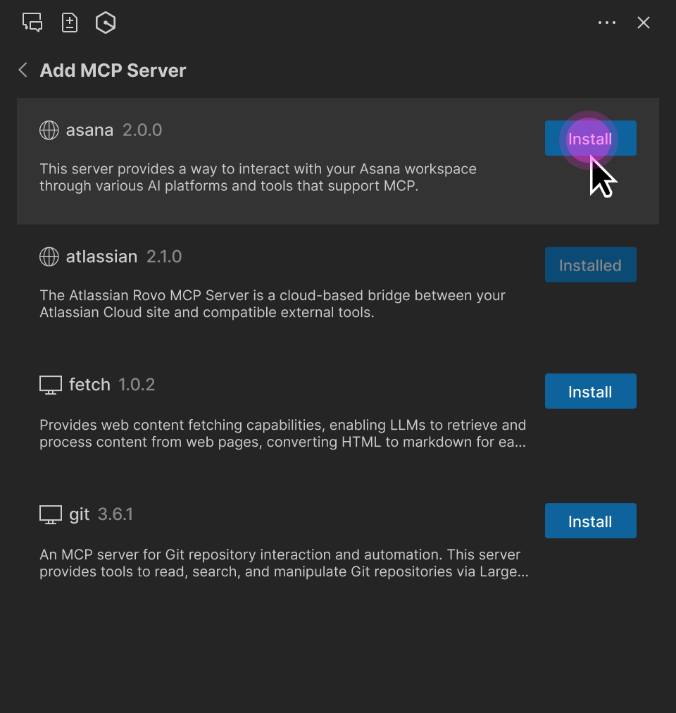

# MCP governance for Q Developer

Pro-tier customers using IAM Identity Center as the sign-in method can control MCP access for users within their
organization. By default, your users can use any MCP server in their Q client. As an administrator, you have the
ability to either entirely disable the use of MCP servers by your users, or specify a vetted list of MCP servers
that your users are allowed use.

These restrictions are controlled via an MCP on/off toggle and an MCP registry, respectively. The MCP toggle and
registry attributes are part of the [Q Developer profile](subscribe-understanding-profile.md "subscribe-understanding-profile.md"),
which can be defined at an organization level or at an account level, with the account-level profile superseding
the organizational-level profile. This enables you to specify a default MCP policy for your overall organization
and then override that default for specific accounts; for example, have MCP disabled for the organization overall,
but enabled with an allow-list for certain teams (accounts).

###### Note

Both the toggle and the registry settings are enforced on the client side. Be aware that your end users could
circumvent it.

## Disabling MCP for your organization

To disable MCP for your account or organization:

1. Open the Amazon Q Developer console.
2. Choose **Settings**.
3. Under **Preferences**, choose **Edit**.
4. In the **Edit Preferences** pop-up, toggle **Model Context Protocol (MCP)**
   to **Off**.
5. Choose **Save**.

## Specifying an MCP allow-list for your organization

To control which MCP servers users in your organization are allowed to use, you can specify a list of allowed MCP
servers in a JSON file, serve this JSON file over HTTPS, and enter that URL in the desired Q Developer Profile.
Any Q Developer clients using this profile will then enforce that users can only use the MCP servers you have
allow-listed in the JSON file.

### Specifying the MCP registry URL

1. Open the Amazon Q Developer console.
2. Choose **Settings**.
3. Under **Preferences**, choose **Edit**.
4. In the **Edit Preferences** pop-up, ensure **Model Context Protocol (MCP)**
   is **On**.
5. In the **MCP Registry URL** field, enter the URL of an MCP registry JSON file containing
   the allow-listed MCP servers.
6. Choose **Save**.

Note that the MCP registry URL is encrypted both in transit and at rest in accordance with
[our data encryption policy](data-encryption.md "data-encryption.md").

### MCP registry file format

The format of the registry JSON file is a subset of the server schema JSON in the
[MCP registry standard](https://github.com/modelcontextprotocol/registry "https://github.com/modelcontextprotocol/registry") v0.1.
The JSON schema definition for the subset supported by Q Developer is available in the
[registry schema](#registry-schema "#registry-schema") section at the end of this document.

Below is a simple, contrived example of an MCP registry file containing both a remote (HTTP) and a local
(stdio) MCP server definition.

```
{
  "servers": [
    {
      "server": {
        "name": "my-remote-server",
        "title": "My server",
        "description": "My server description",
        "version": "1.0.0",
        "remotes": [
          {
            "type": "streamable-http",
            "url": "https://acme.com/my-server",
            "headers": [
              {
                "name": "X-My-Header",
                "value": "SomeValue"
              }
            ]
          }
        ]
      }
    },
    {
      "server": {
        "name": "my-local-server",
        "title": "My server",
        "description": "My server description",
        "version": "1.0.0",
        "packages": [
          {
            "registryType": "npm",
            "registryBaseUrl": "https://npm.acme.com",
            "identifier": "@acme/my-server",
            "transport": {
              "type": "stdio"
            },
            "runtimeArguments": [
              {
                "type": "positional",
                "value": "-q"
              }
            ],
            "packageArguments": [
              {
                "type": "positional",
                "value": "start"
              }
            ],
            "environmentVariables": [
              {
                "name": "ENV_VAR",
                "value": "ENV_VAR_VALUE"
              }
            ]
          }
        ]
      }
    }
  ]
}
```

The following table describes each property of the registry JSON file. All properties are mandatory, unless
otherwise noted. See the [registry schema](#registry-schema "#registry-schema") section for the full JSON
schema.

Nested attributes are shown with a horizontal offset from their parent. For example, "headers" is a child
attribute of "remotes", and "name" and "value" are child attributes of "headers".

| Attribute                           | Description                                                                                                                                                                                                                                                                                                                      | Optional? | Example value                                |
| ----------------------------------- | -------------------------------------------------------------------------------------------------------------------------------------------------------------------------------------------------------------------------------------------------------------------------------------------------------------------------------- | --------- | -------------------------------------------- |
| **Common attributes**               |
| name                                | Server name. Must be unique within a given registry file.                                                                                                                                                                                                                                                                        |           | "aws-ccapi-mcp"                              |
| title                               | Human-readable server name.                                                                                                                                                                                                                                                                                                      | Yes       | "AWS CC API"                                 |
| description                         | Description of server.                                                                                                                                                                                                                                                                                                           |           | "Manage AWS infra through natural language." |
| version                             | Version of server. Semantic versioning (x.y.z) is strongly recommended.                                                                                                                                                                                                                                                          |           | "1.0.2"                                      |
| **Remote (HTTP) server attributes** |
| remotes                             | Array with exactly one entry specifying the remote endpoint.                                                                                                                                                                                                                                                                     |           | -                                            |
| type                                | Must be one of "streamable-http" or "sse".                                                                                                                                                                                                                                                                                       |           | "streamable-http"                            |
| url                                 | MCP server endpoint URL.                                                                                                                                                                                                                                                                                                         |           | "https://mcp.figma.com/mcp"                  |
| headers                             | Array of HTTP headers to include in each request.                                                                                                                                                                                                                                                                                | Yes       | -                                            |
| name                                | HTTP header name.                                                                                                                                                                                                                                                                                                                |           | "Authorization"                              |
| value                               | HTTP header value.                                                                                                                                                                                                                                                                                                               |           | "Bearer mF_9.B5f-4.1JqM"                     |
| **Local (stdio) server attributes** |
| packages                            | Array with exactly one entry containing the MCP server definition.                                                                                                                                                                                                                                                               |           | -                                            |
| registryType                        | Must be one of "npm", "pypi", or "oci".<br>The following package runners are used to download and run the MCP server package:<br>• For registry type "npm", the "npx" runner is used<br>• For "pypi", "uvx" is used<br>• For "oci", "docker" is used<br>Client machines must have the appropriate package runners pre-installed. |           | “npm”                                        |
| registryBaseUrl                     | Package registry URL.                                                                                                                                                                                                                                                                                                            | Yes       | "https://npm.acme.com"                       |
| identifier                          | Server package identifier.                                                                                                                                                                                                                                                                                                       |           | "@acme/my-server"                            |
| transport                           | Object with exactly one property, "type".                                                                                                                                                                                                                                                                                        |           | -                                            |
| type                                | Must be "stdio".                                                                                                                                                                                                                                                                                                                 |           | “stdio”                                      |
| runtimeArguments                    | Array of arguments provided to the runtime, i.e., to npx, uvx or docker.                                                                                                                                                                                                                                                         | Yes       | -                                            |
| type                                | Must be "positional".                                                                                                                                                                                                                                                                                                            |           | “positional”                                 |
| value                               | Runtime argument value.                                                                                                                                                                                                                                                                                                          |           | “-q”                                         |
| packageArguments                    | Array of arguments provided to the MCP server.                                                                                                                                                                                                                                                                                   | Yes       | -                                            |
| type                                | Must be "positional".                                                                                                                                                                                                                                                                                                            |           | “positional”                                 |
| value                               | Package argument value.                                                                                                                                                                                                                                                                                                          |           | “start”                                      |
| environmentVariables                | Array of env vars to set before starting the server.                                                                                                                                                                                                                                                                             | Yes       | -                                            |
| name                                | Environment variable name.                                                                                                                                                                                                                                                                                                       |           | "LOG_LEVEL"                                  |
| value                               | Environment variable value.                                                                                                                                                                                                                                                                                                      |           | “INFO”                                       |

### Serving the MCP registry file

The MCP registry JSON file must be served over HTTPS. You can serve this however you want, e.g., using S3,
Apache/nginx, etc. This URL must be accessible by the Q Developer clients running on your users' PCs. It,
however, does not need to be accessible from the AWS console, which means that it can be private to your
corporate network.

For security reasons, the HTTPS endpoint must have a valid SSL certificate signed by a trusted Certificate
Authority. In particular, you cannot use a self-signed certificate for the registry endpoint.

Q will fetch the MCP registry at startup and periodically (every 24 hours). If, during the periodic sync, Q
notices that a locally-installed MCP server is no longer present in the registry, it will terminate that server
and disallow the user from adding it back. If it notices that the locally-installed server has a different
version than the server in the registry, it will relaunch the server with the version as defined in the
registry.

### Q Developer plugins

When a user launches Q Developer, it will check if a registry URL is defined on the profile. If so, it will
retrieve the registry JSON at that URL, and enforce that users can only use the MCP servers defined in the
registry. When users attempt to add an MCP server, they will be shown a list of servers defined in the registry
that they can select from.



Users cannot modify any of the parameters (URL, package identifier, runtimeArguments, etc.) of a registry MCP
server. They can still, however, do the following:

1. Adjust MCP tool permissions (“Ask to run”, “Always run”, or “Deny”).
2. Select MCP server scope (Global or Workspace).
3. Change the request timeout.
4. Specify additional environment variables for local MCP servers.
5. Specify additional HTTP headers for remote MCP servers.

###### Note

If the user specifies an env var or HTTP header that is already defined in the registry, the user's
definition will take precedence. This allows users to specify attributes that are specific to their
setup, e.g., auth keys or local folder paths.

### MCP registry JSON schema

Below is the JSON schema definition for the MCP registry JSON files supported by Q Developer. You can use this
schema to validate any registry files that you create.

```
{
  "$schema": "https://json-schema.org/draft-07/schema",
  "properties": {
    "servers": {
      "type": "array",
      "items": {
        "type": "object",
        "properties": {
          "server": {
            "$ref": "#/definitions/ServerDetail"
          }
        },
        "required": [
          "server"
        ]
      }
    }
  },
  "definitions": {
    "ServerDetail": {
      "properties": {
        "name": {
          "description": "Server name. Must be unique within a given registry file.",
          "example": "weather-mcp",
          "maxLength": 200,
          "minLength": 3,
          "pattern": "^[a-zA-Z0-9._-]+$",
          "type": "string"
        },
        "title": {
          "description": "Optional human-readable title or display name for the MCP server. MCP subregistries or clients MAY choose to use this for display purposes.",
          "example": "Weather API",
          "maxLength": 100,
          "minLength": 1,
          "type": "string"
        },
        "description": {
          "description": "Clear human-readable explanation of server functionality. Should focus on capabilities, not implementation details.",
          "example": "MCP server providing weather data and forecasts via OpenWeatherMap API",
          "maxLength": 100,
          "minLength": 1,
          "type": "string"
        },
        "version": {
          "description": "Version string for this server. SHOULD follow semantic versioning (e.g., '1.0.2', '2.1.0-alpha'). Equivalent of Implementation.version in MCP specification. Non-semantic versions are allowed but may not sort predictably. Version ranges are rejected (e.g., '^1.2.3', '~1.2.3', '\u003e=1.2.3', '1.x', '1.*').",
          "example": "1.0.2",
          "maxLength": 255,
          "type": "string"
        },
        "packages": {
          "items": {
            "$ref": "#/definitions/Package"
          },
          "type": "array"
        },
        "remotes": {
          "items": {
            "anyOf": [
              {
                "$ref": "#/definitions/StreamableHttpTransport"
              },
              {
                "$ref": "#/definitions/SseTransport"
              }
            ]
          },
          "type": "array"
        }
      },
      "required": [
        "name",
        "description",
        "version"
      ],
      "type": "object"
    },
    "Package": {
      "properties": {
        "registryType": {
          "description": "Registry type indicating how to download packages (e.g., 'npm', 'pypi', 'oci')",
          "enum": [
            "npm",
            "pypi",
            "oci"
          ],
          "type": "string"
        },
        "registryBaseUrl": {
          "description": "Base URL of the package registry",
          "examples": [
            "https://registry.npmjs.org",
            "https://pypi.org",
            "https://docker.io"
          ],
          "format": "uri",
          "type": "string"
        },
        "identifier": {
          "description": "Package identifier - either a package name (for registries) or URL (for direct downloads)",
          "examples": [
            "@modelcontextprotocol/server-brave-search",
            "https://github.com/example/releases/download/v1.0.0/package.mcpb"
          ],
          "type": "string"
        },
        "transport": {
          "anyOf": [
            {
              "$ref": "#/definitions/StdioTransport"
            },
            {
              "$ref": "#/definitions/StreamableHttpTransport"
            },
            {
              "$ref": "#/definitions/SseTransport"
            }
          ],
          "description": "Transport protocol configuration for the package"
        },

        "runtimeArguments": {
          "description": "A list of arguments to be passed to the package's runtime command (such as docker or npx).",
          "items": {
            "$ref": "#/definitions/PositionalArgument"
          },
          "type": "array"
        },
        "packageArguments": {
          "description": "A list of arguments to be passed to the package's binary.",
          "items": {
            "$ref": "#/definitions/PositionalArgument"
          },
          "type": "array"
        },
        "environmentVariables": {
          "description": "A mapping of environment variables to be set when running the package.",
          "items": {
            "$ref": "#/definitions/KeyValueInput"
          },
          "type": "array"
        }
      },
      "required": [
        "registryType",
        "identifier",
        "transport"
      ],
      "type": "object"
    },
    "StdioTransport": {
      "properties": {
        "type": {
          "description": "Transport type",
          "enum": [
            "stdio"
          ],
          "example": "stdio",
          "type": "string"
        }
      },
      "required": [
        "type"
      ],
      "type": "object"
    },
    "StreamableHttpTransport": {
      "properties": {
        "type": {
          "description": "Transport type",
          "enum": [
            "streamable-http"
          ],
          "example": "streamable-http",
          "type": "string"
        },
        "url": {
          "description": "URL template for the streamable-http transport. Variables in {curly_braces} reference argument valueHints, argument names, or environment variable names. After variable substitution, this should produce a valid URI.",
          "example": "https://api.example.com/mcp",
          "type": "string"
        },
        "headers": {
          "description": "HTTP headers to include",
          "items": {
            "$ref": "#/definitions/KeyValueInput"
          },
          "type": "array"
        }
      },
      "required": [
        "type",
        "url"
      ],
      "type": "object"
    },
    "SseTransport": {
      "properties": {
        "type": {
          "description": "Transport type",
          "enum": [
            "sse"
          ],
          "example": "sse",
          "type": "string"
        },
        "url": {
          "description": "Server-Sent Events endpoint URL",
          "example": "https://mcp-fs.example.com/sse",
          "format": "uri",
          "type": "string"
        },
        "headers": {
          "description": "HTTP headers to include",
          "items": {
            "$ref": "#/definitions/KeyValueInput"
          },
          "type": "array"
        }
      },
      "required": [
        "type",
        "url"
      ],
      "type": "object"
    },
    "PositionalArgument": {
      "properties": {
        "value": {
          "description": "The value for the input.",
          "type": "string"
        }
      },
      "required": [
        "value"
      ],
      "type": "object"
    },
    "KeyValueInput": {
      "properties": {
        "name": {
          "description": "Name of the header or environment variable.",
          "example": "SOME_VARIABLE",
          "type": "string"
        },
        "value": {
          "description": "The value for the input.",
          "type": "string"
        }
      },
      "required": [
        "name"
      ],
      "type": "object"
    }
  },
  "required": [
    "servers"
  ],
  "type": "object"
}
```
