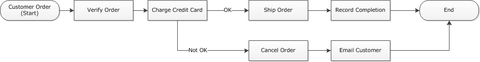

# Implementing exclusive choice with Amazon SWF

In some scenarios, you might want to schedule a different set of activities based on the outcome of a previous
activity. With the exclusive choice pattern, you can create flexible workflows that meet the complex requirements
of your application.

Amazon SWF does not have a specific exclusive choice action. To implement exclusive choice, you must
write your decider logic to make decisions based on the results of a previous activity. Some
applications for exclusive choice include the following:

- Performing cleanup activities if the results of a previous activity were unsuccessful
- Scheduling different activities based on whether the customer purchased a basic or advanced plan
- Performing different customer authentication activities based on the customer's ordering history
  In the e-commerce example, you might use exclusive choice to either ship or cancel an order based on the outcome
  of charging the credit card. In the following figure, the decider schedules the Ship Order and Record Completion
  activity tasks if the credit card is successfully charged. Otherwise, it schedules the Cancel Order and Email
  Customer activity tasks.


The decider schedules the `ShipOrder` activity if the credit card is successfully charged. Otherwise,
the decider schedules the `CancelOrder` activity.

In this case, program the decider to interpret the history and determine whether the credit card was
successfully charged. To do this, you might have logic similar to the following

```
IF lastEvent = "WorkflowExecutionStarted"
	addToDecisions ScheduleActivityTask(ActivityType = "VerifyOrderActivity")

ELSIF lastEvent = "ActivityTaskCompleted"
	    AND ActivityType = "VerifyOrderActivity"
	addToDecisions ScheduleActivityTask(ActivityType = "ChargeCreditCardActivity")

#Successful Credit Card Charge Activities
ELSIF lastEvent = "ActivityTaskCompleted"
      AND ActivityType = "ChargeCreditCardActivity"
  addToDecisions ScheduleActivityTask(ActivityType = "ShipOrderActivity")

ELSIF lastEvent = "ActivityTaskCompleted"
	    AND ActivityType = "ShipOrderActivity"
  addToDecisions ScheduleActivityTask(ActivityType = "RecordOrderCompletionActivity")

ELSIF lastEvent = "ActivityTaskCompleted"
	    AND ActivityType = "RecordOrderCompletionActivity"
	addToDecisions CompleteWorkflowExecution

#Unsuccessful Credit Card Charge Activities
ELSIF lastEvent = "ActivityTaskFailed"
      AND ActivityType = "ChargeCreditCardActivity"
  addToDecisions ScheduleActivityTask(ActivityType = "CancelOrderActivity")

ELSIF lastEvent = "ActivityTaskCompleted"
	    AND ActivityType = "CancelOrderActivity"
	addToDecisions ScheduleActivityTask(ActivityType = "EmailCustomerActivity")

ELSIF lastEvent = "ActivityTaskCompleted"
	    AND ActivityType = "EmailCustomerActivity"
	addToDecisions CompleteWorkflowExecution

ENDIF
```

If the credit card was successfully charged, the decider should respond with
`RespondDecisionTaskCompleted` to schedule the `ShipOrder` activity.

```
https://swf.us-east-1.amazonaws.com
RespondDecisionTaskCompleted
{
  "taskToken": "12342e17-80f6-FAKE-TASK-TOKEN32f0223",
  "decisions":[
      {
          "decisionType":"ScheduleActivityTask",
          "scheduleActivityTaskDecisionAttributes":{
              "control":"OPTIONAL_DATA_FOR_DECIDER",
              "activityType":{
                  "name":"ShipOrder",
                  "version":"2.4"
              },
              "activityId":"3e2e6e55-e7c4-fee-deed-aa815722b7be",
              "scheduleToCloseTimeout":"3600",
              "taskList":{
                  "name":"SHIPPING"
              },
              "scheduleToStartTimeout":"600",
              "startToCloseTimeout":"3600",
              "heartbeatTimeout":"300",
              "input": "123 Main Street, Anytown, United States"
          }
      }
  ]
}
```

If the credit card was not successfully charged, the decider should respond with
`RespondDecisionTaskCompleted` to schedule the `CancelOrder` activity.

```
https://swf.us-east-1.amazonaws.com
RespondDecisionTaskCompleted
{
  "taskToken": "12342e17-80f6-FAKE-TASK-TOKEN32f0223",
  "decisions":[
      {
          "decisionType":"ScheduleActivityTask",
          "scheduleActivityTaskDecisionAttributes":{
              "control":"OPTIONAL_DATA_FOR_DECIDER",
              "activityType":{
                  "name":"CancelOrder",
                  "version":"2.4"
              },
              "activityId":"3e2e6e55-e7c4-fee-deed-aa815722b7be",
              "scheduleToCloseTimeout":"3600",
              "taskList":{
                  "name":"CANCELLATIONS"
              },
              "scheduleToStartTimeout":"600",
              "startToCloseTimeout":"3600",
              "heartbeatTimeout":"300",
              "input": "Out of Stock"
          }
      }
  ]
}
```

If Amazon SWF is able to validate the data in the `RespondDecisionTaskCompleted` action, Amazon SWF returns a
successful HTTP response similar to the following.

```
HTTP/1.1 200 OK
Content-Length: 11
Content-Type: application/json
x-amzn-RequestId: 93cec6f7-0747-11e1-b533-79b402604df1
```
