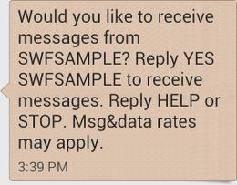
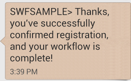

# Subscription Workflow Tutorial: Running the Workflow

Now that you've completed the implementation of your workflow, activities, and the workflow and activity
pollers, you're ready to run the workflow.

If you haven't done so already, you'll need to provide your AWS access keys in the
`aws-config.txt` file, like in [Configuring the AWS Session](swf-sns-tutorial-setup-swf.md#configuring-the-aws-session "swf-sns-tutorial-setup-swf.md#configuring-the-aws-session") in Part 1 of the tutorial.

Now, go to your command line and change to the directory where the tutorial source files are located. You
should have the following files:

````
.
|-- aws-config.txt
|-- basic_activity.rb
|-- get_contact_activity.rb
|-- send_result_activity.rb
|-- subscribe_topic_activity.rb
|-- swf_sns_activities.rb
|-- swf_sns_workflow.rb
|-- utils.rb `-- wait_for_confirmation_activity.rb ``` Now, start the workflow with the following command. ``` ruby swf_sns_workflow.rb ``` This will begin the workflow, and should print out a message with a line that you can copy and paste into a separate command-line window (or even on another computer, if you've copied the tutorial source files onto it). ``` Amazon SWF Example ------------------ Start the activity worker, preferably in a separate command-line window, with the following command: > ruby swf_sns_activities.rb `87097e76-7c0c-41c7-817b-92527bb0ea85-activities` You can copy & paste it if you like, just don't copy the '>' character. Press return when you're ready... ``` The workflow code will wait patiently for you to start the activity poller in a separate window. Open a new command-line window, change to the directory where the source files are located again, and then use the command provided by the `swf_sns_workflow.rb` file to start the activity poller. For example, if you received the preceding output, you would type (or paste) the following. ``` ruby swf_sns_activities.rb `87097e76-7c0c-41c7-817b-92527bb0ea85-activities` ``` Once you begin running your activity poller, it will start to output information about activities registration. ``` ** initialized and registered activity: get_contact_activity ** initialized and registered activity: subscribe_topic_activity ** initialized and registered activity: wait_for_confirmation_activity ** initialized and registered activity: send_result_activity ``` You can now return to your original command-line window, and press return to start your workflow execution. It will register the workflow and schedule the first activity. ``` Starting workflow execution. ** registered workflow: swf-sns-workflow ** scheduling activity task: get_contact_activity ``` Go back to the other window, where your activity poller is running. The result of the first running activity is displayed, providing a prompt for you to enter your email or SMS phone number. Enter either, or both, of these pieces of data, and then confirm your text entry. ``` activity task received: <AWS::SimpleWorkflow::ActivityTask> ** Starting activity task: get_contact_activity Please enter either an email address or SMS message (mobile phone) number to receive Amazon SNS notifications. You can also enter both to use both address types. If you enter a phone number, it must be able to receive SMS messages, and must be 11 digits (such as 12065550101 to represent the number 1-206-555-0101). Email: me@example.com Phone: 12065550101 You entered: email: me@example.com phone: 12065550101 Is this correct? (y/n): y ``` ###### Note The phone number provided is fictitious, and is used only for illustrative purposes. Use your own phone number and email address here! Soon after entering this information, you should receive an email or text message from Amazon SNS, asking you to confirm your topic subscription. If you entered an SMS number, you will see something like the following appear on your phone.  If you reply to this message with `YES`, you'll get the response that we provided in `send_result_activity`.  While all of this was happening, did you see what was happening in your command-line window? Both the workflow and activity pollers have been hard at work. Here's the output from the workflow poller. ``` ** scheduling activity task: subscribe_topic_activity ** scheduling activity task: wait_for_confirmation_activity ** scheduling activity task: send_result_activity !! All activities complete! Sending complete_workflow_execution... ``` Here's the output from the activity poller, which was happening at the same time in another command-line window. ``` ++ Activity task completed: get_contact_activity ** Starting activity task: subscribe_topic_activity ++ Activity task completed: subscribe_topic_activity ** Starting activity task: wait_for_confirmation_activity Topic subscription still pending for (email: me@example.com) Topic subscription confirmed for (sms: 12065550101) ++ Activity task completed: wait_for_confirmation_activity ** Starting activity task: send_result_activity Thanks, you've successfully confirmed registration, and your workflow is complete! ++ Activity task completed: send_result_activity All done! ``` Congratulations, your workflow is complete, and so is this tutorial! You may want to re-run the workflow again to see how timeouts work, or to enter different data. Just remember that once you subscribe to a topic, *you're still subscribed until you unsubscribe*. Re-running the workflow before unsubscribing to topics will probably result in automatic success, because the `wait_for_confirmation_activity` will see that your subscription is already confirmed. **To unsubscribe from the Amazon SNS topic** <br>• Respond in the negative (send `STOP`) to the text message. <br>• Choose the unsubscribe link that you received in your email. You're now ready to re-subscribe to the topic again. ## Where Do I Go from Here? This tutorial has covered a lot of ground, but there's still much more you can learn about the AWS SDK for Ruby, Amazon SWF, or Amazon SNS. For more information and many more examples, see the official documentation for each: <br>• [AWS SDK for Ruby Documentation](https://aws.amazon.com/documentation/sdkforruby/ "https://aws.amazon.com/documentation/sdkforruby/") <br>• [Amazon Simple Notification Service Documentation](https://aws.amazon.com/documentation/sns/ "https://aws.amazon.com/documentation/sns/") <br>• [Amazon Simple Workflow Service Documentation](https://aws.amazon.com/documentation/swf/ "https://aws.amazon.com/documentation/swf/")
````
