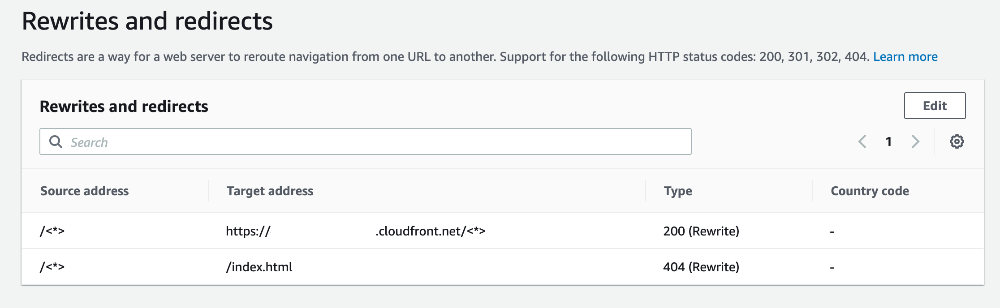

# SSR supported features

This section provides information about Amplify's support for SSR features.

Amplify provides Node.js version support to match the version of Node.js that was used
to build your app.

Amplify provides a built-in image optimization feature that supports all SSR apps. If
you don't want to use the default image optimization feature, you can implement a custom image
optimization loader.

###### Topics

- [Node.js version support for Next.js apps](#node-version-support-ssr "#node-version-support-ssr")
- [Image optimization for SSR apps](#image-optimization "#image-optimization")
- [Amazon CloudWatch Logs for SSR apps](#ssr-CloudWatch-logs "#ssr-CloudWatch-logs")
- [Amplify Next.js 11 SSR support](#ssr-nextjs11-support "#ssr-nextjs11-support")

## Node.js version support for Next.js apps

When Amplify builds and deploys a Next.js compute app, it uses the
Node.js runtime version that matches the major version of
Node.js that was used to build the app.

###### Note

Starting on September 15, 2025, Amplify hosting will no longer support Node.js 14,
Node.js 16, and Node.js 18 runtimes. Supported runtimes include Node.js 20 and Node.js 22.

You can specify the Node.js version to use in the **Live package
override** feature in the Amplify console. For more information about
configuring live package updates, see [Using specific package and dependency versions in the
build image](custom-build-image.md#setup-live-updates "custom-build-image.md#setup-live-updates"). You can also specify the Node.js
version using other mechanisms, such as nvm commands. If you don't specify a
version, Amplify defaults to use the current version used by the Amplify build
container.

## Image optimization for SSR apps

Amplify Hosting provides a built-in image optimization feature that supports all SSR
apps. With Amplify's image optimization, you can deliver high-quality images in the right
format, dimension, and resolution for the device that is accessing them, while maintaining
the smallest possible file size.

Currently, you can either use the Next.js Image component to optimize images on-demand
or you can implement a custom image loader. If you are using Next.js 13 or later, you don't
need to take any further action to use Amplify's image optimization feature. If you are
implementing a custom loader, see the following _Using a custom image
loader_ topic.

### Using a custom image loader

If you use a custom image loader, Amplify detects the loader in your application's
`next.config.js` file and doesn't utilize the built-in image
optimization feature. For more information about the custom loaders that Next.js supports,
see the [Next.js images](https://nextjs.org/docs/pages/api-reference/next-config-js/images "https://nextjs.org/docs/pages/api-reference/next-config-js/images") documentation.

## Amazon CloudWatch Logs for SSR apps

Amplify sends information about your SSR runtime to Amazon CloudWatch Logs in your AWS account.
When you deploy an SSR app, the app requires an IAM service role that Amplify assumes
when calling other services on your behalf. You can either allow Amplify Hosting compute
to automatically create a service role for you or you can specify a role that you have
created.

If you choose to allow Amplify to create an IAM role for you, the role will already
have the permissions to create CloudWatch Logs. If you create your own IAM role, you will need to
add the following permissions to your policy to allow Amplify to access Amazon CloudWatch Logs.

```
logs:CreateLogStream
logs:CreateLogGroup
logs:DescribeLogGroups
logs:PutLogEvents
```

For more information about service roles, see [Adding a service role with permissions to deploy
backend resources](amplify-service-role.md "amplify-service-role.md").

## Amplify Next.js 11 SSR support

If you deployed a Next.js app to Amplify prior to the release of Amplify Hosting
compute on November 17, 2022, your app is using Amplify's previous SSR provider, Classic
(Next.js 11 only). The documentation in this section applies only to apps deployed using the
Classic (Next.js 11 only) SSR provider.

###### Note

We strongly recommend that you migrate your Next.js 11 apps to the Amplify Hosting
compute managed SSR provider. For more information, see [Migrating a Next.js 11 SSR app to Amplify
Hosting compute](update-app-nextjs-version.md "update-app-nextjs-version.md").

The following list describes the specific features that the Amplify Classic (Next.js
11 only) SSR provider supports.

###### Supported

features

- Server-side rendered pages (SSR)
- Static pages
- API routes
- Dynamic routes
- Catch all routes
- SSG (Static generation)
- Incremental Static Regeneration (ISR)
- Internationalized (i18n) sub-path routing
- Environment variables

###### Unsupported features

- Image optimization
- _On-Demand_ Incremental Static Regeneration (ISR)
- Internationalized (i18n) domain routing
- Internationalized (i18n) automatic locale detection
- Middleware
- Edge Middleware
- Edge API Routes

### Pricing for Next.js 11 SSR apps

When deploying your Next.js 11 SSR app, Amplify creates additional backend resources
in your AWS account, including:

- An Amazon Simple Storage Service (Amazon S3) bucket that stores the resources for your app's static assets.
  For information about Amazon S3 charges, see [Amazon S3
  Pricing](https://aws.amazon.com/s3/pricing/ "https://aws.amazon.com/s3/pricing/").
- An Amazon CloudFront distribution to serve the app. For information about CloudFront charges, see
  [Amazon CloudFront Pricing](https://aws.amazon.com/cloudfront/pricing/ "https://aws.amazon.com/cloudfront/pricing/").
- Four [Lambda@Edge
  functions](../../../AmazonCloudFront/latest/DeveloperGuide/lambda-at-the-edge.md "../../../AmazonCloudFront/latest/DeveloperGuide/lambda-at-the-edge.md") to customize the content that CloudFront delivers.

### AWS Identity and Access Management permissions for Next.js 11 SSR

apps

Amplify requires AWS Identity and Access Management (IAM) permissions to deploy an SSR app. For SSR apps,
Amplify deploys resources such as an Amazon S3 bucket, a CloudFront distribution,
Lambda@Edge functions, an Amazon SQS queue (if using ISR) and IAM roles.
Without the required minimum permissions, you will get an `Access Denied` error
when you try to deploy your SSR app. To provide Amplify with the required permissions,
you must specify a service role.

To create an IAM service role that Amplify assumes when calling other services on
your behalf, see [Adding a service role with permissions to deploy
backend resources](amplify-service-role.md "amplify-service-role.md"). These instructions demonstrate
how to create a role that attaches the `AdministratorAccess-Amplify` managed
policy.

The `AdministratorAccess-Amplify` managed policy provides access to
multiple AWS services, including IAM actions. and should be considered as powerful as
the `AdministratorAccess` policy. This policy provides more permissions than
required to deploy your SSR app.

It is recommended that you follow the best practice of granting least privilege and
reduce the permissions granted to the service role. Instead of granting administrator
access permissions to your service role, you can create your own customer managed IAM
policy that grants only the permissions required to deploy your SSR app. See, [Creating IAM policies](../../../IAM/latest/UserGuide/access_policies_create-console.md "../../../IAM/latest/UserGuide/access_policies_create-console.md") in the _IAM User Guide_ for
instructions on creating a customer managed policy.

If you create your own policy, refer to the following list of the minimum permissions
required to deploy an SSR app.

```
acm:DescribeCertificate
acm:DescribeCertificate
acm:ListCertificates
acm:RequestCertificate
cloudfront:CreateCloudFrontOriginAccessIdentity
cloudfront:CreateDistribution
cloudfront:CreateInvalidation
cloudfront:GetDistribution
cloudfront:GetDistributionConfig
cloudfront:ListCloudFrontOriginAccessIdentities
cloudfront:ListDistributions
cloudfront:ListDistributionsByLambdaFunction
cloudfront:ListDistributionsByWebACLId
cloudfront:ListFieldLevelEncryptionConfigs
cloudfront:ListFieldLevelEncryptionProfiles
cloudfront:ListInvalidations
cloudfront:ListPublicKeys
cloudfront:ListStreamingDistributions
cloudfront:UpdateDistribution
cloudfront:TagResource
cloudfront:UntagResource
cloudfront:ListTagsForResource
iam:AttachRolePolicy
iam:CreateRole
iam:CreateServiceLinkedRole
iam:GetRole
iam:PutRolePolicy
iam:PassRole
lambda:CreateFunction
lambda:EnableReplication
lambda:DeleteFunction
lambda:GetFunction
lambda:GetFunctionConfiguration
lambda:PublishVersion
lambda:UpdateFunctionCode
lambda:UpdateFunctionConfiguration
lambda:ListTags
lambda:TagResource
lambda:UntagResource
route53:ChangeResourceRecordSets
route53:ListHostedZonesByName
route53:ListResourceRecordSets
s3:CreateBucket
s3:GetAccelerateConfiguration
s3:GetObject
s3:ListBucket
s3:PutAccelerateConfiguration
s3:PutBucketPolicy
s3:PutObject
s3:PutBucketTagging
s3:GetBucketTagging
lambda:ListEventSourceMappings
lambda:CreateEventSourceMapping
iam:UpdateAssumeRolePolicy
iam:DeleteRolePolicy
sqs:CreateQueue           // SQS only needed if using ISR feature
sqs:DeleteQueue
sqs:GetQueueAttributes
sqs:SetQueueAttributes
amplify:GetApp
amplify:GetBranch
amplify:UpdateApp
amplify:UpdateBranch
```

### Troubleshooting Next.js 11 SSR

deployments

If you experience unexpected issues when deploying a Classic (Next.js 11 only) SSR app
with Amplify, review the following troubleshooting topics.

###### Topics

- [My application's output directory is
  overridden](#output-directory-overridden "#output-directory-overridden")
- [I get a 404 error after deploying my SSR site](#404-error "#404-error")
- [My application is missing the rewrite rule
  for CloudFront SSR distributions](#cloudfront-rewrite-rule-missing "#cloudfront-rewrite-rule-missing")
- [My application is too large to deploy](#app-too-large-to-deploy "#app-too-large-to-deploy")
- [My build fails with an out of memory error](#out-of-memory "#out-of-memory")
- [My application has both SSR and SSG branches](#ssr-and-ssg-branches "#ssr-and-ssg-branches")
- [My application stores static files in a folder with a
  reserved path](#amplify-reserved-path "#amplify-reserved-path")
- [My application has reached a CloudFront
  limit](#cloudfront-distribution-limit "#cloudfront-distribution-limit")
- [Lambda@Edge functions are created
  in the US East (N. Virginia) Region](#nextjs-version-lambda-edge-functions "#nextjs-version-lambda-edge-functions")
- [My Next.js application uses unsupported
  features](#nextjs-version-support "#nextjs-version-support")
- [Images in my Next.js application aren't loading](#image-size-limit "#image-size-limit")
- [Unsupported Regions](#amplify-region-support "#amplify-region-support")

#### My application's output directory is

overridden

The output directory for a Next.js app deployed with Amplify must be set to
`.next`. If your app's output directory is being overridden, check the
`next.config.js` file. To have the build output directory default to
`.next`, remove the following line from the file:

```
distDir: 'build'
```

Verify that the output directory is set to `.next` in your build
settings. For information about viewing your app's build settings, see [Configuring the build settings for an Amplify application](build-settings.md "build-settings.md").

The following is an example of the build settings for an app where
`baseDirectory` is set to `.next`.

```
version: 1
frontend:
  phases:
    preBuild:
      commands:
        - npm ci
    build:
      commands:
        - npm run build
  artifacts:
    baseDirectory: .next
    files:
      - '**/*'
  cache:
    paths:
      - node_modules/**/*

```

#### I get a 404 error after deploying my SSR site

If you get a 404 error after deploying your site, the issue could be caused by your
output directory being overridden. To check your `next.config.js` file and
verify the correct build output directory in your app's build spec, follow the steps in
the previous topic, [My application's output directory is
overridden](#output-directory-overridden "#output-directory-overridden").

#### My application is missing the rewrite rule

for CloudFront SSR distributions

When you deploy an SSR app, Amplify creates a rewrite rule for your CloudFront SSR
distributions. If you can't access your app in a web browser, verify that the CloudFront
rewrite rule exists for your app in the Amplify console. If it's missing, you can
either add it manually or redeploy your app.

To view or edit an app's rewrite and redirect rules in the Amplify console, in the
navigation pane, choose **App settings**, then **Rewrites and
redirects**. The following screenshot shows an example of the rewrite rules
that Amplify creates for you when you deploy an SSR app. Notice that in this example,
a CloudFront rewrite rule exists.



#### My application is too large to deploy

Amplify limits the size of an SSR deployment to 50 MB. If you try to deploy a
Next.js SSR app to Amplify and get a `RequestEntityTooLargeException`
error, your app is too large to deploy. You can attempt to work around this issue by
adding cache cleanup code to your `next.config.js` file.

The following is an example of code in the `next.config.js` file that
performs cache cleanup.

```
module.exports = {
    webpack: (config, { buildId, dev, isServer, defaultLoaders, webpack }) => {
        config.optimization.splitChunks.cacheGroups = { }
        config.optimization.minimize = true;
        return config
      },
}
```

#### My build fails with an out of memory error

Next.js enables you to cache build artifacts to improve performance on subsequent
builds. In addition, Amplify's AWS CodeBuild container compresses and uploads this cache
to Amazon S3, on your behalf, to improve subsequent build performance. This could cause your
build to fail with an out of memory error.

Perform the following actions to prevent your app from exceeding the memory limit
during the build phase. First, remove `.next/cache/**/*` from the cache.paths
section of your build settings. Next, remove the `NODE_OPTIONS` environment
variable from your build settings file. Instead, set the `NODE_OPTIONS`
environment variable in the Amplify console to define the Node maximum memory limit.
For more information about setting environment variables using the Amplify console,
see [Setting environment variables](setting-env-vars.md "setting-env-vars.md").

After making these changes, try your build again. If it succeeds, add
`.next/cache/**/*` back to the cache.paths section of your build settings
file.

For more information about Next.js cache configuration to improve build performance,
see [AWS
CodeBuild](https://nextjs.org/docs/app/guides/ci-build-caching#aws-codebuild "https://nextjs.org/docs/app/guides/ci-build-caching#aws-codebuild") on the Next.js website.

#### My application has both SSR and SSG branches

You can't deploy an app that has both SSR and SSG branches. If you need to deploy
both SSR and SSG branches, you must deploy one app that uses only SSR branches and
another app that uses only SSG branches.

#### My application stores static files in a folder with a

reserved path

Next.js can serve static files from a folder named `public` that's stored
in the project's root directory. When you deploy and host a Next.js app with Amplify,
your project can't include folders with the path `public/static`. Amplify
reserves the `public/static` path for use when distributing the app. If your
app includes this path, you must rename the `static` folder before deploying
with Amplify.

#### My application has reached a CloudFront

limit

[CloudFront service
quotas](../../../AmazonCloudFront/latest/DeveloperGuide/cloudfront-limits.md "../../../AmazonCloudFront/latest/DeveloperGuide/cloudfront-limits.md") limit your AWS account to 25 distributions with attached Lambda@Edge
functions. If you exceed this quota, you can either delete any unused CloudFront distributions
from your account or request a quota increase. For more information, see [Requesting a quota increase](../../../servicequotas/latest/userguide/request-quota-increase.md "../../../servicequotas/latest/userguide/request-quota-increase.md") in the _Service Quotas User Guide_.

#### Lambda@Edge functions are created

in the US East (N. Virginia) Region

When you deploy a Next.js app, Amplify creates Lambda@Edge functions to customize
the content that CloudFront delivers. Lambda@Edge functions are created in the US East (N. Virginia) Region,
not the Region where your app is deployed. This is a Lambda@Edge restriction. For more
information about Lambda@Edge functions, see [Restrictions on edge functions](../../../AmazonCloudFront/latest/DeveloperGuide/edge-functions-restrictions.md "../../../AmazonCloudFront/latest/DeveloperGuide/edge-functions-restrictions.md") in the _Amazon CloudFront Developer Guide._

#### My Next.js application uses unsupported

features

Apps deployed with Amplify support the Next.js major versions up through version 11. For a detailed list of the Next.js features that are supported and unsupported by
Amplify, see [supported features](#supportedfeatures "#supportedfeatures").

When you deploy a new Next.js app, Amplify uses the most recent supported version
of Next.js by default. If you have an existing Next.js app that you deployed to
Amplify with an older version of Next.js, you can migrate the app to the Amplify
Hosting compute SSR provider. For instructions, see [Migrating a Next.js 11 SSR app to Amplify
Hosting compute](update-app-nextjs-version.md "update-app-nextjs-version.md").

#### Images in my Next.js application aren't loading

When you add images to your Next.js app using the `next/image` component,
the size of the image can't exceed 1 MB. When you deploy the app to Amplify, images
that are larger than 1 MB will return a 503 error. This is caused by a Lambda@Edge limit
that restricts the size of a response that is generated by a Lambda function, including
headers and body, to 1 MB.

The 1 MB limit applies to other artifacts in your app, such as PDF and document
files.

#### Unsupported Regions

Amplify doesn't support Classic (Next.js 11 only) SSR app deployment in every
AWS region where Amplify is available. Classic (Next.js 11 only) SSR isn't supported
in the following Regions: Europe (Milan) eu-south-1, Middle East (Bahrain) me-south-1,
and Asia Pacific (Hong Kong) ap-east-1.
