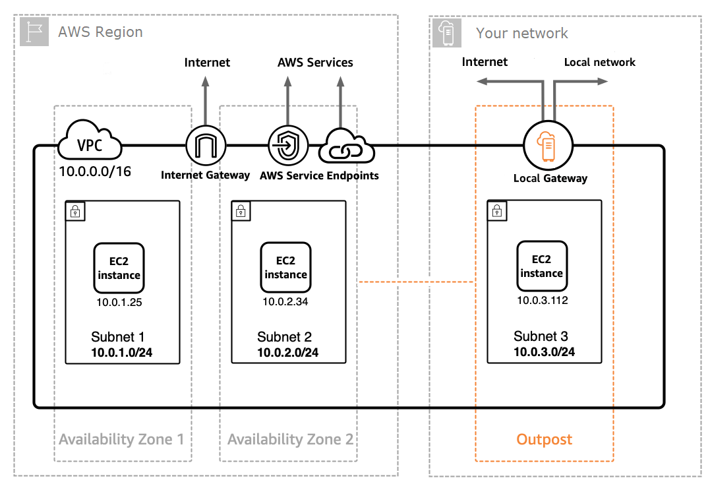

# App Mesh on AWS Outposts

###### Important

End of support notice: On September 30, 2026, AWS will discontinue support for AWS App Mesh. After September 30, 2026, you will no longer be able to access the AWS App Mesh console or AWS App Mesh resources. For more information, visit this blog post [Migrating from AWS App Mesh to Amazon ECS Service Connect](https://aws.amazon.com/blogs/containers/migrating-from-aws-app-mesh-to-amazon-ecs-service-connect "https://aws.amazon.com/blogs/containers/migrating-from-aws-app-mesh-to-amazon-ecs-service-connect").

AWS Outposts enables native AWS services, infrastructure, and operating models in
on-premises facilities. In AWS Outposts environments, you can use the same AWS APIs, tools,
and infrastructure that you use in the AWS Cloud. App Mesh on AWS Outposts is ideal for
low-latency workloads that need to be run in close proximity to on-premises data and
applications. For more information about AWS Outposts, see the [AWS Outposts User Guide](../../../outposts/latest/userguide.md "../../../outposts/latest/userguide.md").

## Prerequisites

The following are the prerequisites for using App Mesh on AWS Outposts:

- You must have installed and configured an Outpost in your on-premises data
  center.
- You must have a reliable network connection between your Outpost and its AWS
  Region.
- The AWS Region for the Outpost must support AWS App Mesh. For a list of
  supported Regions, see [AWS App Mesh Endpoints and Quotas](../../../general/latest/gr/appmesh.md "../../../general/latest/gr/appmesh.md")
  in the _AWS General Reference_.

## Limitations

The following are the limitations of using App Mesh on AWS Outposts:

- AWS Identity and Access Management, Application Load Balancer, Network Load Balancer, Classic Load Balancer, and Amazon Route 53 run in the AWS Region, not on
  Outposts. This will increase latencies between these services and the
  containers.

## Network connectivity considerations

The following are network connectivity considerations for Amazon EKS AWS Outposts:

- If network connectivity between your Outpost and its AWS Region is lost, the
  App Mesh Envoy proxies will continue to run. However you will not be able to
  modify your service mesh until connectivity is restored.
- We recommend that you provide reliable, highly available, and low-latency
  connectivity between your Outpost and its AWS Region.

## Creating an App Mesh Envoy proxy on an Outpost

An Outpost is an extension of an AWS Region, and you can extend an Amazon VPC in an
account to span multiple Availability Zones and any associated Outpost locations. When
you configure your Outpost, you associate a subnet with it to extend your Regional VPC
environment to your on-premises facility. Instances on an Outpost appear as part of your
Regional VPC, similar to an Availability Zone with associated subnets.

To create an App Mesh Envoy proxy on an Outpost, add the App Mesh Envoy container image
to the Amazon ECS task or Amazon EKS pod running on an Outpost. For more information, see [Amazon Elastic Container Service on AWS Outposts](../../../AmazonECS/latest/developerguide/ecs-on-outposts.md "../../../AmazonECS/latest/developerguide/ecs-on-outposts.md") in the _Amazon Elastic Container Service Developer Guide_ and
[Amazon Elastic Kubernetes Service on AWS Outposts](../../../eks/latest/userguide/eks-on-outposts.md "../../../eks/latest/userguide/eks-on-outposts.md") in the
**Amazon EKS User Guide**.
