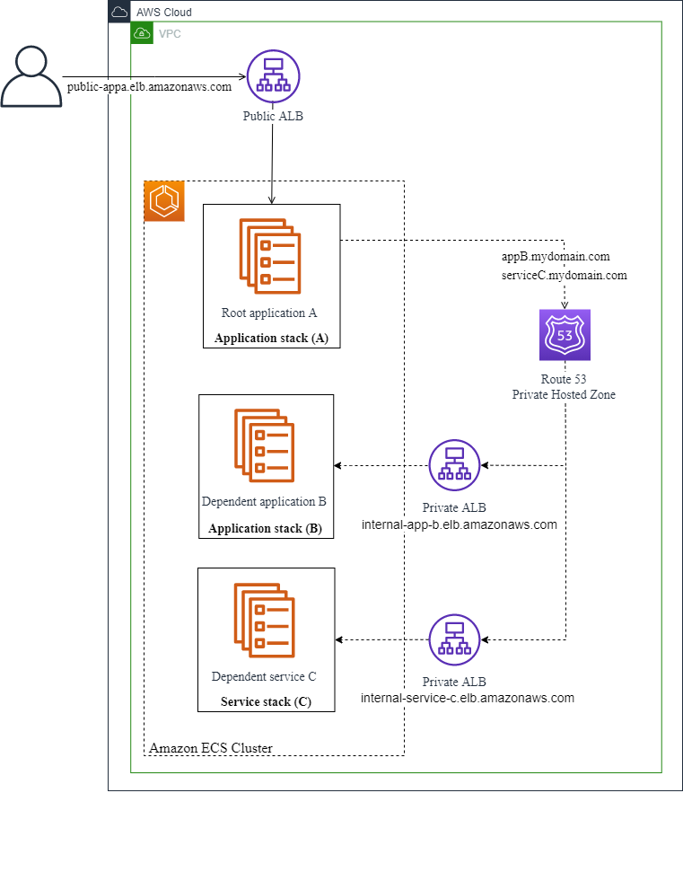
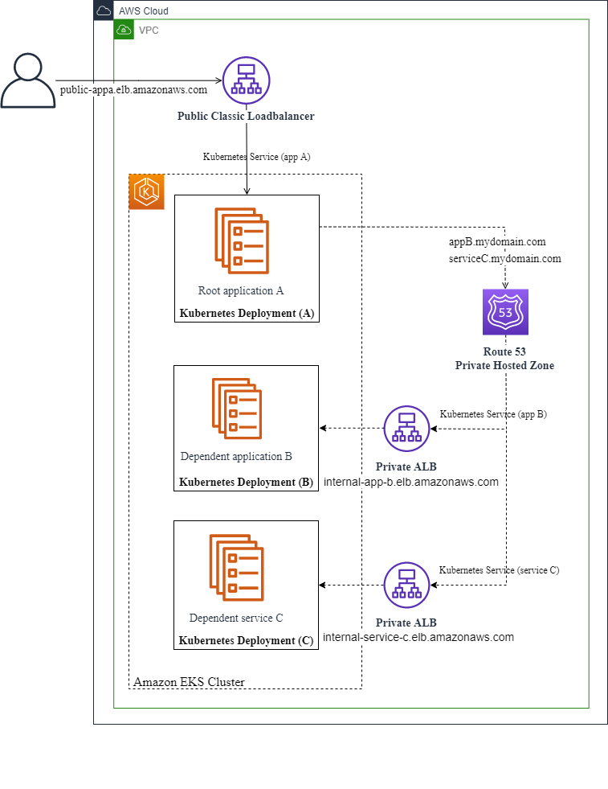

AWS .NET Modernization Tools Porting Assistant (PA) for .NET, AWS App2Container (A2C), AWS Toolkit for .NET Refactoring (TR), and AWS Microservice Extractor (ME) for .NET is no longer open to new customers. If you would like to use the service, sign up prior to November 7, 2025. Alternatively use [AWS Transform](https://aws.amazon.com/transform/ "https://aws.amazon.com/transform/"), which is an agentic AI service developed to accelerate enterprise modernization of .NET.

# Containerizing complex Windows .NET applications with

App2Container

Containerization for complex multi-tier Windows .NET applications requires careful planning.
When functionality is shared between the root application and one or more lower-level or
system applications, you need to make decisions about packaging, deployment, and
orchestration for all of the components.

To summarize how AWS App2Container works to containerize a complex Windows .NET application,
we'll visit each step in the App2Container workflow, and call out the highlights and things to
consider.

## Step 1: Setup and initialization

Setup and initialization are the same for complex Windows .NET applications as for
other types of applications. Setup tasks include installing software, configuring your
AWS profile and IAM permissions, and deciding which servers the App2Container commands
should run on. To learn more about setting up your environment before running App2Container
for the first time, see [Prerequisites: Set up your servers](start-intro.md#start-containerize-prereq "start-intro.md#start-containerize-prereq").

After you have completed the setup tasks, but before you use App2Container for the first
time, you must initialize the servers where you plan to run App2Container commands. To learn
more about initialization and worker machine configuration, see the
[Initialize](a2c-commands.md#init-phase "a2c-commands.md#init-phase") section in the
[App2Container command reference](a2c-commands.md "a2c-commands.md").

## Step 2: Analysis phase

After you have completed setup and initialization tasks on your servers, App2Container helps you to
take an inventory of your running applications, and perform analysis to determine what should
be included in your application containers.

###### Inventory

The first step in the analysis phase is to take an inventory of your applications.
When you run the **app2container inventory** command (or the
**app2container remote inventory** command, if you have
configured a worker machine), App2Container detects the applications that are running in
IIS. It also detects the Windows services that could be configured as dependent
application components.

App2Container identifies each IIS application or Windows service as a separate application, with
its own application ID in the `inventory.json` file. App2Container makes an
effort to exclude basic operating system services that you would not want to add to your
containers. However, even when these services are excluded, the inventory list can still
be quite long.

To narrow the results of the **app2container inventory** or
**app2container remote inventory** commands, you can specify what type of
application you are looking for with the `--type` option:

- To run an inventory of your IIS applications, you can set the `--type`
  option to "iis".
- To run an inventory of your Windows services, you can set the `--type`
  option to "service".

If you don't want App2Container to filter inventory results at all, you can use the
`--nofilter` option. This option prevents App2Container from filtering out default
system services when building the inventory list. For more information and command syntax,
see the **[inventory](cmd-inventory.md "cmd-inventory.md")** or
**[remote inventory](cmd-remote-inventory.md "cmd-remote-inventory.md")** command in the command
reference section.

###### Analysis

When you run the **app2container analyze** or **app2container
remote analyze** commands, App2Container analyzes the application component that you
specify with the `--application-id` parameter.

App2Container creates the folder structure for the application component, inside of the App2Container
directory on your application server or worker machine. It produces the
`analysis.json` file, and saves it to the new folder structure,
along with other artifacts that are required for containerization. The
`analysis.json` file is where you begin to define your container
structure.

###### Tip

Run the **app2container analyze** or **app2container remote
analyze** command for every component in your multi-tier application before
you configure your container structure.

You can implement the following container structures for a multi-tier Windows .NET
application:

- ###### Multiple application components running in separate containers (recommended)

In this scenario, each application component in your multi-tier Windows
.NET application runs in a separate container. Relationships between the
root application and up to two dependent applications are configured in the
`deployment.json` file for the root application.
This file is produced during the containerization phase.

When your application components are running in separate containers, leave the
`additionalApps` array in the `analysis.json` file
empty for all components.

- ###### Multiple application components running in a single container

In this scenario, the application components in a multi-tier Windows
.NET application run together in one container. We recommend that packaging
multiple application components in a single container is only done when there
are cross-dependencies between the components.

To specify multiple application components running in a single container, you
can include up to five dependent component application IDs in the
`additionalApps` array in the `analysis.json` file
for the root application.

###### Note

This configuration has the following limitations:

    + Only the port that is defined for the root application
     is exposed to outside traffic through your load balancer. Ports that
     are defined for other application components are exposed only from the
     container, and are not accessible through the load balancer.
    + If you are using remote commands on a worker machine, all of the
     application components in a multi-tier application must be
     running on the same application server if you want them to run in
     a single container.

To learn more about configuring containers, see [Configuring application containers](config-containers.md "config-containers.md"). To compare configuration examples for a
simple .NET application, and for complex multi-tier .NET applications, expand the
**Containers running on Windows** section, and explore the example tabs.

For more information and command syntax, see the
**[analyze](cmd-analyze.md "cmd-analyze.md")** or
**[remote analyze](cmd-remote-analyze.md "cmd-remote-analyze.md")**
command in the command reference section.

## Step 3: Containerization

This phase creates containers for your application, based on the output of the analysis
phase and on your configuration in the `analysis.json` file.

###### Extract

If you are using a worker machine to run App2Container commands, or if you want to store an
application archive for reference, this phase starts with an **app2container
extract** or **app2container remote extract** command.
Because this has no effect on the configuration for multi-tier application containers,
we will not cover that here.

###### Containerize

The **app2container containerize** command performs the following
tasks for the application that's specified in the `--application id`
parameter:

- Extracts application artifacts from the server it runs on, or reads from an
  extract archive. For complex multi-tier applications, the extract includes
  all artifacts that are needed for all of the components running in the
  container.
- Generates a Dockerfile and a container image, based on the application
  artifacts and the application settings in the `analysis.json`
  file.
- Creates the `deployment.json` file that defines
  initial settings for container deployment during the deployment phase.

You must run the **app2container containerize** command for the
root application container, and for each additional application component that runs
in a separate container. Do not run the command for any components that are included
in the root application container. The command displays real-time task completion
messages, followed by instructions for next steps. This includes the AWS commands
that you run if you are deploying manually.

To configure the `deployment.json` file for a complex multi-tier
application, refer to the following scenario that describes your implementation:

- ###### Multiple application components running in separate containers

In this scenario, each application component is running in a separate
container, and each has its own deployment file. Before running the
**generate app-deployment** command, configure the
`deployment.json` file for the root application to
include all dependent applications or services in the
`dependentApps` array, including the application ID, private
root domain, and DNS record name for each one.

- ###### Multiple application components running in a single container

If you are running multiple application components in a single container,
the process for configuring the `deployment.json` file
is the same as for any other containerized application. Leave the
`dependentApps` array empty.

###### Note

If you are deploying to a specific VPC, make sure that all components point to
that VPC in the `vpcId` parameter in the `reuseResources`
array in the `deployment.json` file.

To learn more about configuring your `deployment.json` file,
see [Configuring container deployment](config-deployment.md "config-deployment.md"). For more
information and command syntax for creating your application container, see the
**[containerize](cmd-containerize.md "cmd-containerize.md")**
command in the command reference section.

## Step 4: Deployment

Deployment steps for complex Windows .NET applications with multiple application
components running in a single container are handled the same as any other application
deployment. For more information and command syntax for deploying your application container,
see the **[generate app-deployment](cmd-generate-appdeploy.md "cmd-generate-appdeploy.md")** command in the command
reference section.

The remainder of the content in this section applies to complex Windows .NET applications
that have multiple application components running in separate containers, similar to the
application example shown in the following diagrams:

Amazon ECS deployment



Amazon EKS deployment



Normally, you run the **generate app-deployment** command for each
application container that you create. However, with complex Windows .NET applications
that have dependent applications running in separate containers, App2Container takes care of some
of that for you. When you run the **generate app-deployment** command for
the root application, App2Container completes the following tasks for the root application
_and each of its dependent application components_:

- Checks for AWS and Docker prerequisites.
- Creates an Amazon ECR repository.
- Pushes the container image to the Amazon ECR repository.
- Generates the following artifacts, depending on your target
  container management service:

###### Amazon ECS

    + An Amazon ECS task definition.
    + The `ecs-master.yml` file that you can
     use for Amazon ECS deployment.

###### Amazon EKS

    + The Kubernetes `eks-master.yml` file that
     you can use for Amazon EKS deployment.
    + The `eks_deployment.yaml` and
     `eks_service.yaml` files that you can use
     with the **kubectl** command.

- Generates a `pipeline.json` file.

Additionally, if you use the `--deploy` option, App2Container takes care of all
of those deployments in the order in which they need to run, and configures shared
infrastructure settings. When App2Container handles the deployment for you, it follows these
conventions:

- The root application and all dependent application components are deployed
  to the same cluster.
- All dependent application components are configured with an internal load
  balancer only.
- Each application component has its own Amazon ECS or Amazon EKS service
  running in a shared cluster.

If you want to customize the deployment artifacts, you can deploy manually, using
the AWS Management Console or AWS CLI when you are ready.

For deployment steps, choose the tab that matches your deployment scenario.

Automated (A2C)
Follow these steps if you are using the App2Container automated deployment.

1. Verify that the values are set correctly in the
   `deployment.json` files for all of your application
   components, before running the **generate app-deployment**
   command for your root application, as follows:
   - None of the application components in the multi-tier
     application should specify `reuseCfnStack`.
   - Dependent application components should not specify
     any of the following parameters: `vpcId`, `gMSAParameters`.
   - The following parameters can be specified in the
     root application, and App2Container applies the same values for all dependent application
     components: `vpcId`, `resourceTags`, and
     `gMSAParameters`.

2. The following example shows the **generate app-deployment**
   command for the root application in our sample multi-tier application,
   using the `--deploy` option, with the `--application-id`
   parameter set to the application ID for the root application. This example
   handles the full deployment for all application components.

````
`PS>` `app2container generate app-deployment --deploy --application-id `iis-colormvciis-b69c09ab` --profile `admin-profile```√ AWS prerequisite check succeeded
√ Docker prerequisite check succeeded
... [more notifications as deployment steps are completed for each dependent application component, followed by the root application and shared configurations]
Deployment successful for application `iis-colormvciis-b69c09ab`

The URL to your Load Balancer Endpoint is:
a2c-i-Publi-1A2BCD3EFGRW-4567890123.us-west-2.elb.amazonaws.com

Successfully created Amazon ECS stack a2c-`iis-colormvciis-b69c09ab`-ECS. Check the AWS CloudFormation Console for additional details.
3. Set up a pipeline for your application stack using app2container:

 app2container generate pipeline --application-id `iis-colormvciis-b69c09ab``
````

The first deployment for a dependent application component creates
shared AWS resources, such as the VPC and Amazon ECS or Amazon EKS cluster. After
the first dependent application component is successfully deployed, App2Container
updates deployment artifacts for all of the other application components
to reference the shared AWS resources prior to completing the remaining
deployments.

Manual (AWS CLI)
Follow these steps to customize your deployment files and use the AWS CLI to deploy
manually. We do not include AWS Management Console instructions here. However, you can
follow the same general order of operations in the console.

1. Verify that the values are set correctly in the
   `deployment.json` files for all of your application
   components, before running the **generate app-deployment**
   command for your root application, as follows:
   - None of the application components in the multi-tier
     application should specify `reuseCfnStack`.
   - Dependent application components should not specify
     any of the following parameters: `vpcId`, `gMSAParameters`.
   - The following parameters can be specified in the
     root application, and App2Container applies the same values for all dependent application
     components: `vpcId`, `resourceTags`, and
     `gMSAParameters`.

2. The following example shows the **generate app-deployment**
   command for the root application in our sample multi-tier application, with
   the `--application-id` parameter set to the application ID for the
   root application. The `--deploy` option is not used in this case,
   as we plan to customize deployment files and then deploy using AWS CLI commands
   to control deployment for each application component.

###### Note

App2Container creates deployment artifacts for all application components in
the complex Windows .NET application when you run the **generate
app-deployment** command for the root application.

Use the **generate app-deployment** command, specifying the
application ID for your root application, as follows:

````
`PS>` `app2container generate app-deployment --application-id `iis-colormvciis-b69c09ab` --profile `admin-profile```√ AWS prerequisite check succeeded
√ Docker prerequisite check succeeded
... [more notifications as deployment steps are completed for each dependent component, followed by the root application and shared configurations]
CloudFormation templates and additional deployment artifacts generated successfully for application `iis-colormvciis-b69c09ab`

You're all set to use AWS CloudFormation to manage your application stack.

Next Steps:
1. Create application stacks for first dependent application using the AWS CLI or the AWS Console. AWS CLI commands:

 aws cloudformation deploy --template-file C:\Users\Administrator\AppData\Local\app2container\iis-dependentappb-12345bcd\EcsDeployment\ecs-master.yml --capabilities CAPABILITY_NAMED_IAM CAPABILITY_AUTO_EXPAND --stack-name a2c-iis-dependentappb-12345bcd-ECS

2. Required! Reuse the VpcId, ClusterId and PublicSubnets from above CloudFormation console outputs and assign them in master templates of `service-colorwindowsservice-69f90194`, `iis-colormvciis-b69c09ab`
If your other dependent application(s) that share the same root domain, also assign HostedZoneId to their master template(s).
Create application stacks for remaining applications using the AWS CLI or the AWS Console. AWS CLI commands:

 aws cloudformation deploy --template-file C:\Users\Administrator\AppData\Local\app2container\`service-colorwindowsservice-69f90194`\EcsDeployment\ecs-master.yml --capabilities CAPABILITY_NAMED_IAM CAPABILITY_AUTO_EXPAND --stack-name a2c-`service-colorwindowsservice-69f90194`-ECS

 aws cloudformation deploy --template-file C:\Users\Administrator\AppData\Local\app2container\`iis-colormvciis-b69c09ab`\EcsDeployment\ecs-master.yml --capabilities CAPABILITY_NAMED_IAM CAPABILITY_AUTO_EXPAND --stack-name a2c-`iis-colormvciis-b69c09ab`-ECS

3. Set up a pipeline for your application stack using app2container:

 app2container generate pipeline --application-id `iis-colormvciis-b69c09ab``
````

3. Review the deployment artifacts that were generated in the
   prior step, and customize the YAML deployment templates and
   other deployment artifacts as needed.

Manual deployment follows this step, beginning with one of
the dependent applications. The first deployment creates any
shared infrastructure that is required.

###### Note

If you are using an existing VPC, the `vpcId`
that you specified in the `deployment.json`
file for the root application should be reflected in the YAML
deployment templates for all of the dependent applications. 4. To deploy your first dependent application and create shared
infrastructure, run the following command in the AWS CLI, using
your dependent application's details.

```
`PS>` `aws cloudformation deploy --template-file `C:\Users\Administrator\AppData\Local\app2container\iis-dependentappb-12345bcd\EcsDeployment\ecs-master.yml` --capabilities CAPABILITY_NAMED_IAM CAPABILITY_AUTO_EXPAND --stack-name `a2c-iis-dependentappb-12345bcd-ECS``
```

5.  After your first stack is ready (stack status is
    `CREATE_COMPLETE`), update the YAML deployment
    templates for all remaining application components in your
    application to reference the following shared infrastructure
    in the parameters for existing resources:

        * VpcId
        * PublicSubnets
        * ClusterId

    Additionally, for any remaining dependent applications, update
    the following references:

        * DomainName
        * RecordName
        * ExistingHostedZoneId – update this if dependent
         applications share the root domain, or if they are using
         an existing domain.
        * RecordExist – set this to "true" (string) if the
         record already exists in the hosted zone. If you are creating
         a new domain, set this to "false". The default value is
         "true".

6.  Deploy any remaining dependent applications, using your
    application component information and the updated YAML deployment
    templates, with the **cloudformation deploy**
    command. The following command example deploys the service component
    in our sample multi-tier application.

```
`PS>` `aws cloudformation deploy --template-file `C:\Users\Administrator\AppData\Local\app2container\`service-colorwindowsservice-69f90194`\EcsDeployment\ecs-master.yml` --capabilities CAPABILITY_NAMED_IAM CAPABILITY_AUTO_EXPAND --stack-name `a2c-`service-colorwindowsservice-69f90194`-ECS``
```

7. After you've created all of your dependent component stacks,
   deploy your root application with the **cloudformation
   deploy** command. The following command example
   deploys the root application in our sample multi-tier application.

```
`PS>` `aws cloudformation deploy --template-file `C:\Users\Administrator\AppData\Local\app2container\`iis-colormvciis-b69c09ab`\EcsDeployment\ecs-master.yml` --capabilities CAPABILITY_NAMED_IAM CAPABILITY_AUTO_EXPAND --stack-name `a2c-`iis-colormvciis-b69c09ab`-ECS``
```

###### Tip

It can take a few minutes to spin up a CloudFormation stack, along with
the other infrastructure that is created for your deployment. You
can use one of the following methods to check the stack status
for your deployment:

- Sign in to the AWS Management Console and open the AWS CloudFormation console at
  [https://console.aws.amazon.com/cloudformation](https://console.aws.amazon.com/cloudformation/ "https://console.aws.amazon.com/cloudformation/").

In the console, you can see stacks that are being created,
as well as existing stacks. For more information, see
[Viewing
AWS CloudFormation stack data and resources on the AWS Management Console](../../../AWSCloudFormation/latest/UserGuide/cfn-console-view-stack-data-resources.md "../../../AWSCloudFormation/latest/UserGuide/cfn-console-view-stack-data-resources.md") in the
_AWS CloudFormation User Guide_.

- Use one of these AWS CloudFormation commands in the AWS CLI:
  **list-stacks** or **describe-stacks**.
  For more information, see **Available Commands**
  in the [AWS CLI Command Reference](../../../cli/latest/reference/cloudformation/index.md#cli-aws-cloudformation "../../../cli/latest/reference/cloudformation/index.md#cli-aws-cloudformation").
- Use one of these AWS CloudFormation API commands: **ListStacks**
  or **DescribeStacks**. For more information, see
  [Actions](../../../AWSCloudFormation/latest/APIReference.md "../../../AWSCloudFormation/latest/APIReference.md") in the _AWS CloudFormation API Reference_.
