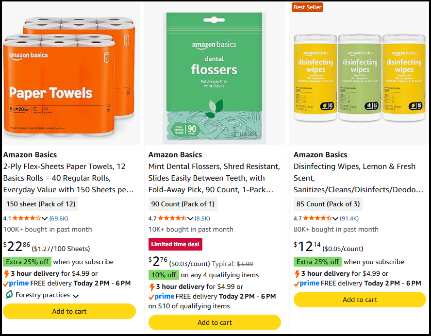

# About experiments in AWS AppConfig

This section provides in-depth information about each of the required tasks for setting up and running an experiment using AWS AppConfig experimentation. To help illustrate how to complete these tasks, this section uses an example called _Increase add-to-cart rate by adding a button for each product displayed_ experiment. For this experiment, a DevOps team wants to increase add-to-cart rates (and potentially sales rates) by adding a button beneath _each_ item displayed on their site, like the following example from Amazon.com:

After you understand how to complete these tasks in AWS AppConfig experimentation, see [Creating and running an experiment](appconfig-experimentation-creating.md "appconfig-experimentation-creating.md") to get started.

###### Topics

- [Documenting your hypothesis](appconfig-experimentation-about-defining.md "appconfig-experimentation-about-defining.md")
- [Specifying the target audience for the experiment](appconfig-experimentation-about-specifying-audience.md "appconfig-experimentation-about-specifying-audience.md")
- [Selecting the experiment feature flag](appconfig-experimentation-about-experiment-feature-flag.md "appconfig-experimentation-about-experiment-feature-flag.md")
- [About controls and treatments](appconfig-experimentation-about-controls-and-treatments.md "appconfig-experimentation-about-controls-and-treatments.md")
- [About running and monitoring an experiment](appconfig-experimentation-about-running-an-experiment.md "appconfig-experimentation-about-running-an-experiment.md")
- [About data collection](appconfig-experimentation-about-data-collection.md "appconfig-experimentation-about-data-collection.md")
