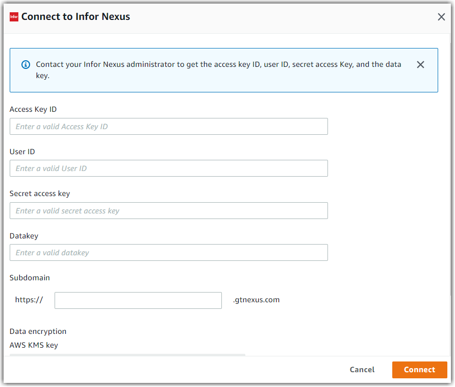

# Infor Nexus

The following are the requirements and connection instructions for using Infor Nexus with
Amazon AppFlow.

###### Note

You can use Infor Nexus as a source only.

###### Topics

- [Requirements](#infornexus-requirements "#infornexus-requirements")
- [Connection instructions](#infornexus-setup "#infornexus-setup")
- [Supported destinations](#infor-nexus-destinations "#infor-nexus-destinations")
- [Notes](#infornexus-notes "#infornexus-notes")

## Requirements

- Amazon AppFlow uses hash-based message authentication (HMAC) to connect to Infor Nexus.
- You must provide Amazon AppFlow with your access key ID, user ID, secret access key, and data
  key. To retrieve this information, contact your Infor Nexus administrator.

## Connection instructions

###### To connect to Infor Nexus while creating a flow

1.  Sign in to the AWS Management Console and open the Amazon AppFlow console at [https://console.aws.amazon.com/appflow/](https://console.aws.amazon.com/appflow/ "https://console.aws.amazon.com/appflow/").
2.  Choose **Create flow**.
3.  For **Flow details**, enter a name and description for the flow.
4.  (Optional) To use a customer managed CMK instead of the default AWS managed CMK, choose
    **Data encryption**, **Customize encryption settings** and
    then choose an existing CMK or create a new one.
5.  (Optional) To add a tag, choose **Tags**, **Add tag**
    and then enter the key name and value.
6.  Choose **Next**.
7.  Choose **Infor Nexus** from the **Source name** dropdown
    list.
8.  Choose **Connect** to open the **Connect to Infor
    Nexus** dialog box.

        1. Under **Access Key ID**, enter your access key ID.
        2. Under **User ID**, enter your Infor Nexus user ID.
        3. Under **Secret access key**, enter your secret access key.
        4. Under **Datakey**, enter your data key.
        5. Under **Subdomain**, enter the subdomain for your instance of Infor
         Nexus.
        6. Under **Data encryption**, enter your AWS KMS key.
        7. Under **Connection name**, specify a name for your connection.
        8. Choose **Connect**.

    

9.  You will be redirected to the Infor Nexus login page. When prompted, grant Amazon AppFlow
    permissions to access your Infor Nexus account.

Now that you are connected to your Infor Nexus account, you can continue with the flow
creation steps as described in [Creating flows in Amazon AppFlow](create-flow.md "create-flow.md").

###### Tip

If you aren’t connected successfully, ensure that you have followed the instructions in the
[Requirements](#infornexus-requirements "#infornexus-requirements")
section.

## Supported destinations

When you create a flow that uses Infor Nexus as the data source, you can set the destination to any of the following connectors:

- Amazon Connect
- Amazon Honeycode
- Lookout for Metrics
- Amazon Redshift
- Amazon S3
- Marketo
- Salesforce
- Snowflake
- Upsolver
- Zendesk

You can also set the destination to any custom connectors that you
create with the Amazon AppFlow Custom Connector SDKs for [Python](https://github.com/awslabs/aws-appflow-custom-connector-python "https://github.com/awslabs/aws-appflow-custom-connector-python") or [Java](https://github.com/awslabs/aws-appflow-custom-connector-java "https://github.com/awslabs/aws-appflow-custom-connector-java") . You can download these SDKs from GitHub.

## Notes

- When you use Infor Nexus as a source, you can run schedule-triggered flows at a maximum
  frequency of one flow run per minute.
