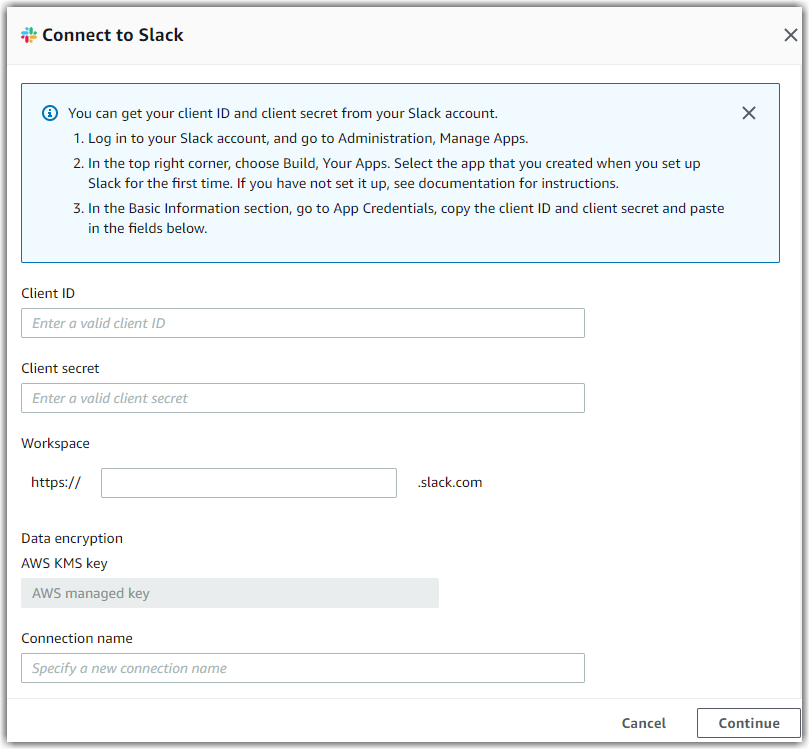

# Slack

The following are the requirements and connection instructions for using Slack with
Amazon AppFlow.

###### Note

You can use Slack as a source only.

###### Topics

- [Requirements](#slack-requirements "#slack-requirements")
- [Connection instructions](#slack-setup "#slack-setup")
- [Notes](#slack-notes "#slack-notes")
- [Supported destinations](#slack-destinations "#slack-destinations")
- [Related resources](#slack-resources "#slack-resources")

## Requirements

- To create a Slack connection in Amazon AppFlow, you must note your client ID, client secret,
  and Slack instance name. To retrieve your client ID and secret from Slack, you first must
  create a Slack App if you haven't already. For more information about how to create an App and
  then retrieve your client ID and secret, see the [Slack documentation](https://api.slack.com/docs/sign-in-with-slack#sign-in-with-slack__details__create-your-slack-app-if-you-havent-already "https://api.slack.com/docs/sign-in-with-slack#sign-in-with-slack__details__create-your-slack-app-if-you-havent-already").
- Set the redirect URL as follows:
  - https://console.aws.amazon.com/appflow/oauth for the us-east-1 Region
  - https://`region`.console.aws.amazon.com/appflow/oauth for all other
    Regions

- Set the following user token scopes:
  - `channels:history`
  - `channels:read`
  - `groups:history`
  - `groups:read`
  - `im:history`
  - `im:read`
  - `mpim:history`
  - `mpim:read`

## Connection instructions

###### To connect to Slack while creating a flow

1.  Sign in to the AWS Management Console and open the Amazon AppFlow console at [https://console.aws.amazon.com/appflow/](https://console.aws.amazon.com/appflow/ "https://console.aws.amazon.com/appflow/").
2.  Choose **Create flow**.
3.  For **Flow details**, enter a name and description for the flow.
4.  (Optional) To use a customer managed CMK instead of the default AWS managed CMK, choose
    **Data encryption**, **Customize encryption settings** and
    then choose an existing CMK or create a new one.
5.  (Optional) To add a tag, choose **Tags**, **Add tag**
    and then enter the key name and value.
6.  Choose **Next**.
7.  Choose **Slack** from the **Source name** dropdown
    list.
8.  Choose **Connect** to open the **Connect to Slack**
    dialog box.

        1. Under **Client ID**, enter your Slack client ID.
        2. Under **Client secret**, enter your Slack client secret.
        3. Under **Workspace**, enter the name of your Slack instance.
        4. Under **Data encryption**, enter your AWS KMS key.
        5. Under **Connection name**, specify a name for your connection.
        6. Choose **Continue**.

    

9.  You will be redirected to the Slack login page. When prompted, grant Amazon AppFlow
    permissions to access your Slack account.

Now that you are connected to your Slack account, you can continue with the flow creation
steps as described in [Creating flows in Amazon AppFlow](create-flow.md "create-flow.md").

###### Tip

If you aren’t connected successfully, ensure that you have followed the instructions in the
[Requirements](#slack-requirements "#slack-requirements") section.

## Notes

- When you use Slack as a source, you can run schedule-triggered flows at a maximum
  frequency of one flow run per minute.

## Supported destinations

When you create a flow that uses Slack as the data source, you can set the destination to any of the following connectors:

- Amazon Connect
- Amazon Honeycode
- Amazon Redshift
- Amazon S3
- Marketo
- Salesforce
- Snowflake
- Upsolver
- Zendesk

You can also set the destination to any custom connectors that you
create with the Amazon AppFlow Custom Connector SDKs for [Python](https://github.com/awslabs/aws-appflow-custom-connector-python "https://github.com/awslabs/aws-appflow-custom-connector-python") or [Java](https://github.com/awslabs/aws-appflow-custom-connector-java "https://github.com/awslabs/aws-appflow-custom-connector-java") . You can download these SDKs from GitHub.

## Related resources

- [Retrieve your client ID and secret](https://api.slack.com/docs/sign-in-with-slack#sign-in-with-slack__details__create-your-slack-app-if-you-havent-already "https://api.slack.com/docs/sign-in-with-slack#sign-in-with-slack__details__create-your-slack-app-if-you-havent-already") in the Slack documentation
- [New – Announcing
  Amazon AppFlow (dataflow: Slack, S3, Athena, QuickSight)](https://aws.amazon.com/blogs/aws/new-announcing-amazon-appflow "https://aws.amazon.com/blogs/aws/new-announcing-amazon-appflow") in the _AWS
  News_ blog
- How to transfer data from Slack to Amazon S3 using Amazon AppFlow
