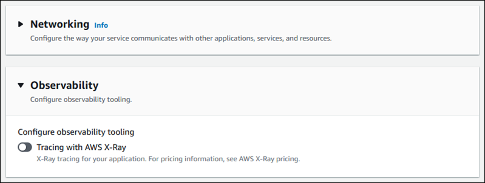

# Configuring observability for your service

AWS App Runner integrates with several AWS services to provide you with an extensive observability suite of tools for your App Runner service. For more
information, see [Observability for your App Runner service](monitor.md "monitor.md").

App Runner supports enabling some observability features and configuring their behavior by using a sharable resource called
_ObservabilityConfiguration_. You can provide an observability configuration resource when you create or update a service. The App Runner
console creates one for you when you create a new App Runner service. Providing an observability configuration is optional. If you don't provide one, App Runner
provides a default observability configuration.

You can share a single observability configuration across multiple App Runner services to ensure they have the same observability behavior. For more
information, see [Configuring service settings using sharable resources](manage-configure-resources.md "manage-configure-resources.md").

You can configure the following observability features using observability configurations:

- _Trace configuration_ – Settings for tracing requests that your application serves and downstream calls that it makes.
  For more information about tracing, see [Tracing for your App Runner application with X-Ray](monitor-xray.md "monitor-xray.md").

## Manage observability

Manage observability for your App Runner services using one of the following methods:

App Runner console
When you [create a service](manage-create.md "manage-create.md") using the App Runner console, or when you [update its
configuration later](manage-configure.md "manage-configure.md"), you can configure observability features for your service. Look for the **Observability**
configuration section on the console page.

App Runner API or AWS CLI
When you call the [CreateService](../api/API_CreateService.md "../api/API_CreateService.md") or [UpdateService](../api/API_UpdateService.md "../api/API_UpdateService.md") App Runner API actions, you can use the `ObservabilityConfiguration` parameter object to enable observability features and
specify an observability configuration resource for your service.

Use the following App Runner API actions to manage your observability configuration resources.

- [CreateObservabilityConfiguration](../api/API_CreateObservabilityConfiguration.md "../api/API_CreateObservabilityConfiguration.md") – Creates a new observability
  configuration or a revision to an existing one.
- [ListObservabilityConfigurations](../api/API_ListObservabilityConfigurations.md "../api/API_ListObservabilityConfigurations.md") – Returns a list of the
  observability configurations that are associated with your AWS account, with summary information.
- [DescribeObservabilityConfiguration](../api/API_DescribeObservabilityConfiguration.md "../api/API_DescribeObservabilityConfiguration.md") – Returns a full description
  of an observability configuration.
- [DeleteObservabilityConfiguration](../api/API_DeleteObservabilityConfiguration.md "../api/API_DeleteObservabilityConfiguration.md") – Deletes an observability
  configuration. You can delete a specific revision or the latest active revision. You might need to delete unnecessary observability configurations if
  you reach the observability configuration quota for your AWS account.
