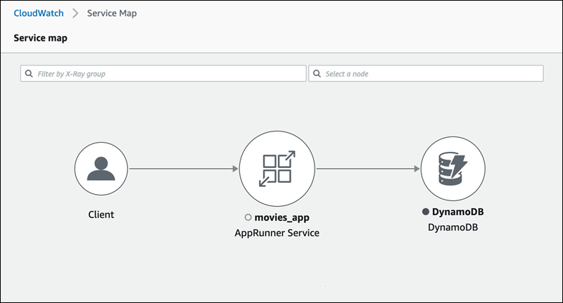
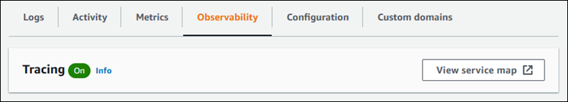

# Tracing for your App Runner application with X-Ray

AWS X-Ray is a service that collects data about requests that your application serves, and provides tools you can use to view, filter, and gain
insights into that data to identify issues and opportunities for optimization. For any traced request to your application, you can see detailed information
not only about the request and response, but also about calls that your application makes to downstream AWS resources, microservices, databases and HTTP
web APIs.

X-Ray uses trace data from the AWS resources that power your cloud applications to generate a detailed service graph. The service graph shows the
client, your front-end service, and backend services that your front-end service calls to process requests and persist data. Use the service graph to
identify bottlenecks, latency spikes, and other issues to solve to improve the performance of your applications.

For more information about X-Ray, see the [AWS X-Ray Developer Guide](../../../xray/latest/devguide.md "../../../xray/latest/devguide.md").



## Instrument your application for tracing

Instrument your App Runner service application for tracing using [OpenTelemetry](https://github.com/open-telemetry "https://github.com/open-telemetry"), a portable telemetry specification.
At this time, App Runner supports the [AWS Distro for OpenTelemetry](https://aws-otel.github.io/docs/introduction "https://aws-otel.github.io/docs/introduction") (ADOT), an OpenTelemetry
implementation that collects and presents telemetry information using AWS services. X-Ray implements the tracing component.

Depending on the specific ADOT SDK that you use in your application, ADOT supports up to two instrumentation approaches: _automatic_
and _manual_. For more information about instrumentation with your SDK, see the [ADOT documentation](https://aws-otel.github.io/docs/introduction "https://aws-otel.github.io/docs/introduction"), and choose your SDK on the navigation pane.

### Runtime setup

The following are the general runtime setup instructions to instrument your App Runner service application for tracing.

###### To setup tracing for your runtime

1. Follow the instructions provided for your runtime in [AWS Distro for
   OpenTelemetry](https://aws-otel.github.io/docs/introduction "https://aws-otel.github.io/docs/introduction") (ADOT), to instrument your application.
2. Install the required `OTEL` dependencies in the `build` section of the `apprunner.yaml` file if you are using
   the source code repository or in the Dockerfile if you are using a container image.
3. Setup your environment variables in the `apprunner.yaml` file if you are using
   the source code repository or in the Dockerfile if you are using a container image.

###### Example Environment variables

###### Note

The following example lists the important environment variables to add to the `apprunner.yaml` file. Add these
environment variables to your Dockerfile if you are using a container image. However, each runtime can have their own
idiosyncrasies and you may need to add more environment variables to the following list. For more information on your runtime specific instructions and
examples on how to setup your application for your runtime, see [AWS Distro for
OpenTelemetry](https://aws-otel.github.io/docs/introduction "https://aws-otel.github.io/docs/introduction") and go to your runtime, under _Getting Started_.

```
env:
    **- name: OTEL\_PROPAGATORS
 value: xray
 - name: OTEL\_METRICS\_EXPORTER
 value: none
 - name: OTEL\_EXPORTER\_OTLP\_ENDPOINT
 value: http://localhost:4317
 - name: OTEL\_RESOURCE\_ATTRIBUTES
 value: 'service.name=example\_app'**
```

###### Note

`OTEL_METRICS_EXPORTER=none` is an important environment variable for App Runner since the App Runner Otel collector doesn't accept metrics
logging. It only accepts metrics tracing.

### Runtime setup example

The following example demonstrates auto-instrumenting your application with the [ADOT Python SDK](https://aws-otel.github.io/docs/getting-started/python-sdk "https://aws-otel.github.io/docs/getting-started/python-sdk"). The SDK automatically produces spans with
telemetry data describing the values used by the Python frameworks in your application without adding a single line of Python code. You need to add or
modify just a few lines in two source files.

First, add some dependencies, as shown in the following example.

###### Example requirements.txt

```
**opentelemetry-distro[otlp]>=0.24b0
opentelemetry-sdk-extension-aws~=2.0
opentelemetry-propagator-aws-xray~=1.0**
```

Then, instrument your application. The way to do it depends on your service source—source image or source code.

Source image
When your service source is an image, you can directly instrument the Dockerfile that controls building your container image and running the
application in the image. The following example shows an instrumented Dockerfile for a Python application. Instrumentation additions are emphasized
in bold.

###### Example Dockerfile

```
FROM public.ecr.aws/amazonlinux/amazonlinux:latest
RUN yum install python3.7 -y && curl -O https://bootstrap.pypa.io/get-pip.py && python3 get-pip.py && yum update -y
COPY . /app
WORKDIR /app
RUN pip3 install -r requirements.txt
**RUN opentelemetry-bootstrap --action=install**
**ENV OTEL\_PYTHON\_DISABLED\_INSTRUMENTATIONS=urllib3**
**ENV OTEL\_METRICS\_EXPORTER=none**
**ENV OTEL\_RESOURCE\_ATTRIBUTES='service.name=example\_app'**
CMD **OTEL\_PROPAGATORS=xray OTEL\_PYTHON\_ID\_GENERATOR=xray opentelemetry-instrument** python3 app.py
EXPOSE 8080
```

Source code repository
When your service source is a repository containing your application source, you indirectly instrument your image using App Runner configuration file
settings. These settings control the Dockerfile that App Runner generates and uses to build the image for your application. The following example shows an
instrumented App Runner configuration file for a Python application. Instrumentation additions are emphasized in bold.

###### Example apprunner.yaml

```
version: 1.0
runtime: python3
build:
  commands:
    build:
      - pip install -r requirements.txt
      **- opentelemetry-bootstrap --action=install**
run:
  command: **opentelemetry-instrument** python app.py
  network:
    port: 8080
  env:
    **- name: OTEL\_PROPAGATORS
 value: xray
 - name: OTEL\_METRICS\_EXPORTER
 value: none
 - name: OTEL\_PYTHON\_ID\_GENERATOR
 value: xray
 - name: OTEL\_PYTHON\_DISABLED\_INSTRUMENTATIONS
 value: urllib3
 - name: OTEL\_RESOURCE\_ATTRIBUTES
 value: 'service.name=example\_app'**
```

## Add X-Ray permissions to your App Runner service instance role

To use X-Ray tracing with your App Runner service, you have to provide the service's instances with permissions to interact with the X-Ray service. You do
this by associating an instance role with your service and adding a managed policy with X-Ray permissions. For more information about an App Runner instance
role, see [Instance role](security_iam_service-with-iam.md#security_iam_service-with-iam-roles-service.instance "security_iam_service-with-iam.md#security_iam_service-with-iam-roles-service.instance"). Add the `AWSXRayDaemonWriteAccess` managed policy to your
instance role and assign it to your service during creation.

## Enable X-Ray tracing for your App Runner service

When you [create a service](manage-create.md "manage-create.md"), App Runner disables tracing by default. You can enable X-Ray tracing for your service as
part of configuring observability. For more information, see [Manage observability](manage-configure-observability.md#manage-configure-observability.manage "manage-configure-observability.md#manage-configure-observability.manage").

If you use the App Runner API or the AWS CLI, the [TraceConfiguration](../api/API_TraceConfiguration.md "../api/API_TraceConfiguration.md") object within the [ObservabilityConfiguration](../api/API_ObservabilityConfiguration.md "../api/API_ObservabilityConfiguration.md") resource object contains tracing settings. To keep tracing
disabled, don't specify a `TraceConfiguration` object.

In both the console and API cases, be sure to associate your instance role discussed in the previous section with your App Runner service.

## View X-Ray tracing data for your App Runner service

On the **Observability** tab of the [service dashboard page](console.md#console.dashboard "console.md#console.dashboard") in the App Runner console, choose
**View service map** to navigate to the Amazon CloudWatch console.



Use the Amazon CloudWatch console to view service maps and traces for requests that your application serves. Service maps show information like request latency
and interactions with other applications and AWS services. The custom annotations that you add to your code allow you to easily search for traces. For
more information, see [Using ServiceLens to monitor the health of your applications](../../../AmazonCloudWatch/latest/monitoring/ServiceLens.md "../../../AmazonCloudWatch/latest/monitoring/ServiceLens.md") in the
_Amazon CloudWatch User Guide_.
