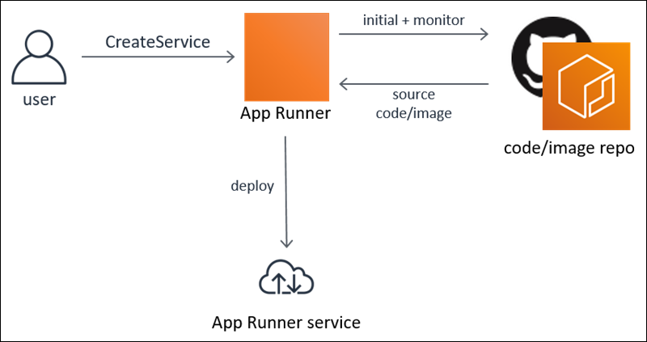

# What is AWS App Runner?

AWS App Runner is an AWS service that provides a fast, simple, and cost-effective way to deploy from source code or a container image directly to a scalable
and secure web application in the AWS Cloud. You don't need to learn new technologies, decide which compute service to use, or know how to provision and
configure AWS resources.

App Runner connects directly to your code or image repository. It provides an automatic integration and delivery pipeline with fully managed operations, high
performance, scalability, and security.

## Who is App Runner for?

If you're a _developer_, you can use App Runner to simplify the process of deploying a new version of your code or image
repository.

For _operations teams_, App Runner enables automatic deployments each time a commit is pushed to the code repository or a new container image
version is pushed to the image repository.

## Accessing App Runner

You can define and configure your App Runner service deployments using any one of the following interfaces:

- App Runner console – Provides a web interface for managing your App Runner services.
- App Runner API – Provides a RESTful API for performing App Runner actions. For more information, see
  [AWS App Runner API Reference](../api.md "../api.md").
- AWS Command Line Interface (AWS CLI) – Provides commands for a broad set of AWS services, including Amazon VPC,
  and is supported on Windows, macOS, and Linux. For more information, see [AWS Command Line Interface](https://aws.amazon.com/cli/ "https://aws.amazon.com/cli/").
- AWS SDKs – Provides language-specific APIs and takes care of many of the connection details, such as
  calculating signatures, handling request retries, and error handling. For more information, see [AWS
  SDKs](http://aws.amazon.com/tools/#SDKs "http://aws.amazon.com/tools/#SDKs").

## Pricing for App Runner

App Runner provides a cost-effective way to run your application. You only pay for resources that your App Runner service consumes. Your service scales down to
fewer compute instances when request traffic is lower. You have control over scalability settings: the lowest and highest number of provisioned
instances, and the highest load an instance handles.

For more information about App Runner automatic scaling, see [Managing App Runner automatic scaling](manage-autoscaling.md "manage-autoscaling.md").

For pricing information, see [AWS App Runner pricing](https://aws.amazon.com/apprunner/pricing "https://aws.amazon.com/apprunner/pricing").

## What's next

Learn how to get started with App Runner in the following topics:

- [Setting up for App Runner](setting-up.md "setting-up.md") – Complete the prerequisite steps for using App Runner.
- [Getting started with App Runner](getting-started.md "getting-started.md") – Deploy your first application to App Runner.
