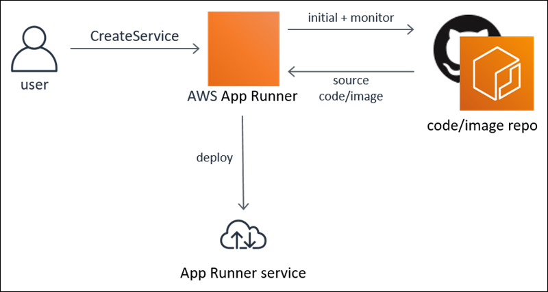

# Release: AWS App Runner general availability on May 18, 2021

AWS announces general availability of AWS App Runner.

**Release date:** May 18, 2021

## Changes

Today we released _AWS App Runner_ for general availability.

App Runner is an AWS service that provides a fast, simple, and cost-effective way to deploy from source code or container image directly to a scalable and
secure web application in the AWS Cloud. You don't need to learn new technologies, decide which compute service to use, or know how to provision and
configure AWS resources.

App Runner connects directly to your container registry or source code repository. It provides an automatic delivery pipeline with fully managed operations,
high performance, scalability, and security.

For concepts, tutorials, and reference materials, see [AWS App Runner Developer Guide](../dg.md "../dg.md").

