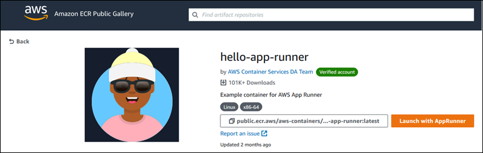

# Release: Direct container launch from Amazon ECR Public Gallery on September 29, 2021

Amazon ECR Public added the ability to launch containers directly to AWS App Runner.

**Release date:** September 29, 2021

## Changes

You can now test popular web frameworks and applications hosted on the [Amazon ECR Public Gallery](https://gallery.ecr.aws "https://gallery.ecr.aws"). When
browsing the gallery, look for **Launch with App Runner** on the gallery page for an image. Choose it to open the App Runner console with most
details pre-filled. Add the port number for the application and launch a new service.

For more information, see [Launch a service directly
from Amazon ECR Public](../dg/service-source-image.md#service-source-image.providers.ecrpublic.direct "../dg/service-source-image.md#service-source-image.providers.ecrpublic.direct") in the _AWS App Runner Developer Guide_.

If you want to try out this feature, we recommend using one of the following container images.

| **Image**                                                                                                                             | **Port**                            |
| ------------------------------------------------------------------------------------------------------------------------------------- | ----------------------------------- |
| [hello-app-runner](https://gallery.ecr.aws/aws-containers/hello-app-runner "https://gallery.ecr.aws/aws-containers/hello-app-runner") | 8000                                |
| [nginx](https://gallery.ecr.aws/nginx/nginx "https://gallery.ecr.aws/nginx/nginx")                                                    | 80                                  |
| [tomcat](https://gallery.ecr.aws/bitnami/tomcat "https://gallery.ecr.aws/bitnami/tomcat")                                             | _See gallery page for description._ |
