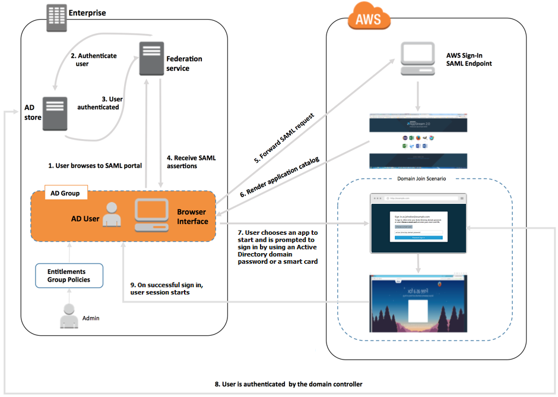

# Overview of Active Directory Domains

Using Active Directory domains with AppStream 2.0 requires an understanding of how they work
together and the configuration tasks that you'll need to complete. You'll need to
complete the following tasks:

1. Configure Group Policy settings as needed to define the end user experience
   and security requirements for applications.
2. Create the domain-joined application stack in AppStream 2.0.
3. Create the AppStream 2.0 application in the SAML 2.0 identity provider and assign it
   to end users either directly or through Active Directory groups.
   For your users to be authenticated to a domain, several steps must occur when these
   users initiate an AppStream 2.0 streaming session. The following diagram illustrates the
   end-to-end user authentication flow from the initial browser request through SAML and
   Active Directory authentication.

###### User Authentication Flow

1. The user browses to `https://applications.exampleco.com`. The
   sign-on page requests authentication for the user.
2. The federation service requests authentication from the organization's
   identity store.
3. The identity store authenticates the user and returns the authentication
   response to the federation service.
4. On successful authentication, the federation service posts the SAML assertion
   to the user's browser.
5. The user's browser posts the SAML assertion to the AWS Sign-In SAML endpoint
   (`https://signin.aws.amazon.com/saml`). AWS Sign-In receives the
   SAML request, processes the request, authenticates the user, and forwards the
   authentication token to the AppStream 2.0 service.
6. Using the authentication token from AWS, AppStream 2.0 authorizes the user and
   presents applications to the browser.
7. The user chooses an application and, depending on the Windows login
   authentication method that is enabled on the AppStream 2.0 stack, they're prompted to
   enter their Active Directory domain password or choose a smart card. If both
   authentication methods are enabled, the user can choose whether to enter their
   domain password or use their smart card. Certificate-based authentication can
   also be used to authenticate users, removing the prompt.
8. The domain controller is contacted for user authentication.
9. After being authenticated with the domain, the user's session starts with
   domain connectivity.
   From the user's perspective, this process is transparent. The user starts by
   navigating to your organization's internal portal and is redirected to an AppStream 2.0
   application portal, without having to enter AWS credentials. Only an Active Directory
   domain password or smart card credentials are required.

Before a user can initiate this process, you must configure Active Directory with the
required entitlements and Group Policy settings and create a domain-joined application
stack.
