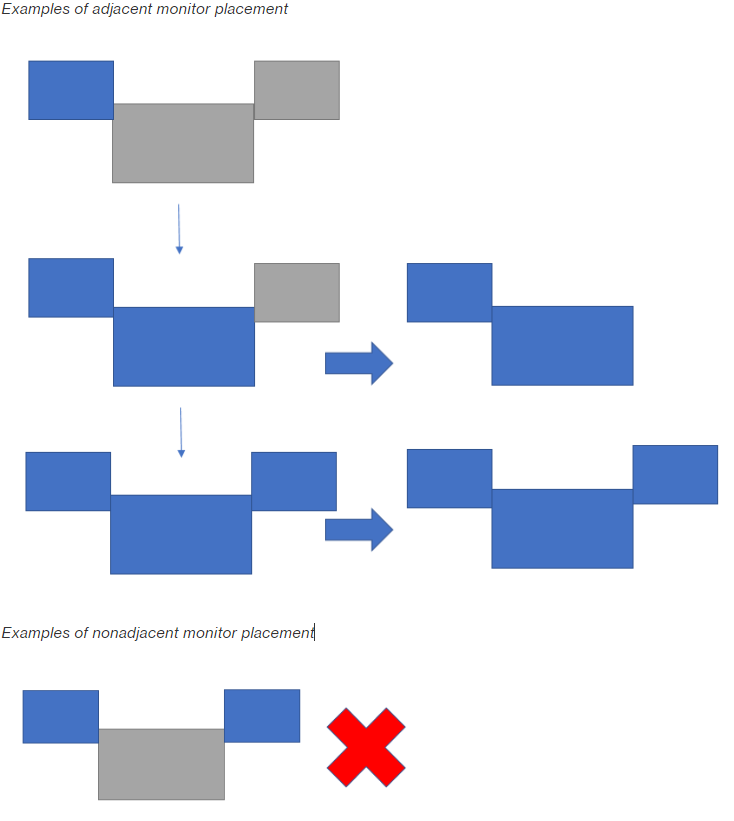

# Monitors

## Monitors and Display

Resolution

The AppStream 2.0 client supports multiple monitors with the following display
resolutions:

- Multiple monitors (up to 2K resolution) — Up to 4 monitors
  with a maximum display resolution of 2560x1600 pixels per
  monitor
- Multiple monitors (4K resolution) — Up to 2 monitors with a
  maximum display resolution of 4096x2160 pixels per monitor

If you prefer a fixed resolution, which does not change even when the
client window is resized, choose **Settings**,
**Display**, **Display Resolution**,
and specify the desired resolution. To re-enable automatic resizing, choose
**Adapt automatically**.

## Using Multiple Monitors

When using multiple monitors, you can choose from the following
options:

- Extend full-screen across a _single_
  monitor
- Extend full-screen across _all_ monitors
- Extend full-screen across _selected_
  monitors

### Extending full-screen

across a single monitor

You can extend full screen only on the current monitor if multiple
monitors are connected to your local computer. To enable this feature,
complete the following steps:

1. On the toolbar at the top of the window, choose the Full
   Screen (crossed arrows) icon.
2. From the drop-down menu, choose **Full screen current
   monitor**.

### Extending full-screen across

all monitors

You can extend the display for a session across all monitors at full
screen resolution. The extended display matches your physical display
layout and screen resolutions. For example, three monitors are connected
to your local computer. The server extends the display for a session
across all three monitors and matches the specific screen resolutions of
your display.

To enable this feature, complete the following steps:

1. On the toolbar at the top of the window, choose the Full
   Screen (crossed arrows) icon.
2. From the drop-down menu, choose **Full screen all
   monitors**.

### Extending full-screen

across selected monitors

If there are three or more monitors connected, AppStream 2.0 can also extend
full-screen across a selection of those available monitors. If your
selected monitors cannot go full screen, an error message will appear
and you will need to perform the procedure again. Selected monitors must
be set adjacent, or sharing a side with each other, in your display
setting.

The following are examples of adjacent monitor placement. If your
monitors are not set adjacent in your display configuration, you must
exit AppStream 2.0 and change your Display settings on your local
machine.

###### Note

The blue boxes are AppStream 2.0-enabled monitors, and the gray boxes are
other monitors.

To enable this feature, complete the following steps:

1. On the toolbar at the top of the window, choose the Full
   Screen (crossed arrows) icon.
2. From the drop-down menu, choose **Full screen selected
   monitors**.
3. The **Full screen selected monitors** window
   appears, displaying your current monitor layout. Select which
   monitors you want DCV to be displayed full screen, and choose
   **Apply**.
