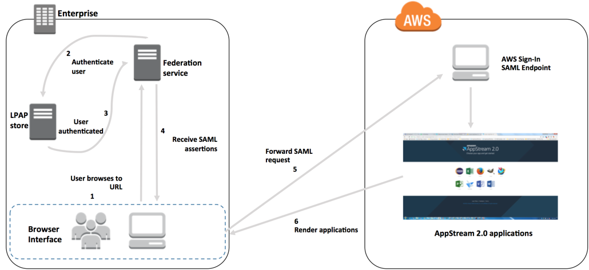

# Example Authentication

Workflow

The following diagram illustrates the authentication flow between AppStream 2.0 and a
third-party identity provider (IdP). In this example, the administrator has set up a
sign-in page to access AppStream 2.0, called `applications.exampleco.com`. The
webpage uses a SAML 2.0–compliant federation service to trigger a sign-on request.
The administrator has also set up a user to allow access to AppStream 2.0.

1. The user browses to `https://applications.exampleco.com`. The
   sign-on page requests authentication for the user.
2. The federation service requests authentication from the organization's
   identity store.
3. The identity store authenticates the user and returns the authentication
   response to the federation service.
4. On successful authentication, the federation service posts the SAML assertion
   to the user's browser.
5. The user's browser posts the SAML assertion to the AWS Sign-In SAML endpoint
   (`https://signin.aws.amazon.com/saml`). AWS Sign-In receives the
   SAML request, processes the request, authenticates the user, and forwards the
   authentication token to AppStream 2.0.

For information about working with SAML in the AWS GovCloud (US) Regions, see [AWS Identity and Access Management](../../../govcloud-us/latest/UserGuide/govcloud-iam.md "../../../govcloud-us/latest/UserGuide/govcloud-iam.md") in the _AWS GovCloud (US) User Guide_. 6. Using the authentication token from AWS, AppStream 2.0 authorizes the user and
presents applications to the browser.
From the user's perspective, this process happens transparently. The user starts at
your organization's internal portal and is automatically redirected to an AppStream 2.0
application portal without being required to enter AWS credentials.
