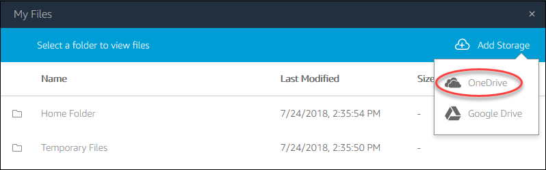
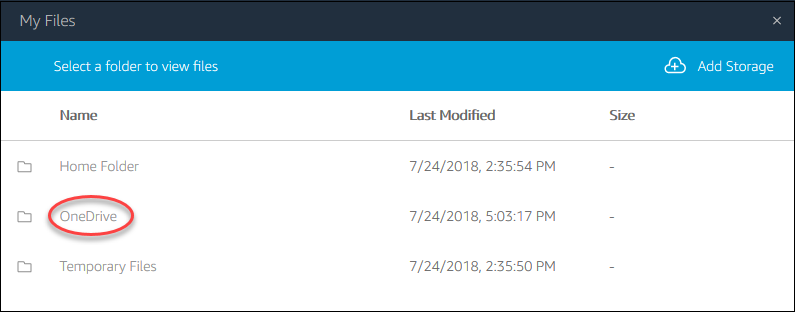

# Use OneDrive for Business

###### Note

OneDrive for Business is currently not supported for Linux-based streaming
instances.

If your AppStream 2.0 administrator has enabled this file storage option, you can add
your OneDrive account to AppStream 2.0. After you add your account and sign in to an AppStream 2.0
streaming session, you can do the following in OneDrive:

- Open and edit files and folders that you store in OneDrive. Other users
  cannot access your content unless you choose to share it.
- Upload and download files between your local computer and OneDrive. Any
  changes that you make to your files and folders in OneDrive during a
  streaming session are backed up and synchronized automatically. They are
  available to you when you sign in to your OneDrive account and access
  OneDrive outside of your streaming session.
- When you are working in an application, you can access your files and
  folders that are stored in OneDrive. Choose **File**,
  **Open** from the application interface and browse to
  the file or folder that you want to open. To save your changes in a file to
  OneDrive, choose **File**, **Save** from
  the application and browse to the location in OneDrive where you want to
  save the file.
- You can also access OneDrive by choosing **My Files**
  from the top left of the AppStream 2.0 toolbar.

###### To add your OneDrive account to AppStream 2.0

To access your OneDrive during AppStream 2.0 streaming sessions, you must first add
your OneDrive account to AppStream 2.0.

1. In the top left of the AppStream 2.0 toolbar, choose the **My
   Files** icon.
2. In the **My Files** dialog box, choose **Add
   Storage**.

 3. Choose **OneDrive**.

 4. Under **Login accounts**, choose the domain for your
OneDrive account.

 5. In the **Sign in** dialog box, enter the sign-in
credentials for your account. 6. After your OneDrive account is added to AppStream 2.0, your OneDrive folder is
displayed in **My Files**.

 7. To work with your files and folders in OneDrive, choose the
**OneDrive** folder and browse to the file or folder
you want. If you do not want to work with files in OneDrive during this
streaming session, close the **My Files** dialog box.

###### To upload and download files between your local computer and your

OneDrive

1. In the top left of the AppStream 2.0 toolbar, choose the **My
   Files** icon.
2. In the **My Files** dialog box, choose
   **OneDrive**.
3. Navigate to an existing folder, or choose **Add Folder**
   to create a folder.
4. When the folder is displayed, do one of the following:
   - To upload a file to the folder, select the file that you want to
     upload, and choose **Upload**.
   - To download a file from the folder, select the file that you want
     to download, choose the down arrow to the right of the file name,
     and choose **Download**.

   

###### To remove OneDrive permissions from AppStream 2.0

If you no longer want to use OneDrive during your AppStream 2.0 streaming sessions,
follow these steps to remove OneDrive permissions from AppStream 2.0.

###### Note

You can restore these permissions at any time during an AppStream 2.0 streaming
session.

1. Sign in to Office 365 or OneDrive for Business.
2. In the right pane, under **My accounts**, choose
   **My account**.
3. On the account dashboard page, in **App permissions**,
   choose **Change app permissions**.
4. On the **App permissions** page, under
   **Amazon AppStream 2.0**, choose
   **Revoke**.
