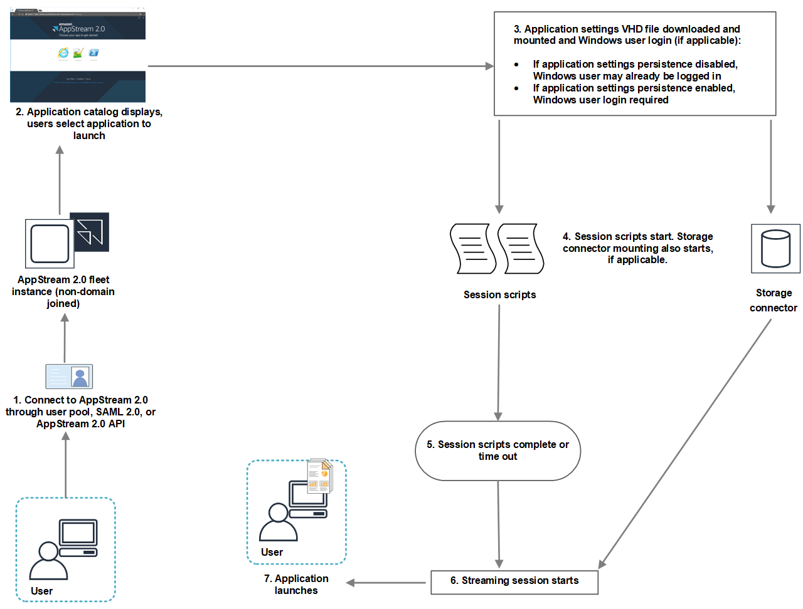
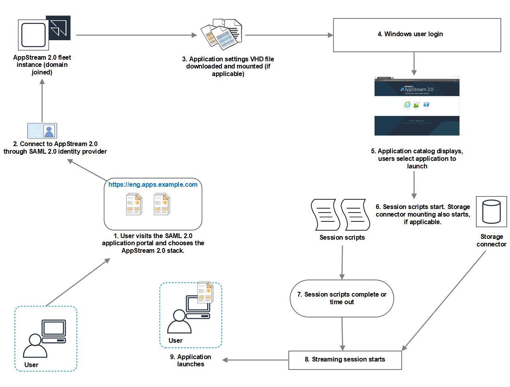

# Run Scripts Before

Streaming Sessions Begin

You can configure your scripts to run for a maximum of 60 seconds before your
users' applications launch and their streaming sessions begin. Doing so enables you
to customize the AppStream 2.0 environment before users start streaming their applications.
When the session scripts run, a loading spinner displays for your users. When your
scripts complete successfully or the maximum waiting time elapses, your users'
streaming session will begin. If your scripts don't complete successfully, an error
message displays for your users. However, your users are not prevented from using
their streaming session.

When you specify a file name on a Windows instance, you must use a double
backslash. For example:

C:\\Scripts\\Myscript.bat

If you don't use a double backslash, an error displays to notify you that the
.json file is incorrectly formatted.

###### Note

When your scripts complete successfully, they must return a value of 0. If
your scripts return a value other than 0, AppStream 2.0 displays the error message to
the user.

When you run scripts before streaming sessions begin and the AppStream 2.0 dynamic
application framework is not enabled, the following process occurs:

1. Your users connect to an AppStream 2.0 fleet instance that is not domain-joined.
   They connect by using one of the following access methods:
   - AppStream 2.0 user pool
   - SAML 2.0
   - AppStream 2.0 API

2. The application catalog displays in the AppStream 2.0 portal, and your users
   choose an application to launch.
3. One of the following occurs:
   - If application settings persistence is enabled for your users, the
     application settings Virtual Hard Disk (VHD) file that stores your
     users' customizations and Windows settings is downloaded and
     mounted. Windows user login is required in this case.

   For information about application settings persistence, see [Enable Application Settings Persistence for Your
   AppStream 2.0 Users](app-settings-persistence.md "app-settings-persistence.md").
   - If application settings persistence is not enabled, the Windows
     user is already logged in.

4. Your session scripts start. If persistent storage is enabled for your
   users, storage connector mounting also starts. For information about
   persistent storage, see [Enable and Administer Persistent Storage for Your
   AppStream 2.0 Users](persistent-storage.md "persistent-storage.md").

###### Note

The storage connector mount doesn't need to complete for the streaming
session to start. If the session scripts complete before the storage
connector mount completes, the streaming session starts.

For information about monitoring the mount status of storage
connectors, see [Use Storage Connectors
with Session Scripts](use-storage-connectors-with-session-scripts.md "use-storage-connectors-with-session-scripts.md"). 5. Your session scripts complete or time out. 6. The users' streaming session starts. 7. The application that your users chose launches.
For information about the AppStream 2.0 dynamic application framework, see [Use the AppStream 2.0 Dynamic Application
Framework to Build a Dynamic App Provider](build-dynamic-app-provider.md "build-dynamic-app-provider.md").

When you run scripts before streaming sessions begin and the AppStream 2.0 dynamic
application framework is enabled, the following process occurs:

1. Your users visit the SAML 2.0 application portal for your organization,
   and they choose the AppStream 2.0 stack.
2. They connect to an AppStream 2.0 fleet instance that is domain-joined.
3. If application settings persistence is enabled for your users, the
   application settings VHD file that stores your users' customizations and
   Windows settings is downloaded and mounted.
4. Windows user logon occurs.
5. The application catalog displays in the AppStream 2.0 portal and your users
   choose an application to launch.
6. Your session scripts start. If persistent storage is enabled for your
   users, storage connector mounting also starts.

###### Note

The storage connector mount doesn't need to complete for the streaming
session to start. If the session scripts complete before the storage
connector mount completes, the streaming session starts.

For information about monitoring the mount status of storage
connectors, see [Use Storage Connectors
with Session Scripts](use-storage-connectors-with-session-scripts.md "use-storage-connectors-with-session-scripts.md"). 7. Your session scripts complete or time out. 8. The users' streaming session starts. 9. The application that your users chose launches.
