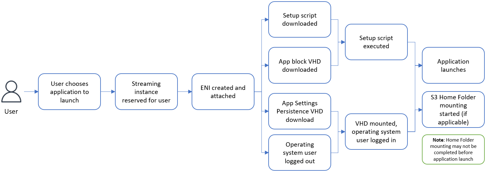
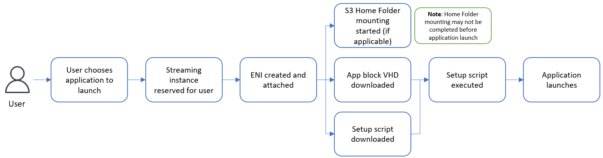

# App block setup script execution in Amazon AppStream 2.0

The following diagrams indicate where in the process the setup script runs.
The run order is dependent upon whether Application Settings Persistence is
enabled on the stack associated with the elastic fleet.

###### Note

AppStream 2.0 uses your VPC details to download the VHD and setup script from the
Amazon S3 bucket. Your VPC must provide access to the Amazon S3 bucket. For more
information, see [Using Amazon S3 VPC Endpoints for
AppStream 2.0 Features](managing-network-vpce-iam-policy.md "managing-network-vpce-iam-policy.md").

Application Settings Persistence is enabled:

Application Settings Persistence is disabled:

