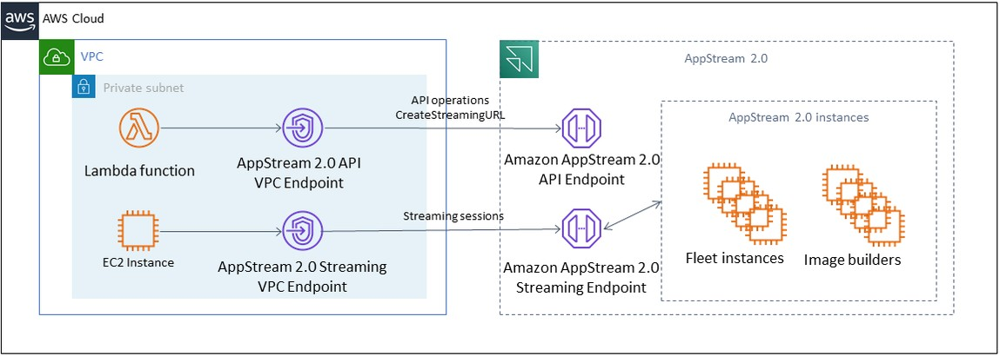

# Using AWS services

## AWS Identity and Access Management

Using an IAM role to access AWS services, and being specific in
the IAM policy attached to it, is a best practice that provides
only the users in WorkSpaces Applications sessions have access without
managing additional credentials. Follow the
[best
practices for using IAM Roles with WorkSpaces Applications](using-iam-roles-to-grant-permissions-to-applications-scripts-streaming-instances.md#best-practices-for-using-iam-role-with-streaming-instances "using-iam-roles-to-grant-permissions-to-applications-scripts-streaming-instances.md#best-practices-for-using-iam-role-with-streaming-instances").

Create
[IAM
policies to protect Amazon S3 buckets](s3-iam-policy.md "s3-iam-policy.md") that are
created to persist user data in both home folders and
application settings persistence. This
[prevents non-WorkSpaces Applications administrators](s3-iam-policy.md#s3-iam-policy-restricted-access "s3-iam-policy.md#s3-iam-policy-restricted-access") from access.

## VPC endpoints

A VPC endpoint enables private connections between your VPC and
supported AWS services and VPC endpoint services powered by AWS PrivateLink. AWS PrivateLink is a technology that enables you to
privately access services by using private IP addresses. Traffic
between your VPC and the other service does not leave the Amazon
network. If public internet access is required only for AWS services, VPC endpoints remove the requirement for NAT gateways
and internet gateways altogether.

In environments where automation routines or developers require
making API calls for WorkSpaces Applications,
[create an interface VPC endpoint for WorkSpaces Applications API
operations](access-api-cli-through-interface-vpc-endpoint.md "access-api-cli-through-interface-vpc-endpoint.md"). For example, if there are EC2
instances in private subnets without public internet access, a
VPC endpoint for WorkSpaces Applications API can be used to call AppStream
2.0 API operations such as
[CreateStreamingURL](../APIReference/API_CreateStreamingURL.md "../APIReference/API_CreateStreamingURL.md").
The following diagram shows an example setup where WorkSpaces Applications
API and streaming VPC endpoints are consumed by Lambda functions
and EC2 instances.

_VPC endpoint_

The streaming VPC endpoint allows you to stream sessions through
a VPC endpoint. The streaming interface endpoint maintains the
streaming traffic within your VPC. Streaming traffic includes
pixel, USB, user input, audio, clipboard, file upload and
download, and printer traffic. To use the VPC endpoint, the VPC
endpoint setting must be enabled at the WorkSpaces Applications stack.
This serves as an alternative to streaming user sessions over
the public internet from locations that have limited internet
access and would benefit from accessing through a Direct Connect
instance. Streaming user sessions through a VPC endpoint require
the following:

- The Security Groups that are associated with the interface
  endpoint must allow inbound access to port `443` (TCP) and
  ports `1400–1499` (TCP) from the IP address range from which
  your users connect.
- The Network Access Control List for the subnets must allow
  outbound traffic from ephemeral network ports `1024-65535`
  (TCP) to the IP address range from which your users connect.
- Internet connectivity is required to authenticate users and
  deliver the web assets that WorkSpaces Applications requires to
  function.

To learn more about restricting traffic to AWS services with
WorkSpaces Applications, see the administration guide for
[creating and streaming from VPC endpoints](creating-streaming-from-interface-vpc-endpoints.md "creating-streaming-from-interface-vpc-endpoints.md").

When full public internet access is required, it’s a best
practice to disable Internet Explorer Enhanced Security
Configuration (ESC) on the Image Builder. For more information,
see the WorkSpaces Applications administration guide to
[disable Internet Explorer enhanced security configuration](customize-fleets.md#customize-fleets-disable-ie-esc "customize-fleets.md#customize-fleets-disable-ie-esc").
