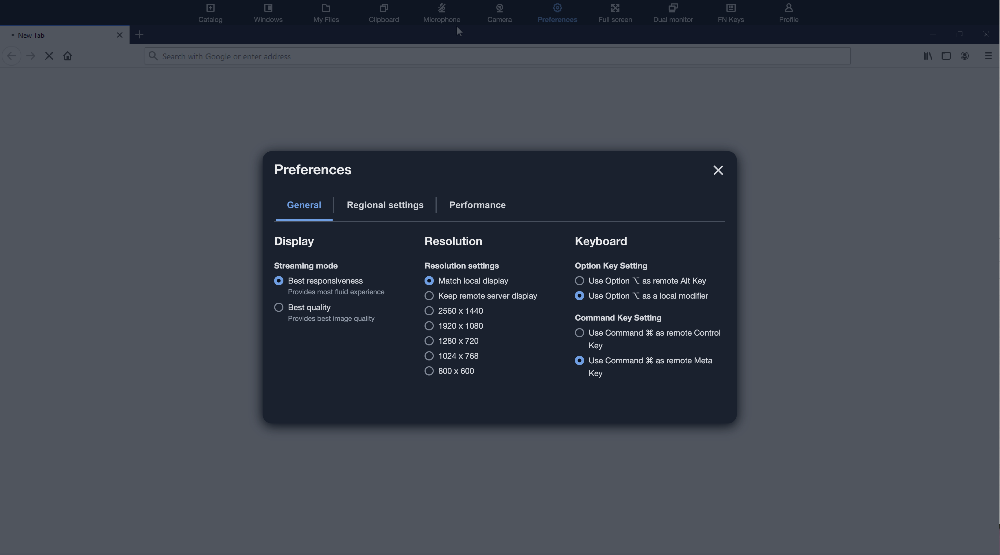

# Remap the Mac Option and Command Keys

When you use a device that runs macOS or Mac OS X to connect to WorkSpaces Applications, you
can remap the Mac Option and Command keys on your keyboard.

A _modifier key_ modifies the action of another key when you use both keys together. You can use a modifier key
with another key to perform a task such as printing. A _Meta key_ is a special type of modifier key. You can use a Meta key to temporarily change the function of
another key when you use both keys together.

| You can remap this Mac key                                                                  | To this key during a streaming session    |
| ------------------------------------------------------------------------------------------- | ----------------------------------------- |
| Option key Keyboard key labeled "option" representing a modifier key on Apple keyboards. | • Remote Alt key • Local modifier key  |
| Command key Key labeled "command" on a keyboard, typically found on Apple devices.       | • Remote Control key • Remote Meta key |

Follow these steps to remap the Mac Option and Command keys during an WorkSpaces Applications streaming session.

###### To remap the Mac Option and Command keys

1. Use a web browser to connect to WorkSpaces Applications.
2. In the top left of the WorkSpaces Applications toolbar, choose the **Settings** icon, and choose **Keyboard Settings**.
3. Choose the options that correspond to the keys that you want to remap.

Follow these steps to remap the Mac Option and Command keys on WorkSpaces Applications web
browser access v2.

###### To remap the Mac Option and Command keys on WorkSpaces Applications web browser access

v2

1. Use a web browser to connect to WorkSpaces Applications.
2. From the top menu of the WorkSpaces Applications toolbar, choose the
   **Preferences** menu.
3. Choose **General**, **Keyboard**, and the options that
   correspond to the keys that you want to remap.
