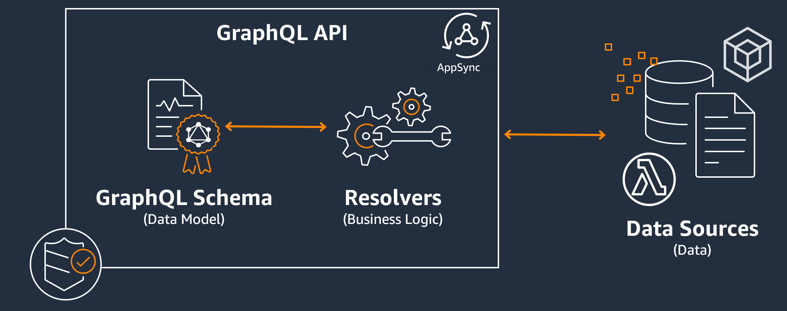

# Components of a GraphQL API

A standard GraphQL API is composed of a single schema that handles the shape of the data that will be
queried. Your schema is linked to one or more of your data sources like a database or Lambda function. In
between the two sits one or more resolvers that handle the business logic for your requests. Each component
plays an important role in your GraphQL implementation. The following sections will introduce these three
components and the role they play in the GraphQL service.

###### Topics

- [GraphQL schemas](schema-components.md "schema-components.md")
- [Data sources](data-source-components.md "data-source-components.md")
- [Resolvers](resolver-components.md "resolver-components.md")
