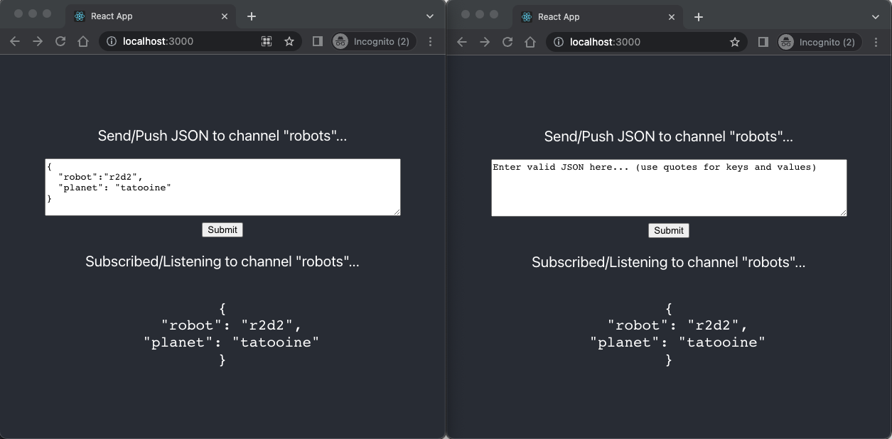

# Creating

generic pub/sub APIs powered by serverless WebSockets in AWS AppSync

###### Important

As of Mar 13, 2025, you can build a real-time PubSub API powered by WebSockets using
AWS AppSync Events. For more information, see [Publish events via WebSocket](../eventapi/publish-websocket.md "../eventapi/publish-websocket.md") in the _AWS AppSync Events
Developer Guide_.

Some applications only require simple WebSocket APIs where clients listen to a
specific channel or topic. Generic JSON data with no specific shape or strongly typed
requirements can be pushed to clients listening to one of these channels in a pure and
simple publish-subscribe (pub/sub) pattern.

Use AWS AppSync to implement simple pub/sub WebSocket APIs with little to no GraphQL
knowledge in minutes by automatically generating GraphQL code on both the API backend
and the client sides.

## Create

and configure pub-sub APIs

To get started, do the following:

1. Sign in to the AWS Management Console and open the [AppSync console](https://console.aws.amazon.com/appsync/ "https://console.aws.amazon.com/appsync/").
   1. In the **Dashboard**, choose
      **Create API**.

2. On the next screen, choose **Create a real-time
   API**, then choose **Next**.
3. Enter a friendly name for your pub/sub API.
4. You can enable [private
   API](using-private-apis.md "using-private-apis.md") features, but we recommend keeping this off for now. Choose
   **Next**.
5. You can choose to automatically generate a working pub/sub API using
   WebSockets. We recommend keeping this feature off for now as well. Choose
   **Next**.
6. Choose **Create API** and then wait for a
   couple of minutes. A new pre-configured AWS AppSync pub/sub API will be
   created in your AWS account.

The API uses AWS AppSync's built-in local resolvers (for more information about
using local resolvers, see [Tutorial: Local
Resolvers](tutorial-local-resolvers-js.md "tutorial-local-resolvers-js.md") in the _AWS AppSync Developer Guide_) to manage multiple
temporary pub/sub channels and WebSocket connections, which automatically delivers
and filters data to subscribed clients based only on the channel name. API calls are
authorized with an API key.

After the API is deployed, you are presented with a couple of extra steps to
generate client code and integrate it with your client application. For an example
on how to quickly integrate a client, this guide will use a simple React web
application.

1. Start by creating a boilerplate React app using [NPM](https://www.npmjs.com/get-npm "https://www.npmjs.com/get-npm") on your local
   machine:

```
$ npx create-react-app mypubsub-app
$ cd mypubsub-app
```

###### Note

This example uses the [Amplify libraries](https://docs.amplify.aws/lib/ "https://docs.amplify.aws/lib/") to connect clients to the backend API.
However there’s no need to create an Amplify CLI project locally.
While React is the client of choice in this example, Amplify libraries
also support iOS, Android, and Flutter clients, providing the same
capabilities in these different runtimes. The supported Amplify
clients provide simple abstractions to interact with AWS AppSync GraphQL
API backends with few lines of code including built-in WebSocket
capabilities fully compatible with the [AWS AppSync real-time WebSocket protocol](real-time-websocket-client.md "real-time-websocket-client.md"):

```
$ npm install @aws-amplify/api
```

2. In the AWS AppSync console, select **JavaScript**, then **Download**
   to download a single file with the API configuration details and generated
   GraphQL operations code.
3. Copy the downloaded file to the `/src` folder in your React
   project.
4. Next, replace the content of the existing boilerplate
   `src/App.js` file with the sample client code available in
   the console.
5. Use the following command to start the application locally:

```
$ npm start
```

6. To test sending and receiving real-time data, open two browser windows and
   access `localhost:3000`. The sample application is
   configured to send generic JSON data to a hard-coded channel named
   `robots`.
7. In one of the browser windows, enter the following JSON blob in the text
   box then click **Submit**:

```
{
  "robot":"r2d2",
  "planet": "tatooine"
}
```

Both browser instances are subscribed to the `robots`
channel and receive the published data in real time, displayed at the bottom of the
web application:



All necessary GraphQL API code, including the schema, resolvers, and operations
are automatically generated to enable a generic pub/sub use case. On the backend,
data is published to AWS AppSync’s real-time endpoint with a GraphQL mutation such
as the following:

```
mutation PublishData {
    publish(data: "{\"msg\": \"hello world!\"}", name: "channel") {
        data
        name
    }
}
```

Subscribers access the published data sent to the specific temporary channel with
a related GraphQL subscription:

```
subscription SubscribeToData {
    subscribe(name:"channel") {
        name
        data
    }
}
```

## Implementing pub-sub APIs into existing applications

In case you just need to implement a real-time feature in an existing application,
this generic pub/sub API configuration can be easily integrated into any application
or API technology. While there are advantages in using a single API endpoint to
securely access, manipulate, and combine data from one or more data sources in a
single network call with GraphQL, there’s no need to convert or rebuild an existing
REST-based application from scratch in order to take advantage of AWS AppSync's
real-time capabilities. For instance, you could have an existing CRUD workload in a
separate API endpoint with clients sending and receiving messages or events from the
existing application to the generic pub/sub API for real-time and pub/sub purposes
only.
