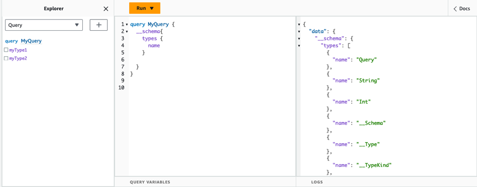
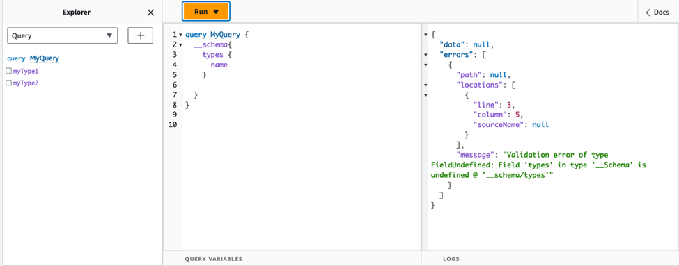
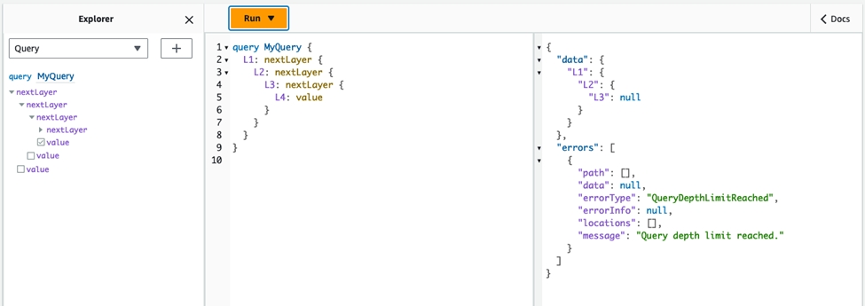
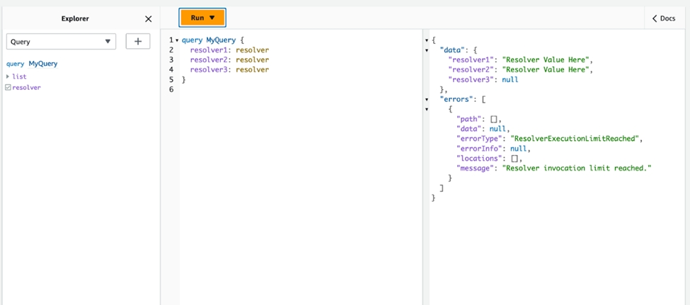

# Configuring GraphQL run complexity, query depth, and introspection with AWS AppSync

AWS AppSync allows you to enable or disable introspection features and set limits to the amount of nested levels and
resolvers in a single query.

## Using the introspection feature

###### Tip

For more information about introspection in GraphQL, see this article on the [GraphQL foundation's website](https://graphql.org/learn/introspection/ "https://graphql.org/learn/introspection/").

By default, GraphQL allows you to use introspection to query the schema itself to discover its types, fields,
queries, mutations, subscriptions, etc. This is an important feature for learning how the data is shaped and
processed by your GraphQL service. However, there are some things to consider when dealing with introspection. You
may have a use case that would benefit from introspection being disabled, such as a case in which field names may
be sensitive or hidden or the full API schema is intended to be left undocumented for consumers. In these cases,
publishing schema data through introspection could result in the leakage of intentionally private data.

To prevent this from happening, you can disable introspection. This will prevent unauthorized parties from
using introspection fields on your schema. However, it's important to note that introspection is useful for
development teams to learn how data in their service is processed. Internally, it might be helpful to keep
introspection enabled while disabling it in production code as an extra layer of security. Another way to handle
this is to add an authorization method, which AWS AppSync also provides. For more information, see [authorization](security-authz.md "security-authz.md").

AWS AppSync allows you to enable or disable introspection at the API level. To enable or disable introspection, do
the following:

1. Sign in to the AWS Management Console and open the [AppSync
   console](https://console.aws.amazon.com/appsync/ "https://console.aws.amazon.com/appsync/").
2. On the **APIs** page, choose the name of a GraphQL API.
3. On your API's homepage, in the navigation pane, choose
   **Settings**.
4. In **API configurations**, choose **Edit**.
5. Under **Introspection queries**, do the following:
   1. Turn on or off **Enable introspection queries**.

6. Choose **Save**.

When introspection is enabled (the default behavior), using the introspection system will work normally. For
example, the image below shows a `__schema` field processing all available types in the schema:



When disabling this feature, a validation error will appear in the response instead:



## Configuring query depth limits

There are times during which you may want more granular control over how the API functions during an
operation. One such control is adding a limit to the amount of nested levels a query may process. By default,
queries are able to process an unlimited amount of nested levels. Limiting queries to a specified amount of nested
levels has potential implications for the performance and flexibility of your project. Take the following
query:

```
query MyQuery {
  L1: nextLayer {
    L2: nextLayer {
      L3: nextLayer {
        L4: value
      }
    }
  }
}
```

Your project may call for limiting queries to `L1` or `L2` for some purpose. By default,
the entire query from `L1` to `L4` would be processed with no way to control that. By
setting a limit, you could prevent queries from accessing anything past the specified level.

To add a query depth limit, do the following:

1. Sign in to the AWS Management Console and open the [AppSync
   console](https://console.aws.amazon.com/appsync/ "https://console.aws.amazon.com/appsync/").
2. On the **APIs** page, choose the name of a GraphQL API.
3. On your API's homepage, in the navigation pane, choose
   **Settings**.
4. In **API configurations**, choose **Edit**.
5. Under **Query depth**, do the following:
   1. Turn on or off **Enable query depth**.
   2. In **Maximum depth**, set the depth limit. This can be between
      `1` and `75`.

6. Choose **Save**.

When a limit is set, going past its upper bound will result in a `QueryDepthLimitReached` error.
For example, the image below shows a query with a depth limit of `2` going past the limit to the third
(`L3`) and fourth (`L4`) levels:



Note that fields can still be marked as nullable or non-nullable in the schema. If a non-nullable field
receives a `QueryDepthLimitReached` error, that error will be thrown to the first nullable parent
field.

## Configuring resolver count limits

You can also control how many resolvers each query can process. Like the query depth, you can set a limit to
this amount. Take the following query that contains three resolvers:

```
query MyQuery {
  resolver1: resolver
  resolver2: resolver
  resolver3: resolver
}
```

By default, each query can process up to 10000 resolvers. In the example above, `resolver1`,
`resolver2`, and `resolver3` will be processed. However, your project may call for
limiting each query to handling one or two resolvers in total. By setting a limit, you can tell the query to not
handle any resolver past a certain number like the first (`resolver1`) or second
(`resolver2`) resolvers.

To add a resolver count limit, do the following:

1. Sign in to the AWS Management Console and open the [AppSync
   console](https://console.aws.amazon.com/appsync/ "https://console.aws.amazon.com/appsync/").
2. On the **APIs** page, choose the name of a GraphQL API.
3. On your API's homepage, in the navigation pane, choose
   **Settings**.
4. In **API configurations**, choose **Edit**.
5. Under **Resolver count limit**, do the following:
   1. Turn on **Enable resolver count**.
   2. In **Maximum resolver count**, set the count limit. This can be between
      `1` and `10000`.

6. Choose **Save**.

Like the query depth limit, exceeding the configured resolver limit causes the query to end with a
`ResolverExecutionLimitReached` error on additional resolvers. In the image below, a query with a
resolver count limit of _2_ tries to process three resolvers. Because of the
limit, the third resolver throws an error and doesn't run.


